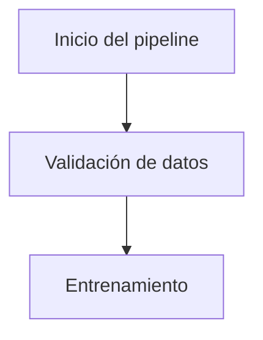

# Guía de Contribución

Gracias por tu interés en este proyecto de ingeniería de software estadístico. Esta guía explica cómo contribuir a la documentación o al código sin alterar la estructura existente.

Al participar, aceptas nuestro [Código de Conducta](CODE_OF_CONDUCT.md).

---

## 0. Cómo contribuir (sin saber programar)

Este proyecto valora tanto el contenido como el código. No necesitas experiencia en Next.js ni TypeScript para aportar.

**Formas de contribuir contenido:**

- **Corregir errores** del manual: erratas, conceptos imprecisos, enlaces rotos, código que no funciona. Usa la plantilla [Reportar error en el contenido](.github/ISSUE_TEMPLATE/reportar_error_contenido.md).
- **Proponer un tema nuevo** (ej. Airflow, dbt, modelos bayesianos en producción). Usa la plantilla [Proponer tema](.github/ISSUE_TEMPLATE/proponer_tema.md) antes de escribir.
- **Ampliar una sección** con ejemplos ejecutables, casos reales o referencias adicionales.
- **Traducir contenido al inglés**: crea el archivo en `content/en/Nombre_Seccion.md` (misma estructura). Empieza con los marcados como `good first issue`.
- **Revisar Pull Requests** de contenido: comentar desde el punto de vista técnico también es una contribución valiosa.

Si es tu primera colaboración, busca issues con la etiqueta [`good first issue`](https://github.com/eariosb/statistical-software-engineering/labels/good%20first%20issue).

### Licencia dual

Este repositorio usa licencia dual (consulta el archivo [LICENSE](LICENSE)):

- **Código** (`app/`, `components/`, `lib/`, `scripts/`, configuraciones) → **MIT**.
- **Contenido del manual** (`content/`) → **CC BY-SA 4.0**.

Al enviar un Pull Request, aceptas que tu contribución se publique bajo la licencia correspondiente según su ubicación. La licencia CC BY-SA garantiza que el manual y sus derivados permanezcan siempre abiertos, requiriendo atribución (tu nombre queda en el historial de Git y en la sección de contribuyentes).

---

## 1. Añadir un nuevo documento Markdown

1. Crea el archivo en `content/` con nombre en `PascalCase`, por ejemplo `content/Mi_Nuevo_Tema.md`.
2. Edita `navigation.json` (en la raíz) y agrega una entrada en la categoría correspondiente:

```json
{ "title": "Mi Nuevo Tema", "slug": "Mi_Nuevo_Tema" }
```

El slug debe coincidir exactamente con el nombre del archivo (sin extensión).


Verifica que la aplicación compile: npm run build.

## 2. Formato Markdown
Listas: usa - para ítems de lista. Evita ◦, • o numeración automática innecesaria.

Bloques de código: usa triple backtick con el lenguaje especificado:

```python
import pandas as pd
```
Siempre especifica el lenguaje. No uses bloques sin etiqueta.

Tablas: formato estándar con tuberías |. Incluye la fila de separación (| --- | --- |).

Líneas en blanco: deja una línea en blanco antes y después de encabezados, listas y bloques de código.

Longitud de línea: máximo 120 caracteres para texto narrativo (no aplica a código).

Negrita: usa **texto**, no __texto__.

Encabezados
Un solo # H1 por documento (título principal).

Secciones principales con ## H2, subsecciones con ### H3.

No saltar niveles (ej. de ## a #### sin un ### intermedio).

## 3. Diagramas Mermaid
Usa flowchart TB (top‑bottom) salvo que el diagrama requiera disposición horizontal.

No uses <br> dentro de las etiquetas de nodos. Usa descripciones concisas de una sola línea.

Encierra las etiquetas con espacios o caracteres especiales entre comillas dobles:



Limita los nodos a ≈60 caracteres. Si el texto es largo, divide el concepto en dos nodos.

## 4. Bloques de código ejecutables vs. ilustrativos
Indica claramente al inicio del bloque si es ejecutable o solo ilustrativo:

```python
# (ejemplo ejecutable)
import pandas as pd
df = pd.DataFrame({"x": [1, 2, 3]})
print(df.head())
# (fragmento ilustrativo, no ejecutable)
# Requiere: modelo entrenado y X_test definidos previamente
y_pred = model.predict(X_test)
```

### Para bloques ejecutables:

- Asegura que todas las importaciones estén presentes.
- Define las variables necesarias dentro del bloque.
- Usa semillas fijas (np.random.seed(2026)) cuando corresponda.

### Para bloques ilustrativos:
Explica brevemente las precondiciones (variables que se asumen ya definidas).

## 5. Pull Requests
Crea una rama con nombre descriptivo: fix/error-tabla-getting-started o feature/nueva-seccion-mlops.

- Mantén los cambios enfocados: una sola corrección o característica por PR.
- Asegura que el build pasa localmente (npm run build).
- Actualiza la sección de "Documentos relacionados" si tu cambio afecta a otros documentos.
-  Solicita revisión y responde a los comentarios.

## 6. Reportar problemas (Issues)

Usa las plantillas disponibles para:

- Reportar error en el contenido
- Proponer tema
- Reportar bug de la aplicación

Incluye siempre:

- Pasos para reproducir (si aplica).
- Versión del navegador / entorno.
- Captura de pantalla (opcional pero útil).

