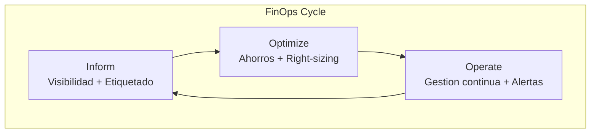
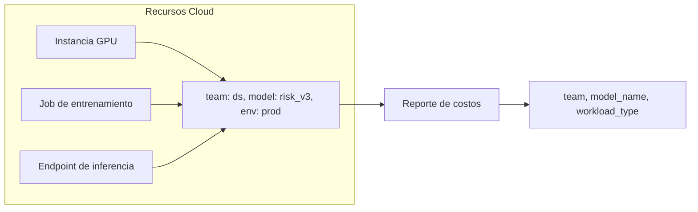
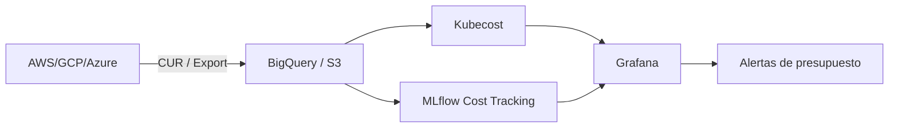
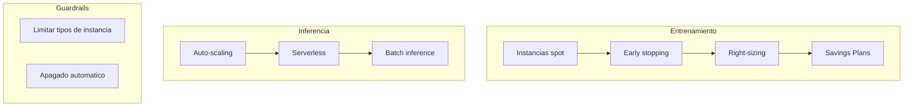
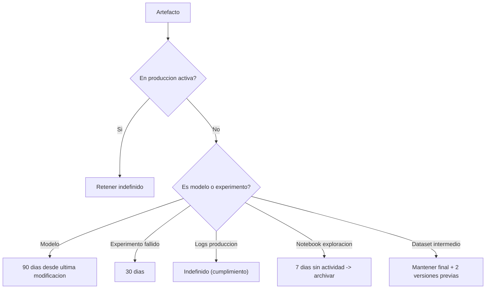
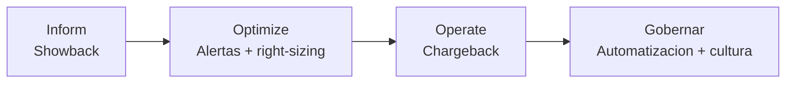

# Gestión de Costos y Eficiencia (FinOps para Sistemas Estadísticos)

## 1. Principio Fundamental

La gestión de costos no es una actividad posterior al desarrollo; es un pilar de diseño.

La pregunta que cada decisión de arquitectura debe responder en paralelo: **¿cumple con los SLOs de rendimiento Y podemos permitirnos ejecutarlo a escala?**

### Ciclo FinOps

## 2. Etiquetado (Tagging): Base de la Visibilidad

Sin etiquetas consistentes, la factura cloud es una lista de ítems sin contexto de negocio. Las cargas de trabajo de ML/estadística rompen el modelo de etiquetado tradicional porque una sola GPU puede servir múltiples modelos y el costo relevante no es la instancia, sino el epoch de entrenamiento o la predicción.

**Etiquetas mínimas requeridas en todos los recursos**:

| Etiqueta | Ejemplo | Propósito |
| --- | --- | --- |
| `team` | `ds-risk-modeling` | Responsabilidad directa |
| `environment` | `dev` / `staging` / `prod` | Separar costos de experimentación de producción |
| `model_name` | `credit_risk_v3` | Rastrear costo por modelo |
| `workload_type` | `training` / `inference` | Identificar etapa del pipeline |
| `cost_center` | `analytics` | Atribución contable |

Automatizar la aplicación de etiquetas via IaC (Terraform, Pulumi). La aplicación manual genera inconsistencias que invalidan los reportes de costo.

### Mapa de etiquetado y agregación de costos

## 3. Herramientas de Monitoreo

| Herramienta | Uso principal |
| --- | --- |
| AWS Cost Explorer / GCP Billing Export → BigQuery | Visibilidad por etiqueta, tendencias, anomalías |
| Kubecost / OpenCost | Costo a nivel de pod en Kubernetes |
| MLflow ≥ 3.10 | Costo por experimento (tokens, llamadas) integrado en el tracking server |
| AWS Budgets / GCP Budgets + Spend Caps | Alertas y límites automáticos de gasto |

### Flujo de monitoreo de costos

**Dashboard mínimo**: gasto diario por `team`, `model_name` y `workload_type`; alerta cuando supera el presupuesto semanal en un 20%.

## 4. Optimización Práctica

### 4.1 Entrenamiento

- **Instancias spot/interrumpibles**: hasta 90% de ahorro para entrenamientos que toleran reinicio desde checkpoint (PyMC admite checkpointing; MLflow guarda el estado por run).
- **Right-sizing**: comenzar con instancias pequeñas; escalar solo cuando el perfil de CPU/RAM lo justifique. Una utilización < 30% indica sobreaprovisionamiento.
- **Early stopping**: detener el entrenamiento cuando la métrica de validación no mejora. Soportado nativamente en PyMC (divergences check) y scikit-learn.
- **Savings Plans**: comprometer uso predecible (1-3 años) para descuentos de hasta 64% en AWS SageMaker.

### 4.2 Inferencia

- **Auto-scaling**: escalar a cero fuera de horario laboral para APIs que no necesitan disponibilidad 24/7.
- **Serverless inference**: para cargas esporádicas (< 100 req/día), elimina el costo de instancias siempre activas.
- **Batch inference**: para predicciones que no requieren baja latencia, 5-10× más económico que endpoints en tiempo real.

### 4.3 Guardrails administrativos

- Limitar los tipos de instancia disponibles por rol (evitar ml.p4d.24xlarge accidentales).
- **Apagado automático de recursos inactivos**: notebooks y workers sin actividad > 60 min se apagan automáticamente. Es la medida de mayor impacto en reducción de desperdicio.

## 5. Retención de Artefactos

Los modelos, datasets y logs se acumulan generando costos de almacenamiento sin valor. Política mínima recomendada:

| Artefacto | Retención |
| --- | --- |
| Modelos en producción activa | Indefinido |
| Modelos en staging / experimentos | 90 días desde última modificación |
| Logs de experimentos fallidos | 30 días |
| Logs de experimentos en producción | Indefinido (cumplimiento) |
| Notebooks de exploración | 7 días sin actividad → archivar |
| Datasets intermedios | Mantener solo versión final + 2 versiones previas |

### Diagrama de decisión para retención de artefactos

Automatizar con políticas de ciclo de vida (S3 Lifecycle, Azure Blob Tiers) y scripts que consulten el linaje de DataHub para identificar artefactos huérfanos (no referenciados por pipelines activos).

## 6. Gobernanza Financiera

**Showback antes que Chargeback**: mostrar los costos a los equipos para crear conciencia antes de descontarlos del presupuesto. Evolucionar a chargeback cuando la asignación sea confiable.

**Revisión quincenal de costos**: revisar los dashboards con el equipo de ingeniería identifica desviaciones antes de que se conviertan en sorpresas al fin de mes.

**Documentar las decisiones de optimización** en `CHANGELOG.md` o `docs/decisions/` junto con las decisiones técnicas: la trazabilidad financiera es parte del registro del proyecto.

### Niveles de madurez FinOps

## 7. Checklist de FinOps

- [ ] Política de etiquetado documentada y aplicada a todos los recursos.
- [ ] Visibilidad de costos por equipo/modelo con actualización diaria.
- [ ] Alertas de presupuesto configuradas para proyectos críticos.
- [ ] Instancias spot habilitadas para entrenamiento no crítico.
- [ ] Apagado automático de notebooks y workers inactivos.
- [ ] Políticas de retención de artefactos automatizadas.
- [ ] Revisión de costos quincenal programada en el calendario del equipo.

## Referencias

- FinOps Foundation: https://www.finops.org/
- AWS FinOps para ML: https://aws.amazon.com/machine-learning/mlops/
- GCP FinOps para AI: https://cloud.google.com/architecture/mlops-continuous-delivery-and-automation-pipelines-in-machine-learning
- Kubecost: https://www.kubecost.com/
- MLflow Cost Tracking: https://mlflow.org/docs/latest/tracing/

## Documentos relacionados

- [Feature Store y Gestión de Features](Feature_Store.md): optimización del almacenamiento y cómputo de features para reducir costos.
- [Monitoreo de Modelos en Producción](Monitoring.md): métricas de rendimiento y costo operativo de los modelos en producción.
- [DataOps para Ingeniería Estadística](DataOps_Statistical_Engineering.md): eficiencia en pipelines de datos y entornos aislados para reducir gasto.
