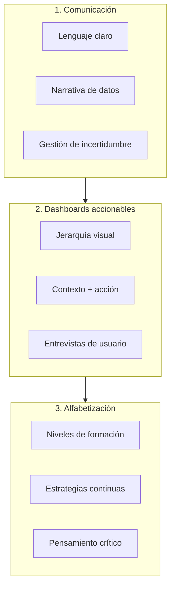
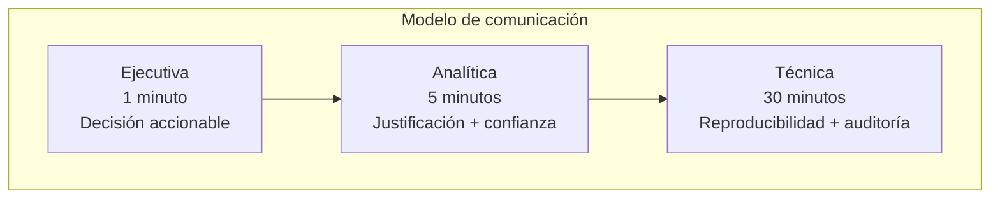
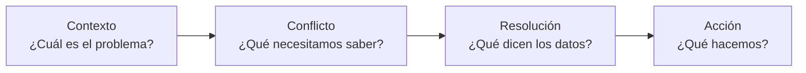
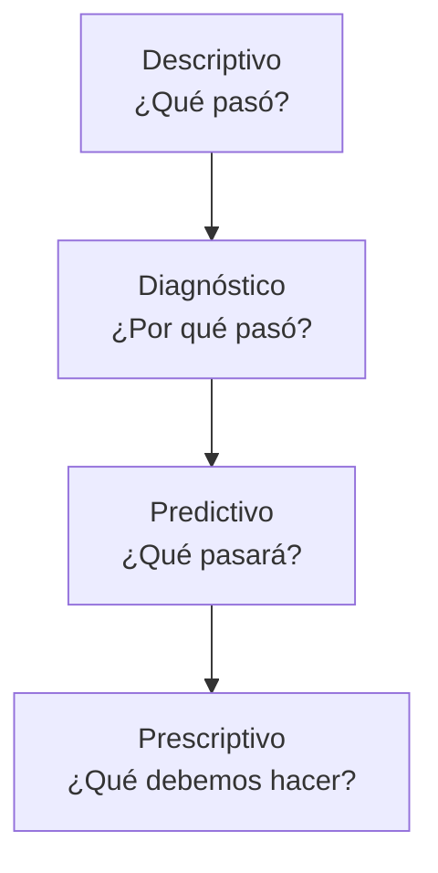
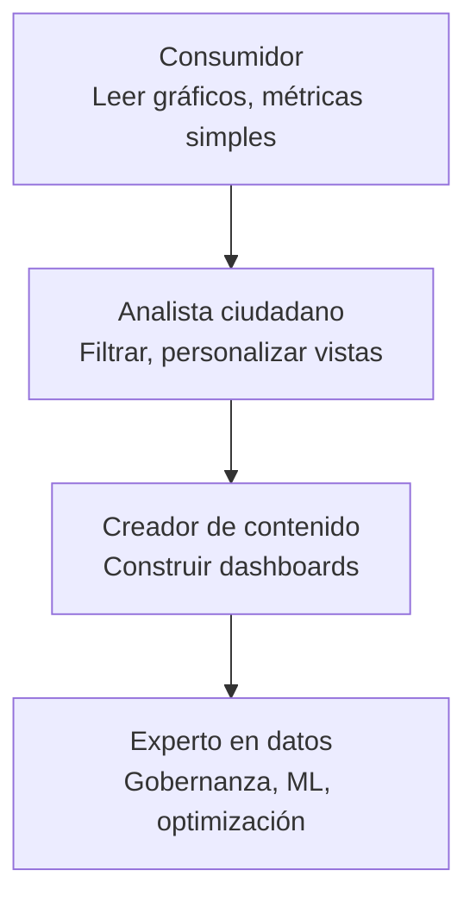
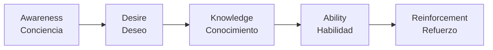

# Cultura de Datos y Alfabetización: El Factor Humano en la Ingeniería de Software Estadístico

## La Brecha Técnica vs. Cultural

Los sistemas de software estadístico más avanzados, los pipelines más robustos y los modelos más precisos fracasan si las personas no confían en ellos, no los entienden o no saben cómo usarlos.  
La cultura de datos no es un “nice to have” opcional: es la piedra angular que sostiene el ecosistema técnico alineado con las decisiones de negocio.

> El software estadístico de alto rendimiento puede existir en un vacío cultural. Pero para crear valor real, debe estar rodeado de un entorno donde los datos se entienden, se cuestionan y se usan para actuar.

Este apartado aborda las habilidades blandas y prácticas organizacionales que transforman un conjunto de dashboards y modelos en un **motor de decisiones basadas en datos**. Se estructura en tres pilares:

-  **Comunicación efectiva con stakeholders**: cómo traducir resultados estadísticos a lenguaje de negocio.
-  **Dashboards accionables**: que no solo informan, sino que impulsan decisiones.
-  **Alfabetización de datos**: estrategias para que toda la organización hable el mismo idioma numérico.

### Diagrama conceptual de los tres pilares

---
## 1. Comunicación Efectiva con Stakeholders

El stakeholder (cliente interno, jefe de producto, gerente) no necesita saber cómo funciona un modelo bayesiano.

### 1.1. El Modelo de Comunicación en Tres Capas

| Capa | Propósito | Contenido típico | Formato |
| --- | --- | --- | --- |
| **Ejecutiva (1 minuto)** | Decisión accionable | Una frase: “Aumenta el presupuesto de marketing en un 15% para el próximo trimestre.” | Reunión, email, Slack |
| **Analítica (5 minutos)** | Justificación y confianza | Efecto estimado, intervalo de credibilidad, principales drivers. | Diapositiva, resumen ejecutivo |
| **Técnica (30 minutos)** | Reproducibilidad y auditoría | Priors, diagnósticos, código, limitaciones. | Documento técnico, notebook |

Cuando presentas a la capa ejecutiva, no muestras el código ni las distribuciones posteriores.

### 1.2. El Arte de Contar una Historia con Datos

Una buena historia de datos sigue una estructura narrativa universal:

1.  **Contexto** (situación actual): ¿Cuál es el problema? ¿Qué sabemos hoy?
2.  **Conflicto** (pregunta analítica): ¿Qué necesitamos saber para mejorar?
3.  **Resolución** (hallazgos): ¿Qué nos dicen los datos? ¿Qué incertidumbre persiste?
4.  **Acción** (siguiente paso): ¿Qué hacemos con esta información?

Ejemplo de narrativa para un modelo de predicción de riesgo:

> *Contexto*: Nuestra tasa de impago ha subido un 8% en los últimos tres trimestres.
> *Conflicto*: Necesitamos saber qué perfiles de cliente son realmente riesgosos.
> *Resolución*: El modelo identifica tres factores clave; los clientes de alto riesgo tienen un 34% de probabilidad de impago (IC 95%: 28%-41%).
> *Acción*: Propongo implementar revisión manual para ese 15% de solicitantes, lo que podría reducir pérdidas un 20% anual.

### 1.3. Lenguaje Claro, No Técnico

Evita la jerga estadística cuando hablas con no especialistas. Usa analogías y términos cotidianos.

| En lugar de... | Di... |
| --- | --- |
| “El intervalo de credibilidad del 95% para el coeficiente es [0.2, 0.5]” | “Estamos 95% seguros de que el efecto real está entre 0.2 y 0.5.” |
| “El modelo tiene un Rhat de 1.02” | “El modelo ha convergido correctamente; las estimaciones son confiables.” |
| “La precisión del modelo es del 87%” | “El modelo acierta 87 de cada 100 predicciones.” |
| “Hay heterocedasticidad en los residuos” | “El error de predicción varía según el nivel de la variable.” |

**Regla de oro:** Si no puedes explicar un concepto en una frase que entienda tu abuela, aún no lo has entendido tú lo suficientemente bien.

### 1.4. Gestión de Expectativas y Manejo de la Incertidumbre

Los stakeholders suelen querer respuestas deterministas (“el próximo mes las ventas serán X”). El deber del analista es comunicar la incertidumbre sin paralizar la decisión.

- **Usa escenarios**: optimista, pesimista, más probable.
- **Cuantifica el riesgo**: “Hay un 15% de probabilidad de que las ventas caigan por debajo del objetivo.”
- **Explica las limitaciones abiertamente**: “Este modelo no captura cambios regulatorios inesperados. Si ocurre uno, la predicción puede ser menos precisa.”

La transparencia genera confianza a largo plazo, aunque a corto plazo parezca que estás dando malas noticias.

---
## 2. Dashboards Accionables: Más Allá de la Información

Un dashboard no es una colección de gráficos bonitos.

### 2.1. La Jerarquía de Dashboards (De lo Descriptivo a lo Prescriptivo)

| Nivel | Pregunta que responde | Ejemplo de acción | Madurez organizacional |
| --- | --- | --- | --- |
| **Descriptivo** | ¿Qué pasó? | “Ventas del último mes: $50K.” | Baja |
| **Diagnóstico** | ¿Por qué pasó? | “Las ventas cayeron un 20% en la región norte por falta de stock.” | Media |
| **Predictivo** | ¿Qué pasará? | “Basado en el modelo, las ventas del próximo mes serán $55K ± $5K.” | Media-Alta |
| **Prescriptivo** | ¿Qué debemos hacer? | “Aumenta el inventario en la región norte en un 30% para evitar rotura de stock.” | Alta |

**Objetivo final**: construir dashboards que automaticen la recomendación, no solo la información.

### 2.2. Principios de Diseño para Dashboards Accionables

| Principio | Descripción | Ejemplo de mal diseño → buen diseño |
| --- | --- | --- |
| **Una página, una historia** | Cada dashboard debe responder a una única pregunta principal. | Mal: 20 KPIs en una sola pantalla. Bien: Dashboard “Salud de la campaña actual”. |
| **Jerarquía visual** | El elemento más importante debe ser el más prominente (posición superior izquierda, tamaño, color). | Mal: El KPI principal está escondido abajo a la derecha. Bien: El indicador de conversión diaria está arriba y en negrita. |
| **Contexto siempre presente** | Un número solo no significa nada. Acompáñalo de referencia: vs. objetivo, vs. período anterior, tendencia. | Mal: “Ventas: 100”. Bien: “Ventas: 100 (+5% vs. objetivo, +2% vs. mes pasado)”. |
| **Facilita la acción** | Cada elemento debería sugerir una acción o tener un botón asociado. | Mal: Gráfico de alerta rojo sin explicación. Bien: “La tasa de abandono superó el umbral → ver detalles / crear campaña de retención”. |
| **Reduce la carga cognitiva** | Usa colores consistentes (verde = bueno, rojo = malo), evita gráficos 3D innecesarios, minimiza la leyenda. | Mal: 10 colores diferentes sin significado. Bien: 3 colores: bueno, neutral, malo. |

### 2.3. El Elemento Humano: Entrevistas de Usuario

Antes de construir un dashboard, entrevista a sus futuros usuarios para entender:

- ¿Qué decisión tomarás con este dashboard?
- ¿Con qué frecuencia? (diaria, semanal, mensual)
- ¿Qué información necesitas para tomar esa decisión?
- ¿Qué te impediría confiar en estos datos?

Una técnica poderosa es el **Job Story**: “Cuando [situación], quiero [motivación] para poder [acción]”.

> “Cuando reviso el rendimiento semanal de ventas, quiero ver qué productos están por debajo del objetivo para poder ajustar el inventario a tiempo.”

El dashboard debe diseñarse para cumplir ese “trabajo”, no para mostrar todas las tablas disponibles.

### 2.4. Ejemplo de Dashboard Accionable (Antes/Después)

**Antes** (dashboard informativo):
- Título: “Reporte de Ventas”
- 15 gráficos: ventas por región, por producto, por vendedor, tendencia mensual, comparativa anual...
- Sin orden, sin contexto, sin llamada a la acción.

**Después** (dashboard accionable):
- Título: “Monitor de decisiones de inventario”
- Parte superior: “Productos con riesgo de rotura de stock” (rojo si stock < punto de pedido). Botón: “Generar orden de compra”.
- Parte media: “Productos con exceso de inventario” (amarillo si stock > stock máximo). Botón: “Crear promoción”.
- Parte inferior: “Tendencia de ventas de los últimos 7 días” (contexto). Sin botón, solo informativo.
- Cada sección responde a una decisión específica: comprar, promocionar, o monitorear.

---
## 3. Alfabetización de Datos: Estrategias para Escalar la Cultura

La alfabetización de datos es la capacidad de leer, trabajar, analizar y argumentar con datos. No se logra con un curso de una semana, sino con una **estrategia continua** que involucra a todos los niveles.

### 3.1. Los Cuatro Niveles de Alfabetización

| Nivel | Audiencia | Capacidades | Formato de formación |
| --- | --- | --- | --- |
| **Consumidor** | Todos (ventas, marketing, operaciones) | Leer un gráfico, entender una métrica, hacer una pregunta simple. | Píldoras de 30 min, ejemplos de su área. |
| **Analista ciudadano** | Usadores frecuentes de dashboards | Crear filtros, personalizar vistas, entender conceptos de agregación. | Talleres de 2 h con ejercicios en la herramienta (Power BI, Looker). |
| **Creador de contenido** | Equipos que preparan dashboards | Construir tableros accionables, unir fuentes de datos, validar calidad. | Curso de 2 días + proyecto tutorizado. |
| **Experto en datos** | Ingenieros, científicos de datos | Gobernanza, modelado avanzado, ML, optimización de pipelines. | Formación continua (certificaciones, conferencias). |

La mayoría de las organizaciones sobreinvierten en el nivel “experto” y descuidan a los consumidores. El resultado: dashboards sofisticados que nadie entiende o usa.

### 3.2. Estrategias Prácticas para Fomentar la Alfabetización

| Estrategia | Descripción | Ejemplo |
| --- | --- | --- |
| **Office Hours de datos** | Sesiones semanales de 1 hora donde cualquier persona puede llevar sus preguntas sobre datos. | “Mi dashboard dice que las ventas cayeron, pero yo veo más pedidos. ¿Qué estoy malinterpretando?” |
| **Glosario de negocio centralizado** | Un wiki o catálogo con definiciones claras de cada métrica, en lenguaje de negocio. | “Tasa de conversión: porcentaje de visitantes que completan una compra. Se calcula como (pedidos / visitas) * 100.” |
| **Data Lunch & Learn** | Charlas informales de 30 min sobre un tema de datos, con ejemplos de la empresa. | “Cómo interpretar intervalos de confianza en los informes de satisfacción al cliente.” |
| **Champions de datos** | Identificar una persona por departamento con afinidad por los datos, darle formación extra, y que sea enlace. | El champion de marketing ayuda a su equipo a formular preguntas claras y valida los dashboards antes de lanzarlos. |
| **Documentación amigable** | No solo código y esquemas técnicos. Escribe guías en tono conversacional, con capturas de pantalla y ejemplos. | “Para saber cuántos clientes nuevos tuvimos ayer, ve al panel ‘Adquisiciones’ y busca la tarjeta ‘Nuevos usuarios’.” |

### 3.3. Fomentar el Pensamiento Crítico

Alfabetización no es solo saber usar herramientas; es **cuestionar los datos** y no tomarlos como verdad absoluta. Promueve preguntas como:

- ¿De dónde vienen estos datos? ¿Quién los recolectó? ¿Con qué frecuencia?
- ¿Hay sesgos en la muestra? ¿Qué no estamos viendo?
- ¿La visualización es engañosa? (ejes truncados, cherry picking)
- ¿Qué incertidumbre hay alrededor de este número?

Crea un **ritual de “revisión de datos”** semanal donde el equipo critique abiertamente las métricas y dashboards. Esto normaliza el escepticismo saludable.

### 3.4. Storytelling con Datos: La Capacidad Final

El nivel más alto de alfabetización es la capacidad de contar una historia convincente que impulse acción. Enseña estas estructuras básicas:

| Estructura | Cuándo usarla | Ejemplo |
| --- | --- | --- |
| **Antes-Después** | Mostrar mejora o impacto | “Antes de la campaña, la retención era del 60%. Después, subió al 75%.” |
| **Causa-efecto** | Explicar por qué ocurrió algo | “El aumento de la temperatura explicó el 80% del incremento en ventas de helados.” |
| **Contraste** | Comparar dos escenarios | “Nuestros clientes de suscripción gastan 3 veces más que los ocasionales.” |
| **Tendencia + anomalía** | Detectar desviaciones | “Las ventas han crecido un 5% cada mes, pero en enero cayeron un 10%. ¿Qué pasó?” |

Incluye ejercicios prácticos en las sesiones de formación: entrega un conjunto de datos simple y pide a cada participante que elabore una historia de 2 minutos para la dirección.

---
## 4. Gestión del Cambio: De los Datos a la Acción

La mejor analítica del mundo no sirve si los equipos no cambian su comportamiento. La gestión del cambio es la disciplina que asegura que los hallazgos se traduzcan en decisiones.

### 4.1. El Modelo ADKAR para la Adopción de Datos

| Fase | Descripción | Acciones concretas |
| --- | --- | --- |
| **Awareness** (Conciencia) | Las personas saben que existe un nuevo dashboard/modelo. | Lanzamiento con demo, email a toda la empresa. |
| **Desire** (Deseo) | Quieren usarlo porque ven el beneficio. | Mostrar casos de éxito de compañeros, vincular el uso a objetivos de equipo. |
| **Knowledge** (Conocimiento) | Saben cómo usarlo. | Formación, documentación, office hours. |
| **Ability** (Habilidad) | Pueden aplicarlo en su día a día. | Ejercicios prácticos, shadowing, acompañamiento inicial. |
| **Reinforcement** (Refuerzo) | Se mantiene en el tiempo. | Incluir el uso del dashboard en las reuniones semanales, celebrar logros, actualizar contenido. |

### 4.2. Indicadores de Éxito de la Cultura de Datos

No basta con lanzar herramientas; hay que medir si la cultura está cambiando. Algunos KPIs útiles:

| KPI | Medición | Objetivo típico |
| --- | --- | --- |
| **Tasa de adopción del dashboard** | Usuarios únicos / usuarios objetivo | > 70% mensual |
| **Tiempo desde que surge una pregunta hasta que se responde con datos** | Medición con encuestas o logs de consultas | Reducir en un 50% en 6 meses |
| **Porcentaje de reuniones donde se mencionan datos** | Observación o autoevaluación | > 80% de las reuniones de decisión |
| **Cantidad de dashboards obsoletos** | Número de dashboards no utilizados en los últimos 30 días | < 10% |
| **Resultado de encuesta de satisfacción** | “Confío en los datos de la empresa” en escala 1-5 | Promedio > 4.0 |

La cultura de datos es el factor más infravalorado en los proyectos de ingeniería de software estadístico. Puedes tener la mejor arquitectura del mundo, pero si los stakeholders no confían en los números, si los dashboards no invitan a la acción, o si los empleados no saben leer un gráfico, el valor nunca se materializará.

Construir una cultura de datos requiere un esfuerzo intencional y continuo, con tres pilares fundamentales:

1.  **Comunicación clara y adaptada a la audiencia** (no jerga, sí contexto).
2.  **Dashboards diseñados para decisiones** (no para información).
3.  **Formación en alfabetización de datos en toda la organización** (no solo para expertos).

Invertir en estas habilidades blandas es tan importante como invertir en la calidad del código.

> La tecnología es el vehículo. La cultura es el motor.

## Documentos relacionados

- [Principios y Prácticas para la Construcción de Sistemas Estadísticos Robustos](Statistical_Software_Principles.md): base técnica sobre la que se construye la cultura de datos.
- [Roadmap de Implementación para Ingeniería de Software Estadístico](Roadmap.md): hoja de ruta para institucionalizar la cultura de datos en la organización.
- [DataOps para Ingeniería Estadística](DataOps_Statistical_Engineering.md): prácticas operativas que refuerzan una cultura de calidad de datos.
