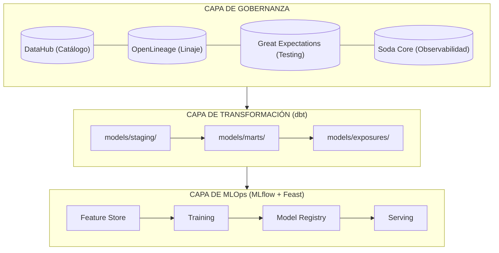

# Estrategia de Datos y Data Governance

La estrategia de datos y su gobernanza efectiva trascienden la validación técnica en los puntos de ingesta. Un sistema de software estadístico profesional requiere una plataforma de metadatos activa (DataHub o OpenMetadata), linaje automático (OpenLineage + dbt), calidad de datos como proceso continuo (Great Expectations + Soda) y políticas de retención y anonimización alineadas con marcos regulatorios como el GDPR.

Esta integración permite que los contratos de datos evolucionen de ser reglas estáticas en código a formar parte de un sistema de gobernanza proactivo y auditable.

Implementar estas capacidades desde etapas tempranas no solo reduce la deuda técnica, sino que construye la base de confianza necesaria para que los productos de datos sean adoptados por tomadores de decisiones en entornos regulados y de alto riesgo.

## 1. Introducción: La Brecha del Contrato de Datos
Los contratos de datos (data contracts) son un primer paso esencial, pero representan apenas la base de la gobernanza. Un contrato garantiza que un dataset cumple un esquema en un punto específico del pipeline, pero no responde preguntas fundamentales para operaciones a escala:

- ¿Qué otros datasets se relacionan con este? ¿Quién los usa?

- Si cambio una columna en la fuente original, ¿qué modelos o dashboards se rompen?

- ¿Cómo evoluciona la calidad de mis datos a lo largo del tiempo?

- ¿Qué datos personales tengo almacenados? ¿Cuánto tiempo debo conservarlos?

Para pasar de un enfoque reactivo ("validar en ingesta") a uno proactivo y estratégico, se requieren cuatro capacidades que esta sección desarrolla: Catálogo de Datos Activo, Linaje Automático, Calidad de Datos como Proceso Continuo y Políticas de Retención y Anonimización.

A continuación, se presentan herramientas y buenas prácticas concretas para implementar cada una de estas capacidades, junto con estrategias de integración y un modelo de madurez para evaluar el progreso.

## 2. Catálogo de Datos Activo

### 2.1. ¿Qué es y por qué va más allá de un simple inventario?

Un catálogo de datos no es una lista estática de tablas y columnas. Es una plataforma de metadatos activa donde confluyen:

- **Metadatos técnicos**: esquemas, tipos, particiones, estadísticas de perfilado.

- **Metadatos de negocio**: descripciones, certificaciones (trusted, gold, pii), etiquetas (PII, financiero, experimental).

- **Metadatos operacionales**: propietarios, frecuencia de actualización, SLAs, logs de calidad.

- **Metadatos de gobernanza**: políticas de retención, linaje certificado, controles de acceso.

Un catálogo activo permite a cualquier miembro del equipo —desde ingenieros hasta analistas y científicos de datos— responder preguntas como: "¿Esta tabla es apta para mi análisis? ¿Quién la mantiene? ¿Con qué frecuencia falla?".

### 2.2. Herramientas de Catálogo de Datos Open Source

| Herramienta | Fortaleza Principal | Caso de Uso Ideal | Hosting |
|-------------|---------------------|-------------------|---------|
| **DataHub** (LinkedIn) | Metadatos técnicos y negocio; linaje; integraciones nativas (dbt, Airflow, Great Expectations). | Organizaciones medianas-grandes que necesitan un catálogo unificado con linaje activo. | On-premise, Kubernetes, Docker Compose. |
| **OpenMetadata** | UI moderna; gobernanza integrada (glossary, tags, workflows de aprobación); conectores amplios. | Equipos que priorizan la experiencia de usuario y los flujos de gobernanza colaborativa. | Kubernetes, Docker. |
| **Amundsen** (Lyft) | Descubrimiento de datos con PageRank; integración fuerte con Apache Atlas para gobernanza. | Entornos con miles de datasets donde el descubrimiento es el dolor principal. | Kubernetes. |

**Recomendación para este proyecto**: DataHub es la opción de referencia por su madurez, comunidad activa y conectores nativos con dbt, Airflow, Great Expectations y OpenLineage.

### 2.3. Implementación: Estrategia por Fases

| Fase | Objetivo | Acciones Concretas |
| --- | --- | --- |
| Fundación | Ingestión automática de metadatos técnicos | Conectar el catálogo al data warehouse y a las bases de datos fuente; configurar escaneo automático de esquemas. |
| Enriquecimiento | Agregar contexto de negocio y gobernanza | Definir glosario de términos de negocio; asignar propietarios y certificación de datasets críticos. |
| Observabilidad | Integrar calidad y linaje | Conectar el catálogo con las herramientas de calidad (Great Expectations, Soda); ingerir logs de ejecución de pipelines. |
| Activación | Gobernar a través del catálogo | Usar el catálogo como motor de políticas (ej. bloquear acceso a datasets PII no certificados). |

Recomendación de adopción: iniciar con un piloto de DataHub conectado solo a datos de entrenamiento de modelos, probar durante 4 semanas y escalar al resto de la plataforma si se cumplen los KPIs (por ejemplo, reducción del 40% en tiempo de búsqueda de datasets).

## 3. Linaje Automático de Datos

### 3.1. Tipos de Linaje

- **Linaje a nivel de columna**: qué columna de origen influye en qué columna de destino.
- **Linaje entre sistemas**: desde una tabla en un data lake hasta una métrica en Power BI o Tableau.
- **Linaje de transformación**: cada operación SQL, regla de calidad o lógica de feature engineering aplicada.

### 3.2. Impact Analysis

| Capacidad | Descripción | Ejemplo |
|-----------|-------------|---------|
| **Impact Analysis** | Antes de modificar una tabla fuente, el catálogo identifica todos los modelos, reportes y APIs que dependen de ella. | Cambiar el tipo de una columna de INT a STRING muestra inmediatamente qué 15 modelos downstream se verían afectados. |

### 3.3. Linaje con OpenLineage y dbt Exposures

**OpenLineage** es un estándar abierto para capturar el linaje de datos entre sistemas. Emite eventos JSON en cada ejecución de pipeline, que pueden centralizarse en DataHub o Marquez.

**dbt Exposures** cierran el linaje hacia los consumidores finales (dashboards, APIs, modelos): definen en `models/exposures/` qué dashboards dependen de cada modelo, y dbt los incluye en el grafo de linaje.

```yaml
# models/exposures/dashboard_ventas.yml
version: 2

exposures:
  - name: dashboard_ventas_mensual
    type: dashboard
    owner:
      name: "equipo-analytics"
      email: "analytics@example.com"
    depends_on:
      - ref('mart_ventas_mensual')
    maturity: high
    url: "https://looker.example.com/dashboards/42"
```

```python
# (ejemplo ejecutable)
# Emitir evento OpenLineage desde un pipeline Python
from openlineage.client import OpenLineageClient
from openlineage.client.run import RunEvent, RunState, Run, Job
import uuid
from datetime import datetime

client = OpenLineageClient(url="http://datahub:5000/api/v1/lineage")

def emit_lineage_event(
    job_name: str,
    input_datasets: list[str],
    output_datasets: list[str],
    run_id: str = None,
):
    run_id = run_id or str(uuid.uuid4())
    event = RunEvent(
        eventType=RunState.COMPLETE,
        eventTime=datetime.utcnow().isoformat() + "Z",
        run=Run(runId=run_id),
        job=Job(namespace="governance-pipeline", name=job_name),
        inputs=[{"namespace": "postgresql://analytics", "name": ds} for ds in input_datasets],
        outputs=[{"namespace": "postgresql://analytics", "name": ds} for ds in output_datasets],
    )
    client.emit(event)
```

## 4. Calidad de Datos como Proceso Continuo

### 4.1. Principios de Calidad de Datos

| Capa | Herramientas | Propósito |
|------|--------------|-----------|
| **Testing de Datos** | Great Expectations, dbt tests | Validar reglas explícitas de negocio en puntos críticos. |
| **Observabilidad** | Soda Core | Monitorear métricas clave y detectar anomalías sin reglas predefinidas. |

**Mejor práctica**: combinar testing (datos críticos, reglas estrictas) con observabilidad (cobertura masiva, detección temprana de anomalías).

### 4.2. Great Expectations en Profundidad

Great Expectations (GE) permite definir, validar y documentar reglas de calidad de datos de forma programática.

**Pasos principales**:

- **Definir Expectativas**: reglas como `expect_column_values_to_not_be_null`, `expect_column_distinct_values_to_be_in_set`.

- **Validar Datos**: ejecutar suites de expectativas sobre batches de datos.

- **Generar Documentación**: crear Data Docs HTML que muestran el estado de calidad de cada dataset.

- **Perfilar Automáticamente**: GE puede generar expectativas automáticamente desde un dataset de referencia.

```yaml
# expectations/ventas_suite.yml
expectation_suite_name: ventas_suite
expectations:
  - expectation_type: expect_column_values_to_not_be_null
    kwargs:
      column: id_venta
  - expectation_type: expect_column_values_to_be_between
    kwargs:
      column: monto
      min_value: 0
      max_value: 100000
  - expectation_type: expect_column_distinct_values_to_equal_set
    kwargs:
      column: estado
      value_set: ["pagado", "pendiente", "reembolsado"]
```

```python
# (fragmento ilustrativo, no ejecutable)
# Ejecutar la suite desde Python
import great_expectations as gx
import pandas as pd

context = gx.get_context()
df = pd.read_parquet("data/ventas.parquet")

validator = context.get_validator(
    batch_request=gx.core.batch.RuntimeBatchRequest(
        datasource_name="pandas_datasource",
        data_connector_name="runtime_connector",
        data_asset_name="ventas",
        runtime_parameters={"batch_data": df},
        batch_identifiers={"run": "daily"},
    ),
    expectation_suite_name="ventas_suite",
)

results = validator.validate()
assert results.success, f"Fallaron {len(results.results)} expectativas"
context.build_data_docs()  # Generar informe HTML
```

### 4.3. Soda Core: Observabilidad Pragmática

Soda Core monitorea métricas clave y usa detección de anomalías para identificar desviaciones inesperadas sin requerir que el usuario defina cada regla.

**Ventajas**:

- Cobertura amplia con mínima configuración.
- Detecta problemas no previstos (ej. cambio sutil en la distribución de ingresos).

**Limitaciones**:

- Genera falsos positivos; necesita validación humana.
- No previene la entrada de datos malos, solo los detecta después.

```yaml
# checks.yml
checks for ventas:
  - row_count > 0
  - missing_count(id_venta) = 0
  - avg(monto) between 100 and 50000
  - anomaly score for stddev(monto) < 3
```

```bash
# Ejecutar checks
soda scan -d analytics -c configuration.yml checks.yml
```

### 4.4. KPIs de Calidad y Alertas

| KPI | Objetivo Recomendado | Método de Medición |
|-----|----------------------|--------------------|
| Tasa de validación de datos críticos | > 99.5% de checks pasando | Great Expectations / dbt test |
| Tiempo medio para detectar incidencias | < 15 minutos | Soda anomalías + alertas |
| Cobertura de linaje de datos | 100% de datasets en producción cubiertos | DataHub / OpenLineage |
| Tiempo medio de resolución | < 1 hora para datasets críticos | Incidencias de Soda / Jira |

**Flujo de alertas recomendado**:

- **SLIs** (Service Level Indicators): freshness, volume, schema, distribution.
- **SLOs** (Service Level Objectives): "99.9% de las tablas críticas tienen freshness < 4 horas".

**Alertas por severidad**:

| Severidad | Canal | Respuesta Esperada |
|-----------|-------|-------------------|
| **P0** (crítica) | Slack #data-incidents + on-call | Respuesta inmediata (< 15 min) |
| **P1** (alta) | Slack equipo ingeniería de datos | < 1 hora |
| **P2** (media) | Jira auto-asignado al propietario | < 4 horas |
| **P3** (baja) | Dashboard de monitoreo | Revisión en siguiente sprint |

## 5. Políticas de Retención y Anonimización

### 5.1. GDPR y Leyes Locales como Marco Obligatorio

El Reglamento General de Protección de Datos (GDPR) establece principios que cualquier estrategia de datos debe cumplir,
especialmente:

- **Minimización de datos**: solo procesar datos personales necesarios para una finalidad específica y legítima.

- **Limitación del almacenamiento**: los datos personales no pueden conservarse indefinidamente; se deben definir plazos de retención basados en la finalidad del procesamiento.

- **Responsabilidad proactiva (accountability)**: documentar todas las decisiones de retención y anonimización.

En Latinoamérica, leyes como la Ley 1581 de 2012 de Colombia o la LGPD de Brasil tienen principios equivalentes y exigen registros de tratamiento similares.

### 5.2. Retención de Datos: Plazos y Automatización

Una política de retención efectiva debe definirse por tipo de dato, plazo máximo y acción posterior:

| Elemento | Descripción | Ejemplo |
|----------|-------------|---------|
| Clasificación por tipo de dato | Datos personales, sensibles, agregados anónimos, datos de entrenamiento. | PII de clientes: 2 años; logs de actividad: 90 días. |
| Particionamiento por fecha | Las tablas se particionan por fecha para permitir eliminación eficiente. | `PARTITION BY DATE(created_at)` en BigQuery/Snowflake. |
| Eliminación automática | Scripts o políticas cloud que borran particiones antiguas. | `DELETE WHERE created_at < CURRENT_DATE - INTERVAL '2 years'`. |

### Ejemplo: Particionamiento por fecha en BigQuery/Snowflake

```sql
-- Crear tabla particionada por fecha (BigQuery / Snowflake)
CREATE TABLE transactions
PARTITION BY DATE(created_at)
AS SELECT * FROM source;

-- Opción 1 (BigQuery): Expiración automática de particiones (recomendado)
ALTER TABLE transactions
SET OPTIONS (
    -- Las particiones con fecha anterior a 2 años se eliminan automáticamente
    partition_expiration_days = 730
);

-- Opción 2 (si no hay expiración automática): Eliminación manual programada
DELETE FROM transactions
WHERE created_at < CURRENT_DATE() - INTERVAL '2 years';
```

En plataformas cloud, servicios como BigQuery Partition Expiration o Snowflake Time Travel automatizan la retención sin scripts adicionales.

### 5.3. Anonimización vs. Seudonimización

Es fundamental distinguir ambos conceptos, ya que tienen implicaciones legales radicalmente diferentes:

| Técnica | Definición | Efecto Legal | Uso Típico |
|---------|------------|--------------|------------|
| **Anonimización** | Eliminación irreversible de la identificación; no se puede reidentificar incluso combinando con otros datos. | Fuera del alcance del GDPR: dejan de ser datos personales. | Datos agregados para investigación; datasets públicos. |
| **Seudonimización** | Reemplazo de identificadores por pseudónimos (tokens, hashes con sal); el reidentificador se almacena separadamente. | Sigue siendo dato personal, pero reduce el riesgo. | Logs de analítica; datasets de entrenamiento internos. |

### 5.4. Datos Sintéticos Realistas para Entrenamiento de Modelos

Las técnicas anteriores son adecuadas para proteger datos en producción, pero presentan una limitación crítica para proyectos estadísticos y de ML: **no preservan las correlaciones y distribuciones conjuntas** necesarias para entrenar modelos con utilidad estadística equivalente a la de los datos originales.

La sustitución campo a campo con `Faker` genera registros sintéticos donde cada columna es independiente de las demás. Un modelo entrenado sobre esos datos aprenderá correlaciones incorrectas o inexistentes.

**Herramientas para datos sintéticos estadísticamente consistentes**:

| Herramienta | Enfoque | Casos de uso | Referencia |
| --- | --- | --- | --- |
| **SDV (Synthetic Data Vault)** | Modelos probabilísticos (GaussianCopula, CTGAN, CopulaGAN) que aprenden la distribución conjunta del dataset original | Tablas únicas y relacionadas; datos mixtos (numérico + categórico) | https://sdv.dev/ |
| **Gretel Synthetics** | GAN y LSTM para datos tabulares, con evaluación de calidad integrada y API cloud/local | Datos sensibles regulados; reportes de calidad automáticos | https://gretel.ai/ |
| **CTGAN / TVAE** | Conditional Tabular GAN y Variational Autoencoder para datos tabulares con valores faltantes y distribuciones sesgadas | Cuando GaussianCopula no captura relaciones complejas | Incluido en SDV |
| **Mostlyai** | Plataforma comercial con motor basado en transformers | Escenarios empresariales con requisitos de compliance estrictos | https://mostly.ai/ |

**Ejemplo con SDV (open source)**:

```python
# (fragmento ilustrativo, no ejecutable)
from sdv.single_table import GaussianCopulaSynthesizer
from sdv.metadata import SingleTableMetadata
import pandas as pd

# Detectar metadata automáticamente desde el dataset real
metadata = SingleTableMetadata()
metadata.detect_from_dataframe(df_real)

# Entrenar el sintetizador sobre los datos reales
synthesizer = GaussianCopulaSynthesizer(metadata)
synthesizer.fit(df_real)

# Generar N registros sintéticos que preservan distribución conjunta
df_synthetic = synthesizer.sample(num_rows=10_000)

# Evaluar calidad estadística: columna a columna y pairwise correlaciones
from sdv.evaluation.single_table import evaluate_quality
quality_report = evaluate_quality(df_real, df_synthetic, metadata)
print(quality_report.get_score())  # Score [0,1]; > 0.85 es aceptable
```

**Cuándo usar cada enfoque**:
- `Faker` (campo a campo): solo para poblar bases de datos de desarrollo donde las correlaciones no importan (pruebas de UI, fixtures de API).
- `SDV / CTGAN`: cuando el dato sintético va a usarse para entrenar o evaluar modelos estadísticos — es el estándar mínimo.
- `Gretel` o `Mostlyai`: cuando el proyecto tiene requisitos regulatorios de privacidad formal (privacy guarantee cuantificable) o cuando se requieren reportes de calidad auditables.
### 5.5. Plan de Retención y Anonimización para Software Estadístico

```yaml
# data_retention_policy.yaml
version: "2.0"
effective_date: 2026-06-01

policy_by_data_class:
  raw_pii:
    types: ["name", "email", "phone", "id_number"]
    retention_days: 90
    action: "anonymize after 90 days (replace with hash_salt)"
    reviewer: "Data Privacy Officer"

  pseudonymous_analytics:
    types: ["hashed_user_id", "event_timestamp", "product_category"]
    retention_days: 730  # 2 years
    action: "delete after 730 days"
    reviewer: "Data Engineer Lead"

  model_training_features:
    types: ["feature_vector", "label", "split"]
    retention_days: 365
    action: "anonymize after 365 (add Laplace noise)"
    reviewer: "ML Engineer Lead"

  audit_logs:
    types: ["user_action", "api_call", "model_prediction"]
    retention_days: 1825  # 5 years (regulatory requirement)
    action: "export to cold storage then delete from production"
    reviewer: "Compliance Officer"

exceptions:
  - data_subject_request_id: "DSR-2026-001"  # litigation hold
    frozen_until: "2027-01-01"
    data_classes: ["raw_pii"]
```

## 6. Integración con el Ecosistema de Ingeniería de Software Estadístico

El catálogo, el linaje, la calidad y las políticas de retención no funcionan de forma aislada. Su integración con el ciclo de vida de modelos y pipelines estadísticos es esencial para la gobernanza efectiva.

### 6.1. Arquitectura de Referencia Integrada



### 6.2. Políticas Derivadas de Metadatos

El catálogo de metadatos no solo documenta: puede activar políticas automáticas cuando ciertos triggers se cumplen:

| Metadato | Política Derivada | Trigger Automático |
|----------|-------------------|-------------------|
| `data_class = "raw_pii"` y `age > 90 days` | Anonimización (reemplazar PII con hash + sal) | Script semanal que consulta la API de DataHub. |
| `data_class = "audit_logs"` y `age > 1825 days` | Exportar a cold storage y eliminar de producción | Job mensual que mueve particiones a S3 Glacier. |
| `model_version` en producción > 30 días sin actualización | Marcar como candidato a archivado | MLflow Model Registry event → DataHub → notificación. |
| `soda_health_score < 0.7` por más de 7 días | Crear incidente de calidad de datos automático | Webhook de Soda → Jira API → ticket al propietario. |
## 7. Recomendaciones para la Implementación

### 7.1. Modelo de Madurez de Gobernanza de Datos

| Nivel | Catálogo | Linaje | Calidad | Retención/Anonimización |
|-------|----------|--------|---------|-------------------------|
| **Inicial** | Inventario manual en documentos | Inexistente o solo en SQL scripts | Validaciones puntuales en ingesta | Sin políticas documentadas |
| **Gestionado** | Catálogo automático (DataHub/OpenMetadata) | Linaje a nivel de tabla desde dbt | Great Expectations en datasets críticos | Políticas documentadas pero manuales |
| **Definido** | + Metadatos de negocio y propietarios | Linaje columnar + OpenLineage + exposures en BI | Soda observabilidad + GE testing | Retención automática por scripts + anonimización seudónima |
| **Gobernado** | + Políticas activas y certificación | Linaje en tiempo real + impact analysis | Calidad como servicio (alertas, SLIs, SLOs) | Anonimización diferencial + auditoría automatizada |
| **Optimizado** | ML/AI para recomendación de datasets y linaje predictivo | Linaje predictivo de impacto de cambios | Calidad preventiva (antes de que ocurra el error) | Retención adaptativa por uso y valor del dato |

### 7.2. Recomendaciones para el Lanzamiento

| Prioridad | Acción | Herramienta | Resultado Esperado |
|-----------|--------|-------------|--------------------|
| 1 | Desplegar DataHub en modo básico (solo metadatos técnicos) | Docker Compose de DataHub (quickstart) | Visibilidad centralizada de tablas, columnas y particiones. |
| 2 | Conectar dbt y Airflow a DataHub usando conectores nativos | dbt-metadata-ingestion + OpenLineage | Linaje a nivel de tabla sin esfuerzo manual. |
| 3 | Definir Great Expectations para 3-5 datasets críticos | Great Expectations + DataHub Assertion entity | Validación automática en los pipelines más importantes. |
| 4 | Establecer política de retención documentada para datos personales | Plantilla basada en sección 5.5, revisada con DPO | Base para cumplir con requisitos regulatorios desde el inicio. |

---

## Apéndice A: Tabla de Herramientas

| Herramienta | Propósito | Enlace |
|-------------|-----------|--------|
| DataHub | Catálogo de metadatos activo | https://datahubproject.io/ |
| OpenMetadata | Catálogo de metadatos open source | https://open-metadata.org/ |
| OpenLineage | Estándar de linaje | https://openlineage.io/ |
| dbt | Transformaciones SQL + linaje | https://www.getdbt.com/ |
| Great Expectations | Testing de datos | https://greatexpectations.io/ |
| Soda Core | Observabilidad de datos | https://www.soda.io/ |
| SDV | Datos sintéticos | https://sdv.dev/ |

## Apéndice B: Glosario

| Término | Definición |
|---------|------------|
| **Metadatos técnicos** | Esquemas, tipos de datos, particiones y estadísticas de almacenamiento. |
| **Metadatos de negocio** | Descripciones, etiquetas (PII, gold), certificaciones y propietarios. |
| **Linaje** | Trazabilidad del flujo de datos desde fuentes hasta consumidores finales. |
| **Point-in-time correctness** | Garantía de que un dataset de entrenamiento solo use datos disponibles hasta el momento del evento. |
| **Anonimización** | Eliminación irreversible de la identificación; el dato deja de ser personal. |
| **Seudonimización** | Reemplazo de identificadores por tokens; el dato sigue siendo personal pero con riesgo reducido. |
| **Data contract** | Especificación formal de esquema, calidad y SLAs para un dataset. |
## Documentos relacionados

- [DataOps para Ingeniería Estadística](DataOps_Statistical_Engineering.md): pipelines de datos como código y contratos de datos.
- [Gestión de Secretos en Contenedores con Vault](Secrets_Management.md): protección de credenciales y datos sensibles en entornos productivos.
- [Checklist Unificado: Cumplimiento Regulatorio y MLOps](MLOps_Compliance_Checklist.md): verificaciones de calidad y cumplimiento para auditorías.
- [Monitoreo de Modelos en Producción](Monitoring.md): calidad de datos continua y detección de drift post-despliegue.
