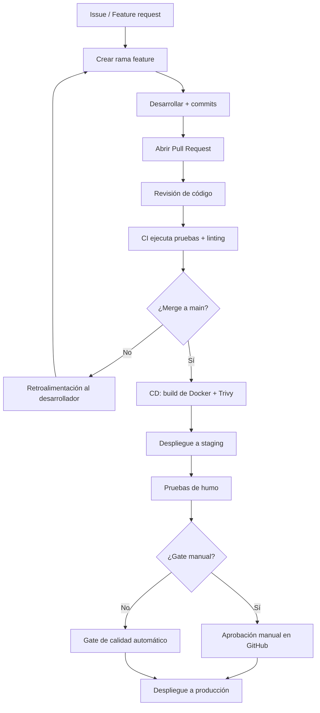
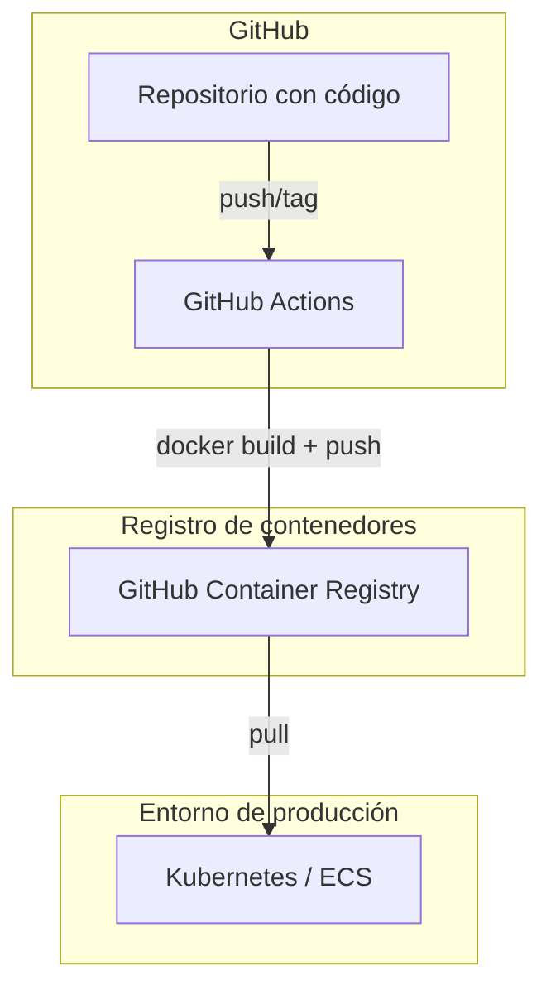

# Guía de Despliegue: CI/CD y Docker para Sistemas Estadísticos

Esta guía cubre el ciclo completo de despliegue: desde el primer commit hasta la producción, integrando GitHub Actions, Docker, MLflow y buenas prácticas de MLOps.

---

## 1. ¿Por qué CI/CD y Docker son indispensables en estadística?

La combinación de **CI/CD** (Integración Continua / Despliegue Continuo) y **Docker** no es un lujo: es un requisito para sistemas estadísticos profesionales.

### 1.1 CI/CD: automatización de la confianza

En un proyecto estadístico, los cambios frecuentes en datos, modelos y código hacen que el despliegue manual sea inviable y peligroso. CI/CD automatiza:

- **Reproducibilidad**: cada ejecución del pipeline captura el entorno exacto (dependencias, versión de datos, hash de Git). Si un modelo funcionaba hace tres meses, se puede reconstruir exactamente.
- **Calidad continua**: antes de cualquier despliegue se ejecutan pruebas unitarias, de integración, validación de datos y gates de calidad (R-hat, ESS, AUC). Si algo falla, el pipeline se detiene.
- **Detección temprana de errores**: un error en una transformación de datos se detecta minutos después del commit, no semanas después en producción.
- **Auditoría y trazabilidad**: cada despliegue queda asociado a un `run_id` de MLflow, un hash de Git y un hash DVC del dataset. Esto permite responder preguntas regulatorias: "¿con qué datos se entrenó el modelo en producción el 15 de marzo?".

> **Truco de experto**: guarda el hash de Git y el hash de DVC como parámetros en MLflow. Así, desde el modelo registrado puedes recuperar exactamente el código y los datos que lo generaron.

### 1.2 Docker: el entorno como código

Docker permite empaquetar la aplicación con todo su entorno: sistema operativo, lenguajes, librerías y variables de entorno. Esto elimina el clásico "en mi máquina funciona". Un contenedor garantiza que el mismo código se ejecute idénticamente en desarrollo, staging, producción o en la máquina de cualquier colaborador.

Por qué Docker es crítico para estadística:

- Dependencias conflictivas: un proyecto puede necesitar Python 3.11 y otro Python 3.8; Docker los aísla.
- Reproducibilidad de análisis pasados: guardando la imagen Docker junto con el código, puedes recrear el entorno exacto de un análisis de hace un año.
- Despliegue en cualquier orquestador (Kubernetes, ECS, Nomad) sin cambios en la aplicación.

---

## 2. Principios clave del pipeline

- **Falla rápido**: cada paso falla inmediatamente si hay errores de calidad, pruebas o vulnerabilidades. No se continúa al siguiente paso.
- **Trazabilidad**: cada despliegue a producción tiene un `run_id` de MLflow, un hash de Git y un hash DVC del dataset. Todos se registran en logs y en el model registry.
- **Separación de concerns**: los workers de entrenamiento (Celery) son independientes de los workers de la API (Uvicorn). Cada uno se escala por separado según la carga.
- **Staging obligatorio**: ningún cambio va directo a producción. Siempre pasa por staging, donde se ejecutan pruebas de humo y validación de latencia.
- **Promoción manual o con gate automático**: la promoción a producción puede ser manual (para modelos críticos) o automática (si el gate de calidad pasa). Ver [MLflow y Gestión de Modelos](MLflow.md).

---

## 3. Flujo de trabajo completo (paso a paso)

### 3.1 Diagrama general



### 3.2 Explicación de cada etapa

1. **Creación de rama feature**: se ramifica desde `main` con nombre `feature/descripcion`. Los experimentos se hacen aquí sin afectar la rama principal.
2. **Desarrollo y commits**: se escribe código y se suben los cambios. Cada commit debería pasar las pruebas localmente antes de hacer push.
3. **Pull Request**: se abre un PR contra `main`. Automáticamente, GitHub Actions ejecuta el pipeline de CI (linting, pruebas unitarias, integración).
4. **Revisión de código**: al menos un revisor aprueba el PR. La revisión debe verificar no solo el código, sino también decisiones estadísticas (elección de priors, validaciones, etc.).
5. **Merge a main**: una vez aprobado, se fusiona. Este evento dispara el pipeline de CD.
6. **Build de Docker + Trivy**: se construye la imagen y se verifica que no tenga vulnerabilidades críticas.
7. **Despliegue a staging**: se actualiza el entorno de staging con la nueva imagen.
8. **Pruebas de humo**: se ejecutan pruebas rápidas: health endpoint, predicción sobre registros de ejemplo, latencia < 200 ms.
9. **Gate de calidad**: automático (métricas de modelo) o manual (aprobación en GitHub).
10. **Despliegue a producción**: la imagen se despliega en el entorno de producción.

---

## 4. Secuencia detallada del pipeline

```text
push/PR a main
  → lint + format (Ruff, Black)
  → unit tests (pytest, cobertura ≥ 80%)
  → integration tests (Docker DB efímera)
  → data contract validation (pandas / Great Expectations)
  → DVC checkout + entrenamiento (Celery worker)
  → MLflow gate de calidad (R-hat, ESS, AUC, etc.)
  → Docker build + Trivy scan
  → deploy staging
  → smoke tests (health, predict, latencia < 200ms)
  → [aprobación manual o gate automático]
  → deploy production
```

Cada paso está en un job separado dentro de GitHub Actions para que se puedan ejecutar en paralelo cuando sea posible.

---

## 5. Pipeline completo con GitHub Actions

El siguiente workflow se activa con cada push a `main` y también puede ejecutarse manualmente (`workflow_dispatch`).

```yaml
name: MLflow Training Pipeline

on:
  push:
    branches: [main]
  workflow_dispatch:

jobs:
  train-and-validate:
    runs-on: ubuntu-latest
    steps:
      - uses: actions/checkout@v4
        with:
          fetch-depth: 0  # Necesario para DVC (todo el historial)

      - name: Setup Python
        uses: actions/setup-python@v4
        with:
          python-version: "3.11"

      - name: Install dependencies
        run: pip install poetry && poetry install --sync

      - name: DVC checkout
        run: |
          dvc remote modify origin --local access_key_id ${{ secrets.AWS_ACCESS_KEY }}
          dvc pull
        env:
          AWS_SECRET_ACCESS_KEY: ${{ secrets.AWS_SECRET_KEY }}

      - name: Linting
        run: ruff check . && black --check .

      - name: Unit tests
        run: pytest tests/unit/ --cov=src --cov-report=xml

      - name: Integration tests
        run: pytest tests/integration/ -v

      - name: Data contract validation
        run: python scripts/validate_data_contract.py

      - name: Train model
        run: python -m src.pipelines.training
        env:
          MLFLOW_TRACKING_URI: ${{ secrets.MLFLOW_TRACKING_URI }}
          DATABASE_URL: ${{ secrets.DATABASE_URL }}

  build-and-scan:
    needs: train-and-validate
    runs-on: ubuntu-latest
    steps:
      - uses: actions/checkout@v4

      - name: Build Docker image
        run: docker build -t statistical-api:${{ github.sha }} .

      - name: Scan for vulnerabilities
        uses: aquasecurity/trivy-action@master
        with:
          image-ref: statistical-api:${{ github.sha }}
          exit-code: "1"
          severity: CRITICAL

      - name: Push to GHCR
        run: |
          echo ${{ secrets.GHCR_TOKEN }} | docker login ghcr.io -u ${{ github.actor }} --password-stdin
          docker push ghcr.io/${{ github.repository }}/statistical-api:${{ github.sha }}

  deploy-staging:
    needs: build-and-scan
    runs-on: ubuntu-latest
    steps:
      - name: Deploy to staging
        run: ./scripts/deploy_staging.sh ${{ github.sha }}

      - name: Smoke tests
        run: pytest tests/smoke/ --base-url=https://staging.api.example.com

  deploy-production:
    needs: deploy-staging
    runs-on: ubuntu-latest
    if: github.event_name == 'workflow_dispatch'  # Solo manual a producción
    environment:
      name: production
      url: https://api.example.com
    steps:
      - name: Deploy to production
        run: ./scripts/deploy_production.sh ${{ github.sha }}
```

> **Truco de experto**: usa `if: github.event_name == 'workflow_dispatch'` para que el despliegue a producción sea siempre manual. Si prefieres automático, cambia la condición a `if: always()` y añade un gate de calidad dentro del job.

---

## 6. Docker: buenas prácticas profundizadas

### 6.1 Dockerfile para la API (Python + FastAPI)

```dockerfile
FROM python:3.11-slim

WORKDIR /app

# 1. Copiar archivos de dependencias (primero lo que menos cambia)
COPY pyproject.toml poetry.lock ./
RUN pip install poetry && \
    poetry config virtualenvs.create false && \
    poetry install --no-interaction --no-ansi

# 2. Crear usuario no root (seguridad)
RUN useradd -m appuser
USER appuser

# 3. Copiar el resto del código (último para aprovechar caché)
COPY . .

# 4. Healthcheck (crítico para orquestadores)
HEALTHCHECK --interval=30s --timeout=5s \
  CMD curl -f http://localhost:8000/health || exit 1

EXPOSE 8000

CMD ["uvicorn", "interfaces.api.main:app", "--host", "0.0.0.0", "--port", "8000"]
```

Buenas prácticas aplicadas en este Dockerfile:

- **Imagen base `-slim`**: mucho más pequeña que la completa, reduce la superficie de ataque.
- **Orden de capas**: dependencias al principio, código al final. Cuando cambias solo el código, Docker reutiliza la capa de dependencias en caché, acelerando el build.
- **Usuario no root**: si un atacante compromete el contenedor, no tiene privilegios de root.
- **Healthcheck**: permite a Kubernetes o ECS reiniciar automáticamente el contenedor si falla.

### 6.2 Dockerfile para dashboard (Next.js)

```dockerfile
FROM node:18-alpine AS builder

WORKDIR /app
COPY package*.json ./
RUN npm ci
COPY . .
RUN npm run build

FROM node:18-alpine
WORKDIR /app
COPY --from=builder /app/.next ./.next
COPY --from=builder /app/public ./public
COPY --from=builder /app/package*.json ./
RUN npm ci --only=production

EXPOSE 3000
CMD ["npm", "start"]
```

> **Truco**: el patrón multi-stage build (etapas `builder` y `runner`) reduce drásticamente el tamaño de la imagen final: el código fuente y las dependencias de desarrollo no se incluyen en la imagen de producción.

### 6.3 Docker Compose completo

```yaml
version: "3.9"

services:
  mlflow:
    image: ghcr.io/mlflow/mlflow:latest
    ports:
      - "5000:5000"
    command: >
      mlflow server
      --host 0.0.0.0
      --port 5000
      --backend-store-uri sqlite:///mlflow.db
      --default-artifact-root /mlruns
    volumes:
      - ./mlruns:/mlruns
      - ./mlflow.db:/mlflow.db

  api:
    build: .
    ports:
      - "8000:8000"
    environment:
      - MLFLOW_TRACKING_URI=http://mlflow:5000
    depends_on:
      - mlflow
    volumes:
      - ./data:/app/data
      - ./models:/app/models

  dashboard:
    build: ./dashboard
    ports:
      - "3000:3000"
    environment:
      # ¡OJO! Dentro del contenedor "api" es el nombre del servicio, no localhost
      - NEXT_PUBLIC_STATS_API_URL=http://api:8000
    depends_on:
      - api
```

> **Error común**: usar `localhost:8000` en `NEXT_PUBLIC_STATS_API_URL` dentro del contenedor del dashboard. Esto falla porque cada contenedor tiene su propia red virtual. La solución es usar el nombre del servicio (`api`).

### 6.4 Tabla de buenas prácticas Docker

| Práctica | Justificación |
| -------- | ------------- |
| Imágenes base ligeras (`-slim`, `-alpine`) | Menor tamaño y menor superficie de ataque. |
| Capas ordenadas (dependencias antes que código) | Maximiza la caché de Docker; rebuilds más rápidos. |
| Usuario no root (`RUN useradd`, `USER`) | Reduce el riesgo si el contenedor es comprometido. |
| Secretos en variables de entorno, nunca en la imagen | Evitar leakage de credenciales en el registro. |
| `HEALTHCHECK` definido | El orquestador detecta y reinicia contenedores caídos. |
| Logs a `stdout`/`stderr` | Los orquestadores (Kubernetes, ECS) los capturan automáticamente. |
| Etiquetado semántico + commit SHA | Trazabilidad: saber exactamente qué código está en producción. |

---

## 7. Integración de GitHub y Docker (CI/CD completo)

### 7.1 Diagrama de flujo integrado



### 7.2 Workflow de construcción y publicación de imágenes

Este workflow es independiente del entrenamiento y se activa al crear un tag semántico (`v*`).

```yaml
# .github/workflows/docker-build.yml
name: Build and Push Docker Image

on:
  push:
    tags:
      - 'v*'

jobs:
  build:
    runs-on: ubuntu-latest
    steps:
      - uses: actions/checkout@v4

      - name: Log in to GHCR
        uses: docker/login-action@v3
        with:
          registry: ghcr.io
          username: ${{ github.actor }}
          password: ${{ secrets.GITHUB_TOKEN }}

      - name: Build and push
        uses: docker/build-push-action@v5
        with:
          context: .
          push: true
          tags: |
            ghcr.io/${{ github.repository }}:latest
            ghcr.io/${{ github.repository }}:${{ github.ref_name }}
```

> **Truco**: usa dos tags: `latest` (para desarrollo) y la versión semántica (para producción). Así puedes hacer rollback fácilmente apuntando al tag anterior.

---

## 8. Gate de calidad automático

El siguiente script se ejecuta después del entrenamiento y decide si promueve el modelo a staging.

```python
# (ejemplo ejecutable)
# Requiere: mlflow instalado y servidor activo en MLFLOW_TRACKING_URI
# Uso: python scripts/quality_gate.py <model_name> <run_id>
import mlflow
import sys
from mlflow.tracking import MlflowClient


def evaluate_and_promote(model_name: str, run_id: str, min_auc: float = 0.88) -> bool:
    client = MlflowClient()
    run = client.get_run(run_id)
    auc = run.data.metrics.get("auc")
    rhat = run.data.metrics.get("rhat_max")
    ess = run.data.metrics.get("ess_min")

    if auc >= min_auc and rhat < 1.01 and ess > 400:
        client.set_registered_model_alias(model_name, "staging", run.info.run_id)
        print(f"Modelo {run_id} promovido a staging (AUC={auc:.4f}, R-hat={rhat:.4f})")
        return True
    else:
        print(f"Gate fallado: AUC={auc}, R-hat={rhat}, ESS={ess}")
        return False


if __name__ == "__main__":
    model_name = sys.argv[1]
    run_id = sys.argv[2]
    success = evaluate_and_promote(model_name, run_id)
    sys.exit(0 if success else 1)
```

En el workflow de GitHub Actions, después del entrenamiento:

```yaml
- name: Quality gate
  run: python scripts/quality_gate.py StatisticalModel ${{ steps.run.outputs.run_id }}
```

---

## 9. Pruebas de humo en staging

Guarda esto en `tests/smoke/test_smoke_staging.py`.

```python
# (ejemplo ejecutable)
# Requiere: pip install requests pytest
# Ejecución: pytest tests/smoke/ -v --base-url=https://staging.api.example.com
import time

import pytest
import requests

BASE_URL = "https://staging.api.example.com"


def test_health_endpoint():
    r = requests.get(f"{BASE_URL}/health", timeout=5)
    assert r.status_code == 200
    assert r.json()["status"] == "ok"


def test_predict_latency():
    payload = {"x1": 1.0, "x2": 0.5}
    start = time.time()
    r = requests.post(f"{BASE_URL}/predict", json=payload, timeout=10)
    latency_ms = (time.time() - start) * 1000
    assert r.status_code == 200
    assert latency_ms < 200, f"Latencia demasiado alta: {latency_ms:.2f}ms"


def test_predict_output_format():
    payload = {"x1": 1.0, "x2": 0.5}
    r = requests.post(f"{BASE_URL}/predict", json=payload, timeout=10)
    data = r.json()
    assert "prediction" in data
    assert "model_version" in data
    assert isinstance(data["prediction"], (int, float))
```

Ejecución en el pipeline:

```yaml
- name: Smoke tests
  run: pytest tests/smoke/ -v --base-url=${{ secrets.STAGING_URL }}
```

---

## 10. Checklist de despliegue

- [ ] El pipeline de CI/CD pasa todas las pruebas (unitarias, integración, contrato de datos).
- [ ] La imagen Docker se construye sin errores y tiene menos de 500 MB.
- [ ] Trivy no encuentra vulnerabilidades `CRITICAL` en la imagen.
- [ ] La imagen está etiquetada con el commit SHA y con la versión semántica.
- [ ] El entorno de staging se actualiza correctamente.
- [ ] Las pruebas de humo pasan (health, predict, latencia).
- [ ] El gate de calidad promueve el modelo a staging.
- [ ] La aprobación manual (si aplica) ha sido concedida.
- [ ] El despliegue a producción no falla y el modelo responde en producción.
- [ ] Los logs de auditoría contienen el `run_id` de MLflow y el hash de Git.

---

## Documentos relacionados

- [MLflow y Gestión de Modelos](MLflow.md) — registro y promoción de modelos dentro del pipeline CI/CD.
- [Pruebas de Integración](Integration_Tests.md) — suite de tests ejecutada en cada stage del pipeline.
- [Gestión de Secretos y Vault](Secrets_Management.md) — inyección segura de credenciales en contenedores.
- [Rollback de Modelos](Rollback.md) — estrategias de reversión cuando el despliegue falla.
- [Checklist Compliance MLOps](MLOps_Compliance_Checklist.md) — verificaciones completas antes de ir a producción.
- [Costos y Eficiencia](Cost_Efficiency.md) — FinOps para sistemas estadísticos.

---

## Referencias y recursos externos

- [GitHub Actions documentation](https://docs.github.com/en/actions)
- [Dockerfile reference](https://docs.docker.com/reference/dockerfile/)
- [Trivy vulnerability scanner](https://github.com/aquasecurity/trivy)
- [MLflow Project](https://mlflow.org)
- [DVC (Data Version Control)](https://dvc.org)
