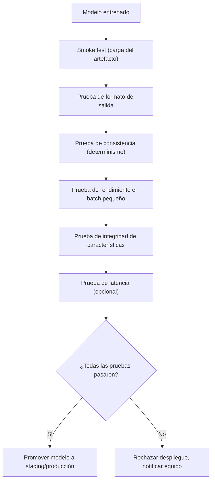
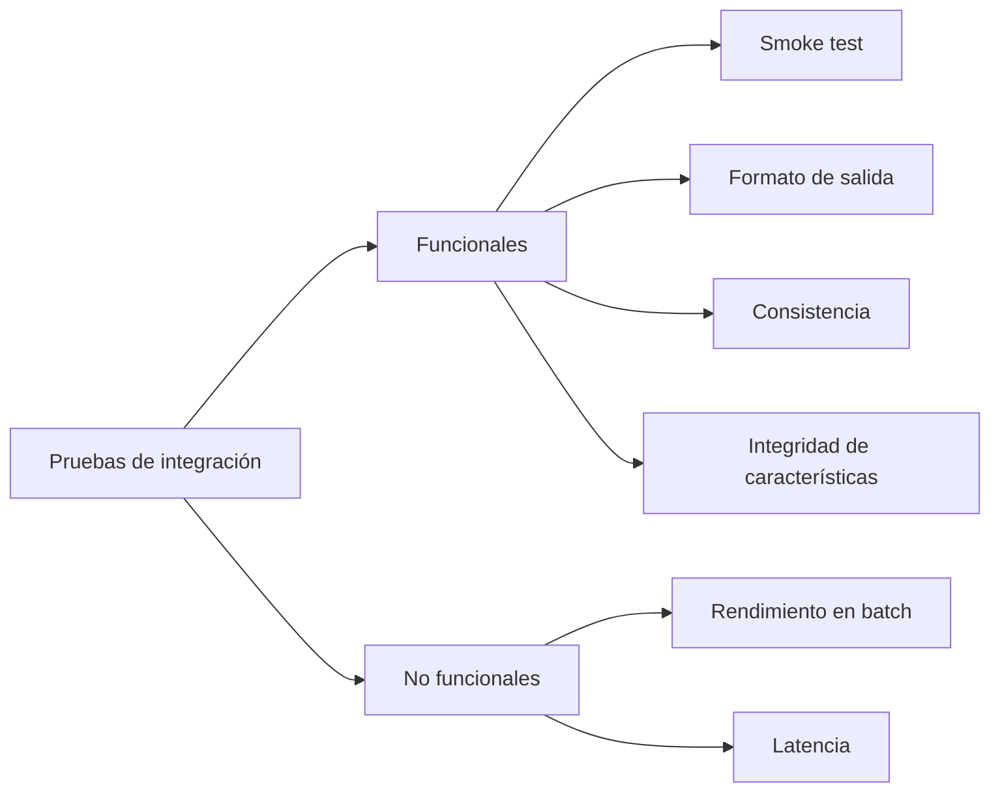
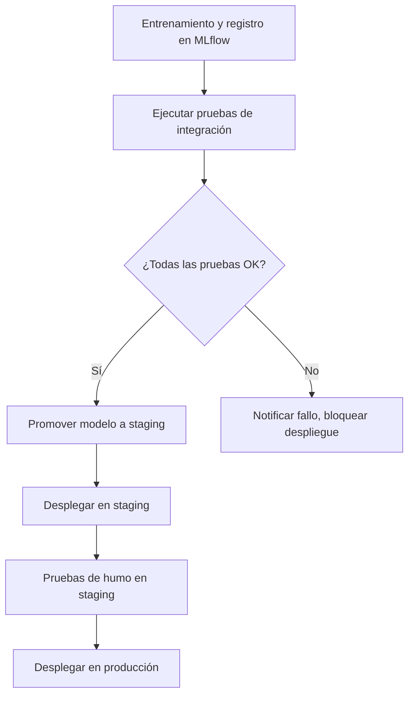

# Pruebas de Integración para Modelos Estadísticos

---

## 1. Introducción

Después de entrenar un modelo y antes de desplegarlo en producción, es esencial ejecutar **pruebas de integración** que verifiquen:

- El artefacto del modelo (`.pkl`, `.rds`, etc.) es válido y se puede cargar.
- Las predicciones tienen el formato, tipo y rango esperados.
- El rendimiento no se ha degradado respecto a una versión anterior.
- El modelo maneja correctamente casos extremos (valores nulos, entradas parciales).

Estas pruebas actúan como un **gate** en el pipeline de CI/CD: si fallan, el modelo no se promociona a entornos superiores (staging → producción).

### Diagrama de flujo general de las pruebas



## 2. Tipos de Pruebas de Integración para Modelos

| Tipo | Qué prueba | Cuándo falla | Ejemplo |
|------|-----------|-------------|---------|
| **Smoke test** | El modelo se carga sin errores | No se puede leer el artefacto, clases/funciones faltan | `model = mlflow.pyfunc.load_model(model_uri)` |
| **Formato de salida** | Estructura esperada (shape, tipo, rangos) | Output no es lista/array, shape incorrecto, valores fuera de rango | `assert prediction.shape == (batch_size, 1)` |
| **Consistencia** | Misma entrada → misma salida (determinismo) | Ejecución repetida con misma entrada produce diferente salida | `assert np.allclose(pred1, pred2)` |
| **Rendimiento** | Métricas (AUC, RMSE, etc.) superan umbral mínimo en validación fija | Modelo es peor que un baseline simple | `assert valid_auc > 0.75` |
| **Integridad de características** | No falla con datos faltantes (si el modelo imputa) | Lanza excepción por valores nulos no manejados | `model.predict(df_with_nans)` |
| **Latencia (opcional)** | Tiempo de inferencia dentro de límite | Predicción en batch pequeño tarda más de N ms | `assert elapsed_seconds < 0.5` |

### Mapa conceptual de las pruebas



## 3. Ejemplo Práctico con Python + pytest + MLflow

Supongamos un modelo de clasificación registrado en MLflow con el alias `"champion"`. Usaremos `pytest` para escribir las pruebas.

### 3.1. Estructura de archivos

```text
tests/
├── conftest.py                 # Fixtures compartidos
├── test_model_integration.py   # Pruebas de integración
└── sample_data/
    └── validation_batch.csv    # Pequeño conjunto de validación
```

### 3.2. Fixtures (`conftest.py`)

```python
# (fragmento ilustrativo, no ejecutable)
import pytest
import pandas as pd
import mlflow
from mlflow.tracking import MlflowClient


@pytest.fixture(scope="session")
def model_uri():
    """Obtiene el URI del modelo con alias 'champion' desde MLflow."""
    client = MlflowClient()
    model_version = client.get_model_version_by_alias("fraud_model", "champion")
    return f"models:/fraud_model/champion"


@pytest.fixture(scope="session")
def loaded_model(model_uri):
    """Carga el modelo una sola vez para todas las pruebas."""
    return mlflow.pyfunc.load_model(model_uri)


@pytest.fixture(scope="session")
def validation_data():
    """Carga un pequeño batch de datos de validación (features + labels)."""
    df = pd.read_csv("tests/sample_data/validation_batch.csv")
    X = df.drop(columns=["label"])
    y = df["label"]
    return X, y
```

### 3.3. Pruebas de Integración (`test_model_integration.py`)

```python
# (fragmento ilustrativo, no ejecutable)
import numpy as np
import pytest
from sklearn.metrics import roc_auc_score


def test_smoke(loaded_model, validation_data):
    """Prueba de humo: el modelo se carga y puede predecir."""
    X, _ = validation_data
    pred = loaded_model.predict(X)
    assert pred is not None, "La predicción no debe ser None"


def test_output_shape(loaded_model, validation_data):
    """Verifica que la salida tenga la forma esperada."""
    X, _ = validation_data
    pred = loaded_model.predict(X)
    # Para clasificación binaria, esperamos (n_samples,) o (n_samples,1)
    assert len(pred.shape) in (1, 2)
    if len(pred.shape) == 2:
        assert pred.shape[1] == 1
    assert len(pred) == len(X)


def test_output_range(loaded_model, validation_data):
    """Para clasificación, las probabilidades deben estar en [0,1]."""
    X, _ = validation_data
    if hasattr(loaded_model, 'predict_proba'):
        proba = loaded_model.predict_proba(X)[:, 1]
    else:
        proba = loaded_model.predict(X)
    assert np.all((proba >= 0) & (proba <= 1)), "Probabilidades fuera de [0,1]"


def test_determinism(loaded_model, validation_data):
    """Misma entrada debe dar la misma salida (sin aleatoriedad)."""
    X, _ = validation_data
    pred1 = loaded_model.predict(X)
    pred2 = loaded_model.predict(X)
    np.testing.assert_array_equal(pred1, pred2)


def test_performance_not_degraded(loaded_model, validation_data):
    """El rendimiento sobre un batch fijo debe superar un umbral mínimo."""
    X, y = validation_data
    if hasattr(loaded_model, 'predict_proba'):
        y_pred_proba = loaded_model.predict_proba(X)[:, 1]
    else:
        y_pred_proba = loaded_model.predict(X)
    auc = roc_auc_score(y, y_pred_proba)
    # Umbral mínimo: 0.75 (ajustar según dominio)
    assert auc >= 0.75, f"AUC demasiado bajo: {auc:.3f} < 0.75"


def test_null_input_handling(loaded_model):
    """El modelo debe manejar valores nulos sin lanzar excepción (si ya está imputado)."""
    import pandas as pd
    row_with_nan = pd.DataFrame({'feature1': [1.0], 'feature2': [None]})
    try:
        loaded_model.predict(row_with_nan)
    except Exception as e:
        pytest.fail(f"El modelo falló con entrada nula: {e}")


def test_latency(loaded_model, validation_data):
    """Prueba opcional de latencia: menos de 0.5 segundos para el batch."""
    import time
    X, _ = validation_data
    start = time.perf_counter()
    _ = loaded_model.predict(X)
    elapsed = time.perf_counter() - start
    assert elapsed < 0.5, f"Latencia muy alta: {elapsed:.2f}s"
```

## 4. Integración en el Pipeline CI/CD (GitHub Actions)

Crea un workflow que se ejecute después del entrenamiento y antes del despliegue.

```yaml
# .github/workflows/test_model.yml
name: Model Integration Tests

on:
  pull_request:
    paths:
      - 'models/**'
      - 'training/**'

jobs:
  test:
    runs-on: ubuntu-latest
    steps:
      - uses: actions/checkout@v4
      - uses: actions/setup-python@v5
        with:
          python-version: '3.10'
      - name: Install dependencies
        run: |
          pip install -r requirements.txt
          pip install pytest mlflow scikit-learn pandas
      - name: Download model artifact (si está en registro)
        env:
          MLFLOW_TRACKING_URI: ${{ secrets.MLFLOW_TRACKING_URI }}
        run: |
          mlflow models download \
            --model-uri "models:/fraud_model/champion" \
            --dst ./downloaded_model
      - name: Run integration tests
        run: pytest tests/test_model_integration.py -v
      - name: Upload test results
        uses: actions/upload-artifact@v4
        if: always()
        with:
          name: test-reports
          path: reports/
```

### Diagrama del pipeline CI/CD con gate de pruebas



## 5. Mejores Prácticas

| Práctica | Descripción |
|----------|-------------|
| Usar datos de validación fijos | No generar muestras aleatorias en cada ejecución; usar un archivo versionado con Git LFS. |
| Aislar las pruebas del entorno de producción | No ejecutar pruebas contra el endpoint real; usar artefacto local o staging. |
| Establecer umbrales realistas | El rendimiento en un batch pequeño puede fluctuar; usar un intervalo de tolerancia (ej. AUC ± 0.02). |
| Automatizar la descarga del modelo | En CI/CD, descargar la versión candidata desde el model registry (MLflow, S3, etc.). |
| Documentar cada prueba | Cada prueba debe tener un comentario claro de qué verifica y por qué el umbral es ese. |

## 6. Referencias

- [pytest](https://docs.pytest.org/)

- [MLflow](https://mlflow.org/)

- [scikit-learn metrics](https://scikit-learn.org/stable/modules/model_evaluation.html)

## Documentos relacionados

- [Guía de Despliegue](Deployment_Guide.md): ejecución automática de las pruebas de integración en cada push.
- [MLflow para la Gestión del Ciclo de Vida de Modelos Estadísticos](MLflow.md): descarga del modelo candidato desde el registry para ejecutar los tests.
- [Getting Started](Getting_Started.md): configuración inicial del entorno donde se ejecutan las pruebas.
