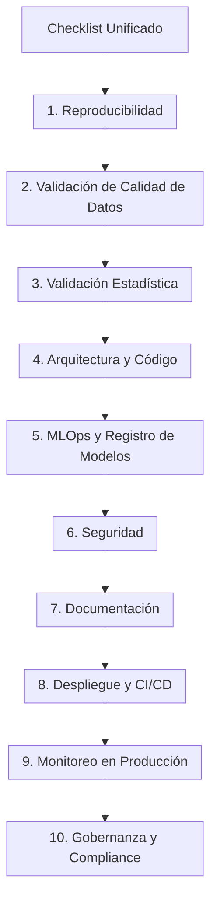
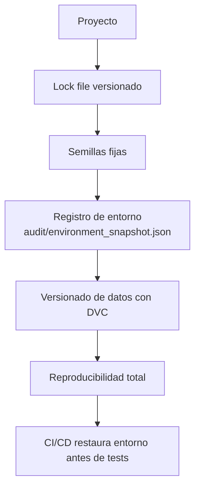
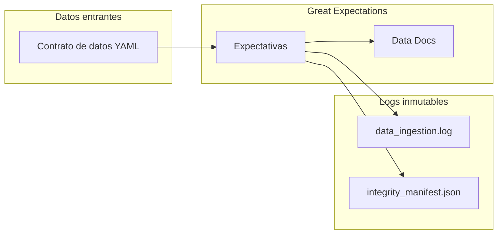
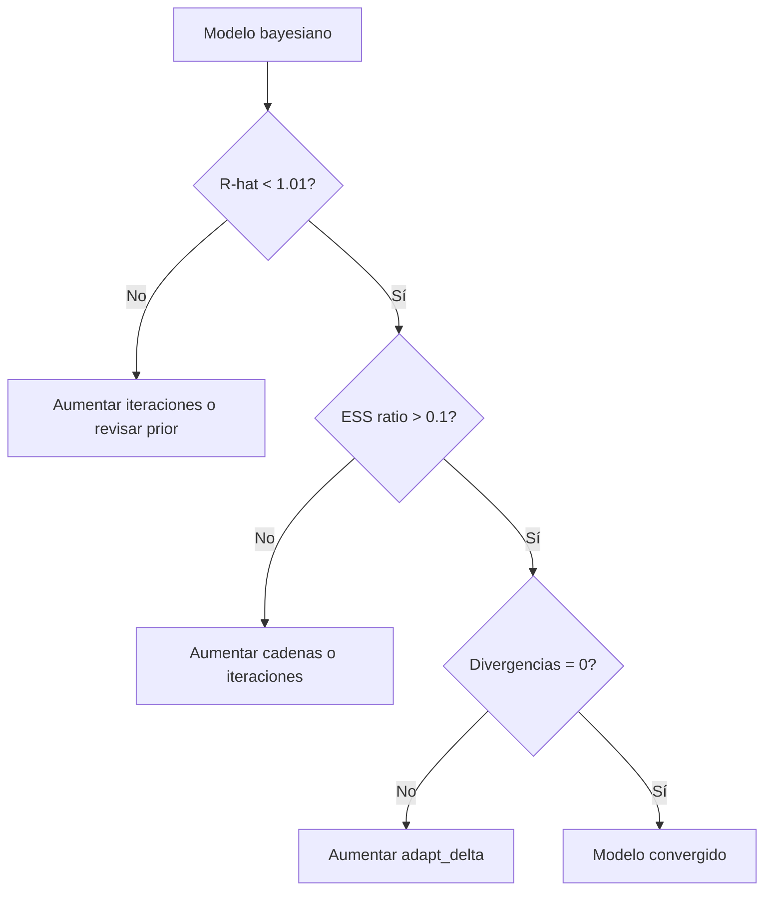
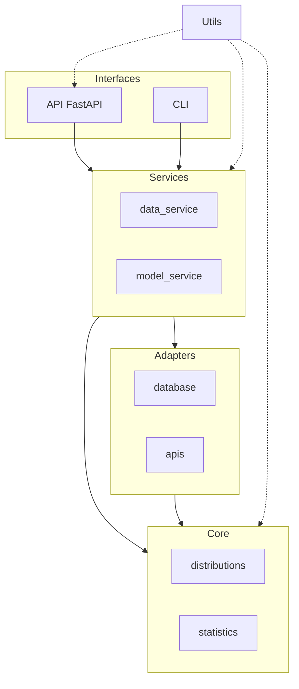
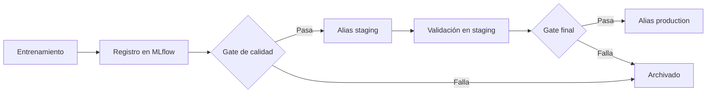
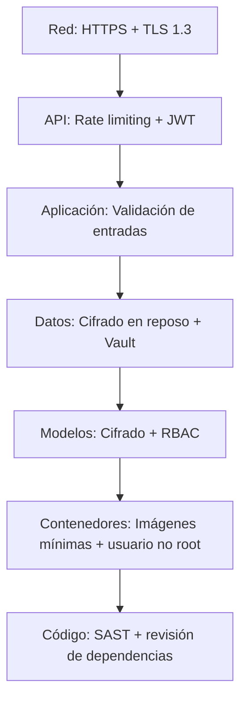
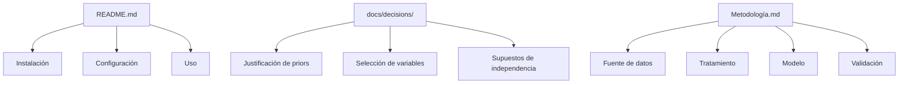
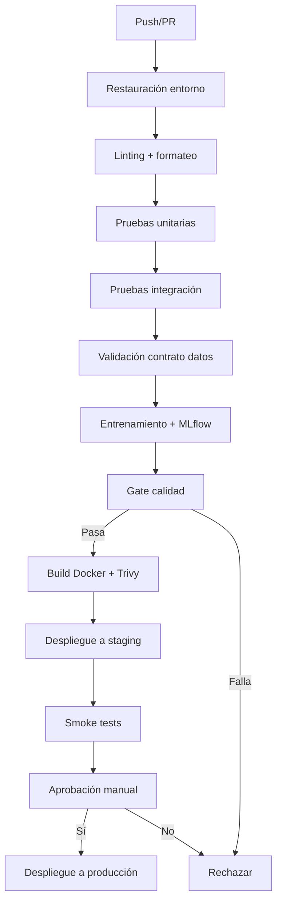
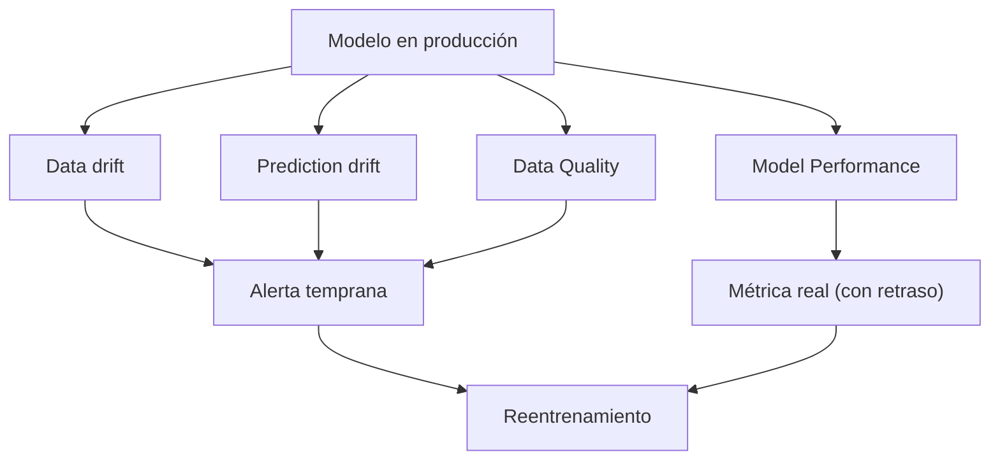

# Checklist Unificado: Cumplimiento Regulatorio y MLOps

**Documento fuente de referencia para todos los proyectos de ingeniería estadística**

Este documento es la referencia única de verificaciones de calidad, cumplimiento y despliegue. El [Manual Completo](Complete_Manual.md) y la [Guía de Implementación](Statistical_Systems_Implementation_Guide.md) referencian este checklist en lugar de duplicarlo.

**Leyenda**: `[P]` = Producción obligatorio, `[R]` = Regulatorio adicional (legaltech, finanzas, salud).

### Diagrama de estructura del checklist



## 1. Reproducibilidad

### Diagrama de flujo de la reproducibilidad



### 1.1 Gestión de dependencias [P]

- [ ] Existe un lock file versionado: `poetry.lock`, `requirements.lock` o `conda-lock.yml`.
- [ ] El lock file está bajo control de versiones en Git.
- [ ] El proceso de restauración del entorno está automatizado y documentado.
- [ ] El pipeline CI/CD restaura el entorno antes de ejecutar cualquier prueba o análisis.
- [ ] El `README.md` especifica la versión del intérprete base (Python 3.11, R 4.3, etc.).

### 1.2 Semillas y aleatoriedad [P]

- [ ] Existe una semilla global configurada al inicio del pipeline (`random_seed=2026`).
- [ ] Los modelos MCMC incorporan un parámetro de semilla explícito.
- [ ] Las semillas están documentadas en el `README.md` o en `docs/decisions/`.

### 1.3 Registro de entorno [P]

- [ ] Un mecanismo automático genera `audit/environment_snapshot.json` con: SO, lenguaje, versión, paquetes instalados, fecha.
- [ ] El snapshot está enlazado en la documentación de resultados.

### 1.4 Versionado de datos [P]

- [ ] Los datasets de entrenamiento están versionados con DVC.
- [ ] El hash del commit DVC/Git correspondiente al dataset se registra como parámetro en MLflow.
- [ ] Es posible reproducir el entrenamiento completo a partir del `run_id` de MLflow.

---
## 2. Validación de Calidad de Datos

### Mapa conceptual de la validación de calidad



### 2.1 Contrato de datos [P]

- [ ] Existe una definición del contrato de datos en formato legible por máquina (YAML o código GE).
- [ ] El contrato especifica: esquema de columnas, tipos, restricciones de nulidad, rangos esperados, unicidad.
- [ ] La ingesta falla explícitamente si el contrato no se cumple.

### 2.2 Validación con Great Expectations [P]

- [ ] Las expectativas están definidas en una suite nombrada (`training_suite`, `inference_suite`).
- [ ] La validación se ejecuta automáticamente en el pipeline antes del entrenamiento.
- [ ] Los resultados de validación se almacenan en `audit/data_validation_<run_id>.json`.

### 2.3 Auditoría de ingesta [P]

- [ ] Cada ingesta genera una entrada estructurada en `audit/data_ingestion.log` con: timestamp, `source_id`, `n_rows`, `hash_sha256`, `dvc_commit`, `validation_status`.
- [ ] El log es append-only (inmutable).

### 2.4 Trazabilidad de datos [R]

- [ ] Existe un manifiesto de integridad `audit/integrity_manifest.json` con hashes MD5 y SHA256 por archivo.
- [ ] Un script de verificación compara hashes actuales vs. almacenados en CI/CD.
- [ ] El catálogo de datos (DataHub u OpenMetadata) tiene registrado el dataset con propietario y SLA.

---
## 3. Validación Estadística

### Árbol de decisión de diagnósticos bayesianos



### 3.1 Diagnósticos para modelos bayesianos [P]

- [ ] R-hat máximo < 1.01 en todos los parámetros.
- [ ] **ESS ratio > 0.1** (ESS / total_draws) para todos los parámetros.
- [ ] Divergencias en HMC = 0.
- [ ] Gráficos de traza archivados como artefactos en MLflow.
- [ ] Diagnósticos guardados en `audit/diagnostics_<run_id>.json`.

### 3.2 Validación de supuestos (modelos frecuentistas) [P cuando aplique]

- [ ] Normalidad de residuos: Shapiro-Wilk, p > 0.05.
- [ ] Homocedasticidad: Breusch-Pagan, p > 0.05.
- [ ] Independencia: Durbin-Watson, p > 0.05.
- [ ] Linealidad: prueba RESET, p > 0.05.
- [ ] Resultados guardados en `audit/assumptions_<run_id>.json`.
- [ ] Si algún supuesto falla: documentada la violación y la acción correctiva.

### 3.3 Análisis de sensibilidad [P]

- [ ] Se ejecutan al menos 3 variantes de especificación (diferentes variables, priors o familia).
- [ ] La variación relativa de coeficientes clave es < 10% (o se documenta explícitamente si supera el umbral).
- [ ] Resultados guardados en `audit/sensitivity_<run_id>.json`.
- [ ] Decisión documentada en `docs/decisions/`.

---
## 4. Arquitectura y Código

### Diagrama de capas



### 4.1 Estructura [P]

- [ ] Separación clara de capas: `core`, `adapters`, `services`, `interfaces`.
- [ ] Sin dependencias circulares entre capas.
- [ ] `core` no importa de `adapters`, `services` o `interfaces`.
- [ ] El frontend se comunica solo con `interfaces/api`, no con capas internas.

### 4.2 Calidad de código [P]

- [ ] Linting automatizado (Ruff/Flake8 para Python).
- [ ] Formateo automático (Black para Python).
- [ ] Sin warnings de linting en el pipeline CI.

### 4.3 Pruebas [P]

- [ ] Pruebas unitarias con cobertura ≥ 80% en módulos críticos (`core`, `services`).
- [ ] Pruebas de integración para flujos end-to-end con datos de muestra.
- [ ] Las pruebas no usan datos reales sensibles; usan semillas fijas y datos simulados.
- [ ] Todas las pruebas pasan en CI antes de cualquier despliegue.

---
## 5. MLOps y Registro de Modelos

### Flujo de promoción de modelos (champion/challenger)



### 5.1 Experiment tracking [P]

- [ ] MLflow configurado con servidor remoto (no solo modo local).
- [ ] Cada ejecución registra: parámetros, métricas, artefactos, hash DVC, hash Git.
- [ ] El nombre del experimento sigue una convención documentada.

### 5.2 Model Registry [P]

- [ ] El modelo está registrado en el MLflow Model Registry con nombre semántico.
- [ ] El flujo de promoción es: `None` → `staging` → `production` → `archived`.
- [ ] La promoción a `production` requiere un gate de calidad automático (métricas mínimas).
- [ ] Cada promoción queda registrada con quién y cuándo.

### 5.3 Reproducibilidad del modelo [P]

- [ ] Dado el `run_id` de MLflow, es posible reproducir exactamente el entrenamiento (datos + código + entorno).
- [ ] El modelo en `production` tiene un `run_id` asociado con todos los artefactos.

---
## 6. Seguridad

### Capas de seguridad en profundidad



### 6.1 Gestión de secretos [P]

- [ ] Sin credenciales en el código fuente ni en el historial de Git.
- [ ] Las credenciales se inyectan desde variables de entorno o HashiCorp Vault.
- [ ] El archivo `.env` está en `.gitignore`.
- [ ] El pipeline valida que las variables de entorno requeridas existen antes de ejecutar.

### 6.2 Cifrado de artefactos [P]

- [ ] Los modelos serializados en reposo están cifrados (S3 con SSE-KMS o equivalente).
- [ ] Los backups también están cifrados.

### 6.3 Control de acceso [P]

- [ ] RBAC implementado: roles diferenciados para ver, predecir y promover modelos.
- [ ] Autenticación JWT o API keys para todos los endpoints que acceden a datos sensibles.

### 6.4 Registro de accesos [P]

- [ ] Todo acceso a la API de predicción genera una entrada de auditoría (middleware).
- [ ] El log incluye: timestamp, endpoint, método, usuario/clave, status_code, duración.
- [ ] Los logs de acceso a datos sensibles (PII, financieros, sanitarios) se almacenan en `audit/data_access.log`. [R]

### 6.5 Rotación de secretos [R]

- [ ] Las claves de API y los tokens tienen expiración configurada.
- [ ] La rotación de secretos está automatizada mediante Vault o el gestor de secretos equivalente.

### 6.6 Protección contra ataques de inferencia [R]

- [ ] Rate limiting estricto por usuario/IP en la API de predicción.
- [ ] Monitoreo de patrones de consulta inusuales (posible model stealing).
- [ ] Documentado en `docs/decisions/` si se añade ruido a las predicciones.

---
## 7. Documentación

### Jerarquía de documentación



### 7.1 Documentación técnica [P]

- [ ] `README.md` con instrucciones de instalación, configuración y uso.
- [ ] `CHANGELOG.md` siguiendo [Keep a Changelog](https://keepachangelog.com/) con versionado semántico.
- [ ] Docstrings en todas las funciones públicas con parámetros, retorno y referencias a decisiones.

### 7.2 Decisiones analíticas [P]

- [ ] Existe al menos un archivo de decisión en `docs/decisions/` por cada modelo o análisis significativo.
- [ ] Cada decisión documenta: contexto, opciones consideradas, decisión tomada, consecuencias.
- [ ] Las decisiones están referenciadas en el código mediante comentarios o metadatos.

### 7.3 Metodología [R]

- [ ] `docs/metodologia.md` existe y contiene: fuente de datos, tratamiento, modelo, validación, interpretación, limitaciones.
- [ ] Las decisiones analíticas tienen justificación explícita (no solo "se hizo así").
- [ ] Incluye referencias a literatura metodológica.

---
## 8. Despliegue y CI/CD

### Secuencia del pipeline CI/CD



### 8.1 Containerización [P]

- [ ] Dockerfile produce imagen reproducible con dependencias fijas.
- [ ] La imagen se escanea con Trivy o equivalente; sin vulnerabilidades críticas.
- [ ] El contenedor ejecuta como usuario no root.
- [ ] Los health checks están implementados y probados.

### 8.2 Pipeline CI/CD [P]

El pipeline ejecuta en orden: restauración de entorno → linting → pruebas unitarias → pruebas de integración → validación de contrato de datos → entrenamiento → gate de calidad → build Docker → escaneo de vulnerabilidades → despliegue a staging → smoke tests → despliegue a producción.

- [ ] El pipeline falla en cualquier paso sin continuar al siguiente.

**Definición de prueba de humo (smoke test) en staging** — Verifica: health endpoint responde en < 5s, modelo carga y predice 10 registros en < 200ms, predicciones en formato válido.

```python
# (fragmento ilustrativo, no ejecutable)
# tests/smoke/test_smoke_staging.py
import pytest
import requests
import time

BASE_URL = "https://staging.api.example.com"
STAGING_API_TOKEN = "your-staging-token"

def test_health_endpoint():
    r = requests.get(f"{BASE_URL}/health", timeout=5)
    assert r.status_code == 200
    assert r.json()["status"] == "ok"

def test_predict_10_records():
    sample_payload = {
        "model_name": "CreditRiskBayesian",
        "features": {
            "total_transacciones_90d": [5, 10, 2, 8, 15, 3, 7, 12, 1, 6],
            "volumen_total_90d": [500, 1200, 200, 900, 2000, 300, 800, 1500, 100, 700],
            "antiguedad_anos": [2, 5, 1, 3, 8, 1, 4, 6, 0, 3],
        }
    }
    start = time.time()
    r = requests.post(
        f"{BASE_URL}/predict",
        json=sample_payload,
        headers={"Authorization": f"Bearer {STAGING_API_TOKEN}"},
        timeout=10,
    )
    latency_ms = (time.time() - start) * 1000
    assert r.status_code == 200
    body = r.json()
    assert "predictions" in body
    assert len(body["predictions"]) == 10
    assert latency_ms < 200
    for pred in body["predictions"]:
        assert 0.0 <= pred <= 1.0
```
- [ ] Los secretos se pasan al pipeline como variables cifradas (GitHub Secrets, Vault).
- [ ] Las aprobaciones manuales para producción están configuradas cuando aplica.

---
## 9. Monitoreo en Producción

### Mapa de señales de monitoreo



### 9.1 Métricas operacionales [P]

- [ ] Latencia de inferencia (p50, p95, p99) monitoreada con Prometheus.
- [ ] Tasa de error < 0.1% de las solicitudes.
- [ ] Alertas configuradas para degradación de latencia o tasa de error.

### 9.2 Monitoreo de drift [P]

- [ ] Estadísticas de referencia capturadas durante el entrenamiento (media, desviación, percentiles).
- [ ] Comparación continua de datos entrantes con referencia (Evidently AI, Hellinger Distance).
- [ ] Alerta automática cuando el drift supera el umbral configurado.
- [ ] Política de reentrenamiento definida (basada en tiempo, drift o métricas de negocio).

### 9.3 Calidad de predicciones [P cuando hay etiquetas]

- [ ] Métricas de rendimiento calculadas cuando lleguen etiquetas (AUC, F1, RMSE según el tipo de modelo).
- [ ] Para modelos bayesianos: cobertura de intervalos de credibilidad monitoreada.
- [ ] Alertas cuando las métricas caen por debajo de los umbrales acordados en el SLA.

---
## 10. Gobernanza y Compliance Regulatorio

### 10.1 Principios de protección de datos [R]

- [ ] Minimización: solo se procesan datos estrictamente necesarios para la finalidad declarada.
- [ ] Finalidad: los datos no se usan para propósitos no declarados en el contrato.
- [ ] Política de retención documentada en `data_retention_policy.yaml`.
- [ ] Proceso de eliminación automática de datos fuera de TTL implementado.

### 10.2 Integridad de registros [R]

- [ ] Los logs de auditoría son append-only y encadenados con hashes (ver [Manual Completo](Complete_Manual.md), sección de auditoría).
- [ ] Los registros se exportan periódicamente a un sistema externo inmutable.
- [ ] Existe un proceso de verificación de integridad del audit trail.

### 10.3 Derechos de los interesados [R]

- [ ] Existe un proceso documentado para responder solicitudes ARCO (Acceso, Rectificación, Cancelación, Oposición).
- [ ] Los endpoints de gestión de derechos están implementados y probados.

---
## 11. Script de Verificación Automatizada

```bash
#!/bin/bash
# pre_delivery_checklist.sh
set -e
echo "=== VERIFICACIÓN DE CUMPLIMIENTO ==="
ERRORS=0

check_file() { [ -f "$1" ] && echo "  ✓ $1" || { echo "  ✗ $1 — FALTANTE"; ERRORS=$((ERRORS+1)); }; }
check_dir()  { [ -d "$1" ] && echo "  ✓ $1/" || { echo "  ✗ $1/ — FALTANTE"; ERRORS=$((ERRORS+1)); }; }
check_jq()   { jq -e "$1" "$2" > /dev/null 2>&1 && echo "  ✓ $2 ($1)" || { echo "  ✗ $2 falla criterio: $1"; ERRORS=$((ERRORS+1)); }; }

echo "--- Reproducibilidad ---"
check_file "poetry.lock"
check_file "audit/environment_snapshot.json"

echo "--- Datos ---"
check_file "audit/data_ingestion.log"
check_dir  "audit"

echo "--- Validación estadística ---"
DIAG=$(ls audit/diagnostics_*.json 2>/dev/null | tail -1)
if [ -n "$DIAG" ]; then
  check_jq '.converged == true' "$DIAG"
  check_jq '.rhat_max < 1.01'  "$DIAG"
else
  echo "  ✗ No se encontró archivo de diagnósticos"
  ERRORS=$((ERRORS+1))
fi

echo "--- Documentación ---"
check_file "README.md"
check_file "CHANGELOG.md"
check_dir  "docs/decisions"

echo "--- Seguridad ---"
if grep -rn "password\|api_key\|secret" --include="*.py" --include="*.ts" --include="*.r" \
   --exclude-dir=".git" --exclude-dir="node_modules" . 2>/dev/null | grep -v "os.environ\|getenv\|Vault\|#"; then
  echo "  ✗ Posibles secretos en código"
  ERRORS=$((ERRORS+1))
else
  echo "  ✓ Sin secretos detectados en código"
fi
check_file ".gitignore"

echo "--- Pruebas ---"
python -m pytest tests/ --tb=short -q 2>&1 | tail -5

echo ""
echo "=== RESULTADO: $ERRORS error(es) encontrado(s) ==="
[ $ERRORS -eq 0 ] && echo "✓ Listo para despliegue" || { echo "✗ Corregir antes de desplegar"; exit 1; }
```

---
## Referencia Rápida de Artefactos

| Categoría | Artefacto | Ubicación | Contenido mínimo |
| --- | --- | --- | --- |
| Reproducibilidad | Lock de dependencias | Raíz | Versiones exactas |
| Reproducibilidad | Snapshot de entorno | `audit/environment_snapshot.json` | SO, lenguaje, paquetes, fecha |
| Datos | Contrato de calidad | `contracts/<dataset>.yaml` | Expectativas GE |
| Datos | Log de ingesta | `audit/data_ingestion.log` | Timestamp, hash, DVC commit |
| Datos | Manifiesto de integridad | `audit/integrity_manifest.json` | Hashes SHA256 |
| Validación | Diagnósticos bayesianos | `audit/diagnostics_<run_id>.json` | R-hat, ESS, divergencias |
| Validación | Tests de supuestos | `audit/assumptions_<run_id>.json` | P-valores, passed/failed |
| Validación | Sensibilidad | `audit/sensitivity_<run_id>.json` | Variación de coeficientes |
| MLOps | Parámetros MLflow | MLflow UI / API | hash DVC, semilla, fórmula |
| Decisiones | Documento de decisión | `docs/decisions/NNN-titulo.md` | Contexto, opciones, decisión |
| Documentación | Metodología | `docs/metodologia.md` | 8 secciones estándar [R] |
| Seguridad | Log de accesos | `audit/data_access.log` | Usuario, dato, timestamp [R] |
| CI/CD | Pipeline | `.github/workflows/` | Stages completos |
## Documentos relacionados

- [Estrategia de Datos y Data Governance](Data_Governance.md): políticas de gobernanza y cumplimiento regulatorio que alimentan este checklist.
- [Monitoreo de Modelos en Producción](Monitoring.md): verificaciones de SLIs, SLOs y alertas incluidas en el checklist.
- [MLflow para la Gestión del Ciclo de Vida de Modelos Estadísticos](MLflow.md): trazabilidad de experimentos y modelos requerida por el checklist.
- [Estrategia de Rollback de Modelos](Rollback.md): procedimientos de reversión verificados en el checklist de despliegue.
