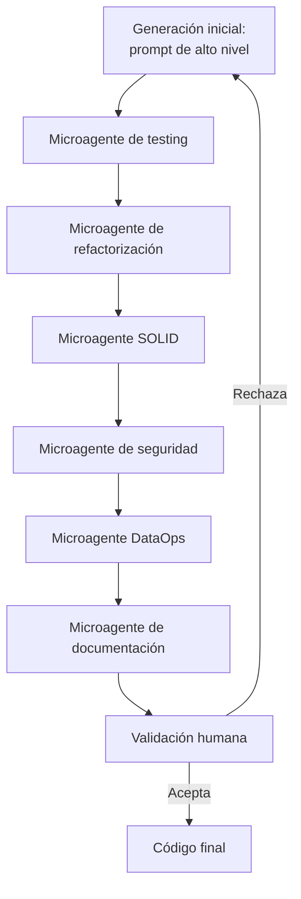

# Skills y Microagentes para Desarrollo Asistido con IA en Ingeniería de Software Estadístico

El desarrollo de software estadístico con IA generativa (LLMs) no exime al ingeniero de aplicar buenas prácticas de calidad de código, testing, arquitectura y gobernanza. Por el contrario, el uso de IA exige mayor disciplina en la verificación y supervisión de lo que se genera automáticamente.

Este documento define **skills** (comandos directos para el agente IA) y **microagentes** (prompts especializados) para delegar tareas específicas al LLM, manteniendo el control humano sobre la calidad y coherencia del sistema.

> En este sitio, los bloques de código se muestran en un componente colapsable. Haz clic en "Mostrar código" para ver el prompt completo.

---

## Diagrama de flujo de trabajo con microagentes



---

## 1. Skills como comandos para el agente IA

Un **skill** es una instrucción directa y breve que se le da al agente IA para ejecutar una tarea de mejora de calidad. Se invocan mediante el prefijo ` /skill:`.

### 1.1 `/skill:revisar-priors`

**Propósito:** Verificar que los priors de un modelo bayesiano sean apropiados, estén justificados y no sean los planos por defecto.

**Instrucción para el agente:**

```text
Actúa como un estadístico experto. Revisa la siguiente especificación de modelo bayesiano (código en Python con PyMC o en R con brms). Identifica:

1. Si se usan priors por defecto sin justificación.
2. Si los priors elegidos son débilmente informativos, informativos o empíricos.
3. Si la elección está documentada (comentarios o referencia a docs/decisions/).
4. Sugiere priors alternativos cuando corresponda.

Devuelve un informe con hallazgos y correcciones concretas.

Código del modelo: [pegar código]
```

### 1.2 `/skill:validar-contrato-datos`

**Propósito:** Generar o validar un contrato de datos (YAML + Great Expectations) para un dataset dado.

**Instrucción para el agente:**

```text
Eres un ingeniero de datos. Dado el siguiente dataset (estructura y contexto de negocio), genera:

1. Un contrato de datos en YAML con: columnas, tipos, restricciones de nulidad, rangos esperados, unicidad.
2. Una suite de expectativas de Great Expectations en Python que implemente dicho contrato.
3. Recomendaciones sobre versionado de datos con DVC y registro de hashes en MLflow.

Dataset: [describir columnas, tipo de datos, reglas de negocio]
```

### 1.3 `/skill:diagnosticar-convergencia`

**Propósito:** Analizar los diagnósticos de convergencia de un modelo bayesiano (R-hat, ESS, divergencias) y recomendar acciones.

**Instrucción para el agente:**

```text
Eres un especialista en inferencia bayesiana. A partir de los siguientes diagnósticos (R-hat, ESS, divergencias, gráficos de traza), indica:

- Si el modelo ha convergido correctamente.
- Si no, sugiere acciones concretas: aumentar iteraciones, ajustar adapt_delta, cambiar priors, etc.
- Explica por qué cada acción ayuda.

Diagnósticos: [pegar valores de R-hat, ESS, divergencias]
```

### 1.4 `/skill:refactorizar-fabrica-modelos`

**Propósito:** Refactorizar un módulo de fábrica de modelos para que cumpla SOLID y sea extensible.

**Instrucción para el agente:**

```text
Actúa como arquitecto de software. Aplica los principios SOLID al siguiente código de fábrica de modelos estadísticos. Específicamente:

- S: Asegura que cada clase tenga una sola responsabilidad (ej. una clase para cada tipo de modelo).
- O: Permite añadir nuevos modelos sin modificar el código existente (usa registro o diccionario).
- D: Inyecta las dependencias (por ejemplo, el gestor de experimentos) en lugar de crearlas internamente.

Entrega el código refactorizado y una explicación de los cambios.

Código actual: [pegar código de la fábrica]
```

### 1.5 `/skill:revisar-seguridad-api`

**Propósito:** Detectar vulnerabilidades en una API FastAPI que expone modelos estadísticos.

**Instrucción para el agente:**

```text
Actúa como auditor de seguridad. Revisa el siguiente código de API FastAPI (endpoints /predict, /fit, etc.) en busca de:

- Rate limiting ausente.
- Validación de entrada insuficiente (inyección de JSON malicioso).
- Exposición de secretos en logs o respuestas de error.
- Autenticación y autorización (JWT, API keys) no implementadas en endpoints sensibles.
- Timeouts no configurados en operaciones largas (entrenamiento).

Para cada hallazgo, indica el riesgo y propón una corrección concreta.

Código: [pegar main.py de FastAPI]
```

### 1.6 `/skill:generar-docstring`

**Propósito:** Generar docstrings completos (formato Google o NumPy) para una función o clase estadística.

**Instrucción para el agente:**

```text
Genera un docstring completo para la siguiente función siguiendo el formato Google o NumPy (elige el que uses en el proyecto). Incluye:

- Descripción breve y detallada.
- Parámetros: tipo, descripción, valores por defecto, restricciones.
- Retorno: tipo, estructura, valores posibles.
- Posibles excepciones.
- Al menos un ejemplo de uso ejecutable (con semilla fija).

Función: [pegar código]
```

---

## 2. Microagentes (prompts para tareas específicas)

Los microagentes se invocan directamente como prompts al LLM sin prefijo especial. Son análogos a los **skills**, pero más detallados y con formato de mensaje completo.

### 2.1 Microagente para testing unitario

**Propósito:** Generar tests unitarios para funciones estadísticas críticas.

```text
Actúa como un ingeniero de software estadístico. Dada la siguiente función en [Python/R], genera un conjunto de tests unitarios con pytest (o testthat) que verifiquen:

1. Comportamiento con entradas válidas (caso feliz).
2. Manejo de casos extremos (vector vacío, valores NA/NaN, infinitos).
3. Detección de errores en tipos de entrada (no numérico).
4. Reproducibilidad (misma semilla, mismo resultado).
5. Robustez a pequeños cambios en los datos (prueba de mutación simple).

Usa el framework de testing estándar: pytest (Python) o testthat (R). Incluye mensajes de error claros y la justificación de cada test en comentarios.

Función: [pegar código o describir la función]
```

### 2.2 Microagente para coherencia de código y estilo

**Propósito:** Revisar y corregir un bloque de código para que siga convenciones consistentes.

```text
Eres un revisor de código especializado en [Python/R/TypeScript]. Revisa el siguiente código y aplícale:

- Convenciones de nomenclatura (snake_case para variables, CamelCase para clases, etc.)
- Longitud máxima de línea (80 caracteres)
- Uso de espacios y sangría consistente
- Eliminación de código muerto o comentado
- Extracción de fragmentos repetidos a funciones auxiliares (principio DRY)
- Adición de tipos (type hints en Python, o comentarios de tipo en R)

Devuelve el código corregido y una lista de cambios realizados.

Código: [pegar código]
```

### 2.3 Microagente para principios SOLID

**Propósito:** Refactorizar un módulo para cumplir con principios SOLID.

```text
Aplica los principios SOLID al siguiente módulo de software estadístico:

- **S (Responsabilidad Única)**: Cada función o clase debe tener una sola razón para cambiar.
- **O (Abierto/Cerrado)**: Permite añadir nuevos tipos de modelos sin modificar el código existente.
- **L (Sustitución de Liskov)**: Las subclases deben poder usarse indistintamente.
- **I (Segregación de interfaces)**: No fuerces a un modelo a implementar métodos que no necesita.
- **D (Inversión de dependencias)**: Los módulos de alto nivel deben depender de abstracciones.

Reescribe el código aplicando estos principios. Explica cada cambio.

Código: [pegar código del servicio de modelos, por ejemplo]
```

### 2.4 Microagente para código limpio y legibilidad

**Propósito:** Mejorar la legibilidad y mantenibilidad de scripts estadísticos.

```text
Refactoriza el siguiente código para hacerlo más limpio y legible, aplicando:

- Nombres de variables y funciones descriptivos.
- Comentarios que expliquen el "por qué", no el "qué".
- Extracción de bloques lógicos a funciones pequeñas con un propósito claro.
- Eliminación de anidamientos excesivos.
- Uso de constantes con nombre en lugar de números mágicos.
- Estructuración lineal del flujo principal, con funciones auxiliares para detalles.

Mantén la funcionalidad original. Entrega el código refactorizado y una breve explicación de las mejoras.

Código: [pegar script de EDA o entrenamiento]
```

### 2.5 Microagente para revisión de seguridad

**Propósito:** Detectar vulnerabilidades comunes en código generado por IA.

```text
Actúa como un auditor de seguridad. Revisa el siguiente código en busca de:

1. Evaluación de expresiones de usuario sin sanitización (riesgo de inyección).
2. Hardcoding de secretos (API keys, contraseñas) o variables de entorno no usadas.
3. Acceso a rutas del sistema de archivos sin validación.
4. Uso de funciones peligrosas (system, eval, exec, os.system).
5. Exposición de datos sensibles en logs o mensajes de error.
6. Falta de rate limiting o timeouts en operaciones costosas (entrenamiento, simulación).

Para cada hallazgo, indica la línea o sección, el riesgo asociado y sugiere una corrección concreta.

Código: [pegar código, ej. de API FastAPI o función de evaluación segura]
```

### 2.6 Microagente para documentación automatizada

**Propósito:** Generar o completar documentación de funciones y módulos.

```text
Genera documentación completa para la siguiente función siguiendo el estándar:

- Para Python: docstring estilo Google o NumPy.
- Para R: roxygen2 (@param, @return, @examples, @export).
- Para TypeScript: comentarios JSDoc/TSDoc.

Incluye:
- Descripción de la función y su propósito estadístico.
- Explicación de cada parámetro (tipo, rango, valores por defecto).
- Valor de retorno (estructura, tipo).
- Al menos dos ejemplos ejecutables (uno básico y uno con opciones avanzadas).
- Posibles errores o advertencias.
- Referencias a literatura si aplica.

Función: [pegar código de la función]
```

### 2.7 Microagente para coherencia entre frontend y backend

**Propósito:** Verificar que la interfaz (Next.js) y la API (FastAPI) comparten contratos consistentes.

```text
Revisa la siguiente definición de API (OpenAPI / FastAPI) y el componente Next.js que la consume.

Verifica:
- Que los nombres de los campos coinciden exactamente.
- Que los tipos de datos son compatibles (string vs number, fecha como string ISO).
- Que el frontend maneja correctamente los códigos de error (400, 500) y respuestas vacías.
- Que las validaciones de entrada son consistentes.
- Que no hay campos obligatorios en el backend que el frontend omite.

Devuelve un informe de discrepancias y sugiere correcciones en uno u otro lado.

API definition: [pegar JSON OpenAPI o descripción de endpoints]

Frontend code: [pegar código TypeScript del cliente API]
```

### 2.8 Microagente para DataOps y calidad de datos

**Propósito:** Aplicar buenas prácticas de DataOps a pipelines de preparación de datos.

```text
Eres un experto en DataOps. Analiza el siguiente pipeline de transformación de datos y sugiere mejoras para:

- Reproducibilidad: guardar versiones de los datos de entrada (hash, timestamp).
- Validación: añadir checks de calidad (Great Expectations o similar) antes y después de cada paso.
- Documentación: incluir metadatos de cada columna (origen, tipo, valores permitidos).
- Trazabilidad: registrar en un log estructurado cada operación.
- Modularidad: dividir el pipeline en etapas reutilizables (extracción, limpieza, feature engineering).

Proporciona el código refactorizado y los metadatos añadidos.

Pipeline (código): [pegar script de ETL]
```

---

## 3. Integración de skills y microagentes en el flujo de trabajo

Un flujo típico asistido por IA con skills y microagentes:

1. **Generación inicial** → El LLM genera una función o módulo a partir de un prompt de alto nivel.
2. **Skill `/skill:revisar-priors`** → Verifica y justifica priors cuando el modelo es bayesiano.
3. **Microagente de testing** → Genera tests unitarios automáticos.
4. **Skill `/skill:refactorizar-fabrica-modelos`** → Aplica SOLID a la fábrica de modelos.
5. **Microagente de seguridad** → Escanea vulnerabilidades.
6. **Skill `/skill:validar-contrato-datos`** → Genera contrato de datos y expectativas de Great Expectations.
7. **Skill `/skill:generar-docstring`** → Documenta la función principal.
8. **Validación humana** → El ingeniero revisa los cambios, ejecuta los tests y decide si acepta.

Este enfoque crea un circuito de mejora continua donde la IA asiste, pero el humano supervisa, corrige y aprende.

---

## 4. Recursos y enlaces de alto valor

### Herramientas y librerías

| Recurso | Descripción | Enlace |
| --- | --- | --- |
| pytest | Framework de testing para Python | https://docs.pytest.org/ |
| testthat | Framework de testing para R | https://testthat.r-lib.org/ |
| ruff | Linter y formateador ultra-rápido para Python | https://docs.astral.sh/ruff/ |
| black | Formateador de código Python | https://black.readthedocs.io/ |
| mypy | Verificador de tipos estático para Python | https://mypy-lang.org/ |
| pre-commit | Framework para hooks de pre-commit | https://pre-commit.com/ |
| Great Expectations | Validación y documentación de calidad de datos | https://greatexpectations.io/ |
| soda-core | Observabilidad de datos | https://www.soda.io/ |
| MLflow | Gestión del ciclo de vida de modelos | https://mlflow.org/ |
| DVC | Versionado de datos y pipelines | https://dvc.org/ |
| Bandit | Análisis de seguridad estático para Python | https://bandit.readthedocs.io/ |
| Safety | Escaneo de dependencias vulnerables | https://pyup.io/safety/ |

### Documentación sobre buenas prácticas con IA

- [Principios de ingeniería de prompts](https://www.promptingguide.ai/)
- [LLM testing strategies](https://www.deepchecks.com/llm-testing/)
- [Responsible AI with LLMs](https://www.microsoft.com/en-us/ai/responsible-ai)

### Estándares y guías de estilo

- [PEP 8 (Python)](https://peps.python.org/pep-0008/)
- [Google Python Style Guide](https://google.github.io/styleguide/pyguide.html)
- [tidyverse style guide (R)](https://style.tidyverse.org/)
- [ESLint](https://eslint.org/) / [Prettier](https://prettier.io/)

---

> El código es el algoritmo. El algoritmo se explica a si mismo.


## Documentos relacionados

- [Principios y Prácticas para la Construcción de Sistemas Estadísticos Robustos](Statistical_Software_Principles.md): fundamentos de calidad que los skills y microagentes ayudan a implementar.
- [MLflow para la Gestión del Ciclo de Vida de Modelos Estadísticos](MLflow.md): gestión del ciclo de vida de modelos asistida por skills de IA.
- [Monitoreo de Modelos en Producción](Monitoring.md): monitoreo automatizado apoyado por microagentes especializados.
