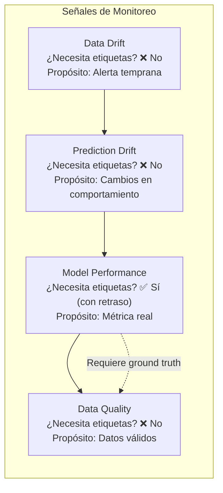
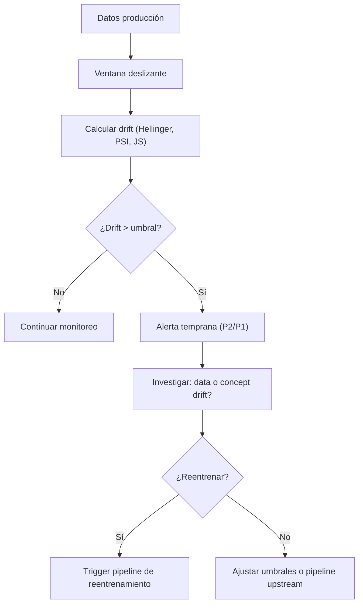
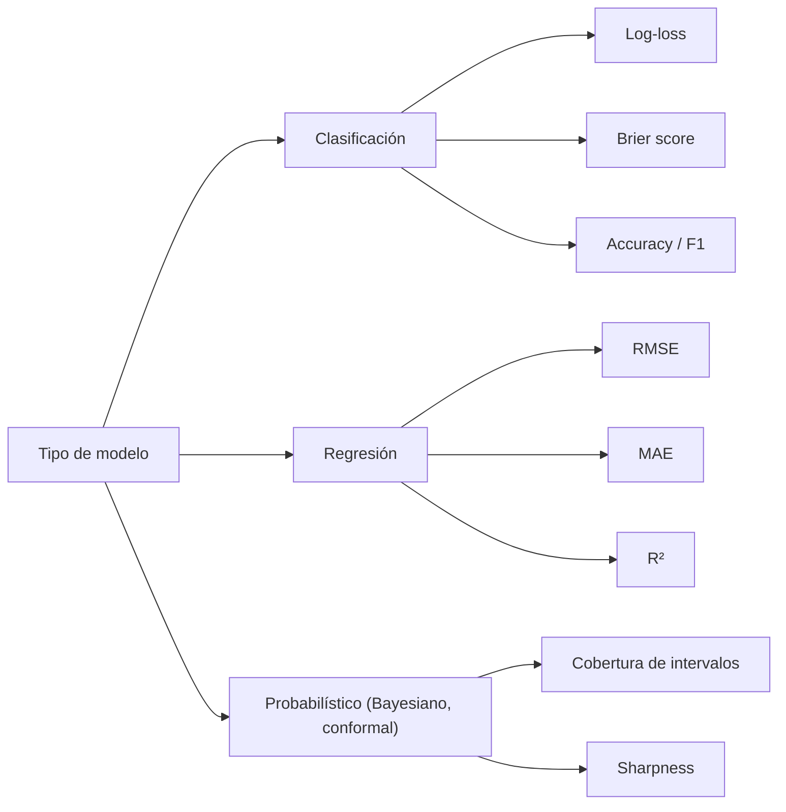
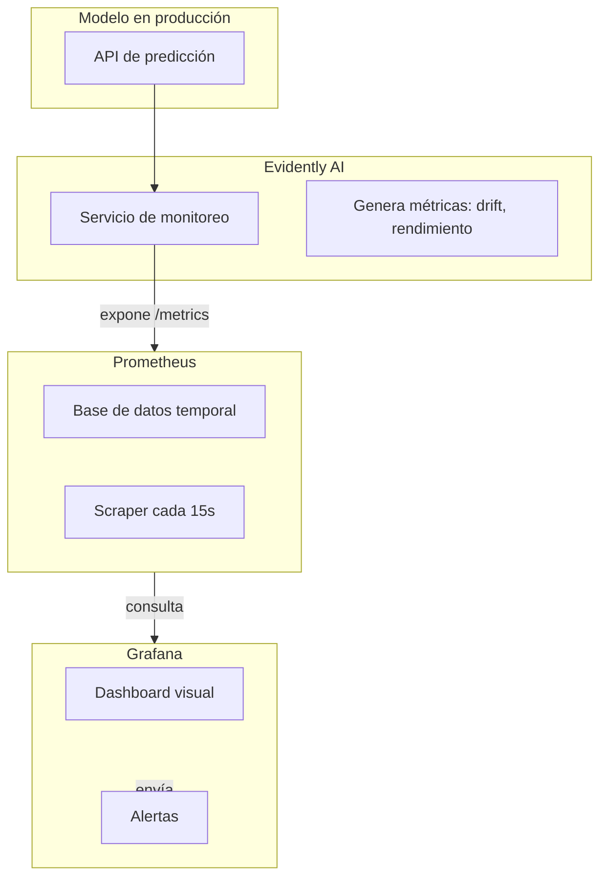
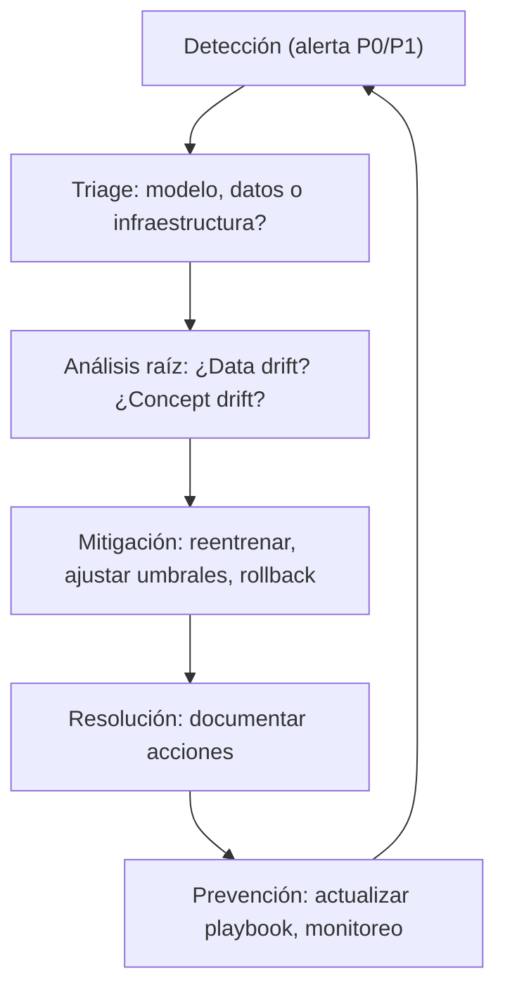

# Monitoreo de Modelos en Producción (ML Monitoring)

## 1. Introducción: El Problema del Fracaso Silencioso

El monitoreo de modelos en producción es una de las disciplinas más subestimadas en ingeniería de software estadístico. Un modelo que funciona perfectamente en el entorno de desarrollo puede degradarse silenciosamente en producción sin generar ningún error o alerta visible.

El software tradicional falla ruidosamente: una excepción, un error 500, un null inesperado.

Un estudio publicado en Scientific Reports encontró degradación temporal del rendimiento en el 91 % de los pares modelo-dataset analizados en dominios como salud, finanzas, transporte y meteorología. La economía es simple: un programa de monitoreo que detecta degradación cuando afecta al 5 % de las salidas es mucho más económico que detectarla después de que ha impactado a una cuarta parte de las decisiones generadoras de ingresos.

Este apartado presenta un marco completo para implementar monitoreo de modelos en producción, incluyendo métricas técnicas, métricas de calidad del modelo, herramientas de código abierto y propietarias, y una estrategia práctica de alertas.

## 2. Las Cuatro Señales Fundamentales del Monitoreo
El monitoreo efectivo requiere observar varias señales en paralelo, porque cada una responde a una pregunta diferente y ninguna captura lo que las otras detectan.

| Señal | ¿Qué mide? | ¿Necesita etiquetas? | Propósito |
| --- | --- | --- | --- |
| Data Drift | Cambios en la distribución de las variables de entrada | No | Alerta temprana: si los inputs cambian, el rendimiento probablemente se degradará |
| Prediction Drift | Cambios en la distribución de las predicciones | No | Detección de cambios en el comportamiento del modelo |
| Model Performance | Precisión, AUC, F1, etc., de las predicciones | Sí (con retraso) | La métrica que realmente importa, pero no está disponible en tiempo real |
| Data Quality | Valores nulos, esquema, cardinalidad, frescura | No | Asegura que los datos que llegan al modelo son válidos |

La columna "¿Necesita etiquetas?" es la observación más importante.

### Diagrama de las cuatro señales de monitoreo



### 2.1. Data Drift

El data drift ocurre cuando la distribución de las variables de entrada cambia respecto a los datos de entrenamiento. Las causas típicas incluyen:

- Cambios estacionales en los datos.
- Evolución del comportamiento de los usuarios.
- Modificaciones en los sistemas upstream que generan los datos.
- Errores silenciosos en pipelines de datos.

### 2.2. Prediction Drift

El **prediction drift** (o drift de predicciones) ocurre cuando la distribución de las salidas del modelo cambia con el tiempo, incluso si las entradas no han variado significativamente. Esto puede deberse a cambios en el entorno (concept drift) o a la deriva del propio modelo.

**Cómo detectarlo**:

- Comparar histogramas de predicciones recientes vs. históricas.
- Calcular PSI sobre las predicciones.
- Monitorear la proporción de clases predichas en clasificación.

**Causas típicas**:

- Cambios en las preferencias de los usuarios.
- Nuevas políticas de negocio.
- Modelo que se desgasta por falta de reentrenamiento.

## 3. Métricas Operacionales: La Salud del Servicio
Además de las métricas específicas del modelo, todo sistema de monitoreo debe incluir métricas operacionales estándar. Estas deben capturarse para cada modelo y versión, usando etiquetas consistentes como service, model_name, model_version, environment.

| Métrica | Descripción | Umbral típico |
| --- | --- | --- |
| Latencia de inferencia | Tiempo que tarda el modelo en responder, percentiles p50, p95, p99 | p95 < 100 ms para tiempo real, < 1 s para batch |
| Throughput | Solicitudes por segundo, procesadas en lote o individuales | Variable según capacidad planificada |
| Tasa de error | Excepciones, solicitudes mal formadas, fallos del modelo | < 0.1 % de las solicitudes |
| Uso de CPU/GPU | Utilización de recursos computacionales | < 80 % sostenido; picos de hasta 95 % |
| Uso de memoria | Memoria RAM consumida por el contenedor/servicio | < 90 % de la memoria asignada |
| Coste por inferencia | Coste computacional por predicción (cloud) | Monitoreo continuo para control de gastos |

### 3.1. Colecta de Telemetría: La Base de la Observabilidad

Una buena telemetría organiza las señales en cuatro clases con guías de retención claras:

| Clase de señal | Instrumentos representativos | Retención sugerida |
| --- | --- | --- |
| Métricas | `model_inference_seconds{model,version}`, `model_requests_total` | 90 días (agregadas), 7-14 días (crudas) |
| Logs | JSON estructurado con trace_id | 30-90 días (índice caliente), archivar a frío |
| Inputs y predicciones | input_hash, resúmenes de features, prediction_prob | 7-30 días (completo solo para muestras) |
| Etiquetas y resultados | true_label, label_source, label_delay | Retención según política de datos |

La telemetría estructurada no es opcional.

## 4. Métricas de Calidad del Modelo: El Rendimiento Real
Cuando la verdad fundamental (ground truth) está disponible (ya sea en tiempo real o con retraso), se deben calcular y registrar métricas de rendimiento del modelo.

### 4.1. Métricas de Rendimiento

La elección de métrica depende del tipo de modelo y del formato de sus predicciones:

- **Clasificación binaria/multiclase**: usar log-loss o Brier score cuando se dispone de probabilidades; usar accuracy, precision, recall o F1 cuando solo se dispone de clases predichas.
- **Regresión**: usar MAE, RMSE, R². Para modelos probabilísticos que emiten intervalos, monitorear cobertura y sharpness.
- **Modelos probabilísticos (Bayesianos, conformal prediction)**: cobertura de intervalos y sharpness son las métricas principales de calidad.

| Métrica | Tipo de modelo | Descripción | Implementación |
| --- | --- | --- | --- |
| Log-loss | Clasificación probabilística | Pérdida logarítmica de las predicciones probabilísticas | `-mean(y_true * log(p_pred) + (1-y_true) * log(1-p_pred))` |
| Brier Score | Clasificación probabilística | Error cuadrático medio de las probabilidades predichas | `mean((p_pred - y_true)²)`; rango [0,1]; < 0.25 aceptable |
| Cobertura de intervalos | Regresión probabilística | Proporción de veces que el intervalo creíble de nivel α contiene el valor real | Ver fórmula y umbrales abajo |
| Amplitud media del intervalo | Regresión probabilística | Cuantifica la incertidumbre comunicada (sharpness) | Intervalos más anchos = más incertidumbre; monitorear tendencia |

**Cobertura de intervalos de credibilidad — fórmula y umbrales**:

```python
# (ejemplo ejecutable)
import numpy as np

def interval_coverage(y_true: np.ndarray, lower: np.ndarray, upper: np.ndarray) -> float:
    """
    Calcula la cobertura empírica de los intervalos de credibilidad.
    Para un intervalo del 95%: se espera cobertura ≈ 0.95.
    Desviaciones absolutas > 5 pp (es decir, < 0.90 o > 1.00) son alertables.
    """
    return float(np.mean((y_true >= lower) & (y_true <= upper)))

def interval_sharpness(lower: np.ndarray, upper: np.ndarray) -> float:
    """Amplitud media del intervalo (menor = predicciones más precisas)."""
    return float(np.mean(upper - lower))
```

**Umbrales de cobertura por nivel del intervalo**:

| Nivel del intervalo | Cobertura esperada | Alerta P1 (acción inmediata) | Alerta P2 (investigar) |
| --- | --- | --- | --- |
| 50% | 0.50 | < 0.40 o > 0.60 | < 0.45 o > 0.55 |
| 80% | 0.80 | < 0.70 o > 0.90 | < 0.75 o > 0.85 |
| 95% | 0.95 | < 0.85 o > 1.00 | < 0.90 o > 0.98 |

**Interpretación**: una cobertura sistemáticamente inferior al umbral indica que los intervalos son demasiado estrechos (el modelo está sobreconfiado). Una cobertura superior indica intervalos demasiado anchos (el modelo es demasiado conservador). Ambas situaciones requieren investigación: la primera es más grave en entornos regulados porque subestima la incertidumbre reportada.

## 5. Detección de Drift: Métricas Estadísticas
La detección de drift se basa en comparar la distribución de los datos en producción con una distribución de referencia (normalmente los datos de entrenamiento o validación). Existen varios algoritmos estándar, cada uno con sus ventajas y desventajas.

### 5.1. Algoritmos Soportados por la Industria

La plataforma WhyLabs, utilizada por miles de organizaciones para monitoreo de IA, soporta cuatro algoritmos principales para detección de drift:

| Algoritmo | Propiedades clave | Cuándo usarlo |
| --- | --- | --- |
| Hellinger Distance | Rango [0,1]; simétrica; robusta ante outliers; recomendada por WhyLabs. | Uso general, especialmente cuando la robustez es prioritaria. |
| Jensen-Shannon (JS) Divergence | Simétrica; más estable que KL; versión mejorada de KL. | Cuando se necesita mayor sensibilidad que Hellinger. |
| Kullback-Leibler (KL) Divergence | Asimétrica; muy sensible a outliers; capaz de detectar patrones de drift sutiles. | Cuando se necesita máxima sensibilidad y se pueden tolerar falsos positivos. |
| Population Stability Index (PSI) | Mide cambios en distribuciones; ampliamente usado en banca y finanzas. | Entornos regulados donde PSI es un estándar conocido. |

| Algoritmo | Robustez | Sensibilidad | Interpretación |
|-----------|----------|--------------|----------------|
| **Hellinger** | ████████░░ (0.8) | ███████░░░ (0.7) | Sensible y robusto |
| **PSI**       | ███████░░░ (0.7) | ██████░░░░ (0.6) | Sensible y robusto |
| **JS Divergence** | █████░░░░░ (0.5) | ████████░░ (0.8) | Muy sensible, ruidoso |
| **KL Divergence** | ██░░░░░░░░ (0.2) | █████████░ (0.9) | Muy sensible, ruidoso |

### Flujo de detección de drift (data drift → alerta → reentrenamiento)


Recomendación práctica para la mayoría de los casos: Hellinger Distance por defecto. JS Divergence si se necesita mayor sensibilidad y se pueden tolerar algo de ruido. KL Divergence solo con umbrales conservadores y buen control de calidad de datos upstream.

### 5.2. Umbrales Prácticos

Los umbrales deben calibrarse según la naturaleza de los datos y la tolerancia al riesgo:

| Algoritmo | Umbral por defecto | Umbral estricto | Interpretación |
|-----------|-------------------|-----------------|----------------|
| Hellinger Distance | 0.7 | 0.4 | > umbral indica distribuciones muy diferentes. |
| JS Divergence | 0.1 | 0.05 | > umbral indica drift significativo. |
| KL Divergence | 0.5 | 0.3 | Muy sensible; usar con cautela. |
| PSI | 0.25 | 0.1 | < 0.1 sin cambios; 0.1–0.25 leve; > 0.25 significativo. |

### 5.3. Estrategia Multi-Métrica

Un enfoque más robusto que usar una única métrica es emplear un consenso de múltiples métricas. La literatura reciente recomienda una capa de monitoreo post-despliegue basada en tres métricas complementarias —KS statistic, PSI y JS divergence— donde solo cuando múltiples métricas superan sus umbrales simultáneamente se activa una alerta de retraining; los incumplimientos de una sola métrica activan un estado de alerta temprana.

Esta estrategia reduce los falsos positivos y proporciona mayor confianza en las decisiones de reentrenamiento.

### Mapa conceptual de métricas según tipo de modelo


## 6. Herramientas de Monitoreo

### 6.1. Evidently AI + Prometheus + Grafana (Open Source)

Evidently AI es un framework de código abierto para evaluar, probar y monitorear sistemas ML y LLM, desde experimentos hasta producción. Funciona con datos tabulares y texto, ofrece más de 100 métricas incorporadas y arquitectura modular.

Arquitectura de la integración:

El servicio Evidently lee los logs del modelo (inputs, predicciones, fechas), calcula métricas específicas de ML (data drift, prediction drift, rendimiento de regresión/clasificación) y las expone en un endpoint de Prometheus. Prometheus scrapea periódicamente estas métricas y las almacena en su base de datos de series temporales. Grafana visualiza las métricas y maneja alertas. Todo el stack es 100 % open source y está empaquetado en contenedores Docker listos para usar.

### Arquitectura de integración Evidently AI + Prometheus + Grafana


Implementación práctica:

```python
# (fragmento ilustrativo, no ejecutable)
# config_monitoring.py
# Ejemplo de configuración del servicio de monitoreo de Evidently
from evidently.monitoring.service import MonitoringService
from evidently.monitoring.config import MonitoringConfig
from evidently.monitoring.metrics import DataDriftMetric, RegressionPerformanceMetric

config = MonitoringConfig(
    metrics=[
        DataDriftMetric(
            drift_algorithm="hellinger",
            threshold=0.1  # Hellinger distance threshold
        ),
        RegressionPerformanceMetric(
            metrics=["rmse", "mae", "r2"]
        )
    ],
    reference_data_path="./data/training_data.parquet",
    window_size=1000,  # Calculate metrics every 1000 records
    moving_window=True
)

service = MonitoringService(config)
service.start_prometheus_exporter(port=8000)
```

Ventajas de esta pila:

- **Open source completo**: sin vendor lock-in, todo el código es auditable.
- **Integración con ecosistema existente**: muchas organizaciones ya usan Prometheus y Grafana para monitoreo de sistemas.
- **Dashboards pre-construidos**: Evidently proporciona dashboards de Grafana pre-diseñados para data drift, agrupando métricas y plots organizados.

### 6.2. WhyLabs AI Control Center (Plataforma Gestionada)

WhyLabs es una plataforma comercial que ofrece observabilidad completa del ciclo de vida de IA, desde datos hasta salidas del modelo, con soporte nativo para LLMs y datos estructurados y no estructurados.

Capacidades clave:

- Monitoreo de drift con cuatro algoritmos soportados (Hellinger, KL, JS, PSI) con umbrales configurables por feature.
- Monitoreo de calidad de datos: valores nulos, esquema, cardinalidad, cambios en el esquema de features.
- Monitoreo de rendimiento de modelos: AUC, precisión, recall, F1, matriz de confusión, incluso para ground truth con retraso.
- Alertas configurables con prioridades y umbrales dinámicos (trailing window o reference profile).
- Panel de control unificado que resume cobertura de monitoreo, volumen de inferencias y recuento de anomalías.
- Integración con MLflow para seguimiento del ciclo de vida del modelo.

Cuándo elegir WhyLabs:

- Equipos pequeños sin capacidad de operar un stack de monitoreo open source.
- Requisitos regulatorios que exigen dashboards listos para auditoría.
- Necesidad de monitorear modelos en múltiples proveedores cloud con una interfaz unificada.
- Soporte para casos de uso avanzados como monitoreo de embeddings y LLMs.

### 6.3. Seldon (Alibi Detect + Alibi Explain + Seldon Core)

Seldon ofrece un ecosistema open source para despliegue y monitoreo de modelos. Sus componentes principales incluyen:

| Componente | Propósito | Caso de uso típico |
| --- | --- | --- |
| **Alibi Detect** | Detección de outliers, adversariales y drift. | Monitoreo de drift en producción con métodos avanzados (MMD, LSDD). |
| **Alibi Explain** | Explicabilidad de predicciones (counterfactuals, SHAP, Anchors). | Cumplimiento regulatorio que exige explicaciones por predicción. |
| **Seldon Core** | Despliegue de modelos en Kubernetes con canary, A/B testing y shadow. | Infraestructura de serving con control de tráfico. |
| **Seldon Enterprise** | Plataforma gestionada sobre Seldon Core con dashboards y alertas. | Equipos que necesitan UI sin operar infraestructura. |

**Cuándo elegir Seldon**:

- El equipo ya usa Kubernetes y quiere despliegue nativo de modelos.
- Se requiere drift detection avanzado (más allá de distribuciones simples).
- Se necesita explicabilidad integrada en el pipeline de inferencia.

### 6.4. MLflow

Capacidades de monitoreo en MLflow:

- **Tracing/Observabilidad**: captura trazas completas de aplicaciones LLM y agentes, construido sobre OpenTelemetry. Monitoriza calidad en producción, costes y seguridad.
- **Evaluación de modelos**: ejecuta evaluaciones sistemáticas, monitorea métricas de calidad en el tiempo y detecta regresiones antes de que lleguen a producción. Incluye más de 50 métricas pre-construidas y LLM judges.
- **Model Registry**: gestiona el ciclo de vida completo de los modelos, con metadatos y artefactos inmutables.
- **Despliegue**: herramientas para despliegue en batch y scoring en tiempo real en plataformas como Docker, Kubernetes, Azure ML y AWS SageMaker.

Cuándo elegir MLflow: equipos que ya usan MLflow para seguimiento de experimentos y desean expandir hacia observabilidad sin añadir herramientas adicionales. MLflow proporciona una solución integrada que cubre desde el desarrollo hasta el monitoreo en producción.

### 6.5. Plataformas de Proveedores Cloud

Cada proveedor cloud ofrece servicios gestionados de monitoreo integrados en sus plataformas ML:

| Proveedor | Servicio de monitoreo | Capacidades clave |
| --- | --- | --- |
| AWS SageMaker | SageMaker Model Monitor | Captura feature drift, calidad de datos y detecta automáticamente cambios en distribuciones. |
| Azure ML | Azure ML + Azure Monitor | Telemetría integrada, alertas, métricas de rendimiento de modelos, integración con Azure DevOps. |
| GCP Vertex AI | Vertex AI Model Monitoring | Reporta skew y drift con integración nativa a Cloud Monitoring. |

## 7. Estrategia de Alertas y Gestión de Incidentes

### 7.1. Jerarquía de Severidad

Un sistema de alertas efectivo asigna niveles de severidad a las alertas, permitiendo responder apropiadamente según el impacto:

| Severidad | Descripción | Ejemplos | Canal de notificación |
| --- | --- | --- | --- |
| P0 / Crítica | Degradación que afecta ingresos, cumplimiento o seguridad | Precisión < 50 %, drift severo en múltiples variables, caída total del endpoint | Página/SMS + Slack critical + escalación automática |
| P1 / Alta | Degradación significativa que requiere acción | Drift moderado en features críticas, aumento > 5 % en errores, p95 latencia > objetivo | Slack channel + email a ML engineer on-call |
| P2 / Media | Tendencia preocupante que requiere investigación | Drift detectado en una sola feature no crítica, alerta temprana de rendimiento | Slack channel + Jira ticket |
| P3 / Baja | Informativa, sin acción inmediata | Nuevo valor categórico no visto antes, pequeño cambio estacional | Dashboard + resumen semanal por correo |

### 7.2. Configuración de Reglas de Alerta

Las reglas de alerta deben definir:

- **Tipo de métrica**: drift, data quality, performance, traffic, custom metric.

- **Comparación**: absoluta (ej. "si latencia > 200 ms") o relativa (ej. "si tráfico ha caído > 10 % respecto a la misma hora la semana pasada").

- **Umbrales**: se pueden definir dos niveles: Warning (opcional) y Critical (requerido).

- **Ventana de evaluación**: número de puntos o período de tiempo para calcular la métrica antes de comparar con umbrales.

- **Retraso de evaluación**: evitar falsos positivos por fluctuaciones temporales de datos.

### 7.3. Flujos de Respuesta a Incidentes

- **Detección**: ¿quién o qué detectó el incidente? ¿cuándo?

- **Triage**: ¿el problema está en el modelo, en los datos upstream, o en la infraestructura?

- **Análisis raíz**: ¿cuál es la causa del drift? ¿es data drift? ¿concept drift? ¿error en pipeline?

- **Mitigación**: ¿se puede resolver con reentrenamiento? ¿o requiere rediseño del modelo?

- **Resolución**: ¿qué acciones se tomaron? ¿cuál fue el resultado?

- **Prevención**: ¿cómo evitar que el mismo incidente ocurra nuevamente?



## 8. Ejemplo de Implementación: Monitoreo End-to-End
A continuación se presenta una implementación práctica del stack Evidently + Prometheus + Grafana en un entorno de producción.

### 8.1. Configuración del Servicio de Monitoreo (Evidently)

```python
# (fragmento ilustrativo, no ejecutable)
# monitoring_service.py
from evidently.monitoring.service import MonitoringService
from evidently.monitoring.config import MonitoringConfig
from evidently.monitoring.metrics import DataDriftMetric, RegressionPerformanceMetric
import pandas as pd
import numpy as np

# Cargar datos de referencia (entrenamiento)
reference_data = pd.read_csv("data/training_data.csv")

# Configurar monitoreo
config = MonitoringConfig(
    metrics=[
        DataDriftMetric(
            drift_algorithm="hellinger",
            threshold=0.1,  # Hellinger distance threshold
            features=["age", "income", "credit_score"]
        ),
        RegressionPerformanceMetric(
            metrics=["rmse", "mae"],
            required_columns=["target"]
        )
    ],
    reference_data=reference_data,
    window_size=1000,  # Calculate every 1000 records
    moving_window=True
)

# Inicializar servicio
service = MonitoringService(config)

# Exponer endpoint de Prometheus
service.start_prometheus_exporter(port=8000)

print("Monitoreo iniciado en http://localhost:8000/metrics")
```

### 8.2. Configuración de Prometheus

```yaml
# prometheus.yml
global:
  scrape_interval: 15s
  evaluation_interval: 15s

scrape_configs:
  - job_name: 'evidently-monitoring'
    static_configs:
      - targets: ['monitoring-service:8000']
    metrics_path: '/metrics'
  - job_name: 'model-api'
    static_configs:
      - targets: ['model-api:8080']
    metrics_path: '/metrics'
```

### 8.3. Dashboard de Grafana (JSON simplificado)

```json
{
  "title": "Model Monitoring Dashboard",
  "panels": [
    {
      "title": "Hellinger Distance by Feature",
      "type": "graph",
      "targets": [
        {
          "expr": "hellinger_distance{feature=\"age\"}",
          "legendFormat": "age"
        },
        {
          "expr": "hellinger_distance{feature=\"income\"}",
          "legendFormat": "income"
        }
      ],
      "alert": {
        "conditions": [
          {
            "type": "query",
            "query": {
              "params": [
                "hellinger_distance",
                "5m",
                "now"
              ]
            },
            "evaluator": {
              "type": "gt",
              "params": [
                0.1
              ]
            }
          }
        ],
        "alertRuleTags": {
          "severity": "warning"
        }
      }
    },
    {
      "title": "Prediction Distribution",
      "type": "histogram",
      "targets": [
        {
          "expr": "prediction_bucket",
          "format": "heatmap"
        }
      ]
    },
    {
      "title": "Inference Latency (p95)",
      "type": "graph",
      "targets": [
        {
          "expr": "histogram_quantile(0.95, rate(model_inference_seconds_bucket[5m]))",
          "legendFormat": "p95"
        }
      ]
    },
    {
      "title": "Alert History",
      "type": "table",
      "targets": [
        {
          "expr": "ALERTS{alertstate=\"firing\"}"
        }
      ]
    }
  ]
}
```

### 8.4. Despliegue con Docker Compose

```yaml
# docker-compose.monitoring.yml
version: '3.8'
services:
  prometheus:
    image: prom/prometheus:latest
    volumes:
      - ./prometheus.yml:/etc/prometheus/prometheus.yml
    ports:
      - "9090:9090"

  grafana:
    image: grafana/grafana:latest
    ports:
      - "3000:3000"
    environment:
      - GF_SECURITY_ADMIN_PASSWORD=admin
    depends_on:
      - prometheus

  evidently-service:
    build: ./monitoring
    ports:
      - "8000:8000"
    environment:
      - PROMETHEUS_HOST=prometheus
      - PROMETHEUS_PORT=9090
    volumes:
      - ./data:/data

  alertmanager:
    image: prom/alertmanager:latest
    volumes:
      - ./alertmanager.yml:/etc/alertmanager/alertmanager.yml
    ports:
      - "9093:9093"
```

Este stack puede desplegarse en cualquier infraestructura con docker-compose up -d y proporciona monitoreo completo de modelos en minutos, no en días.

## 9. Mejores Prácticas y Checklist

### 9.1. Checklist de Implementación de Monitoreo

- [ ] **Telemetría**: ¿Se capturan inputs, predicciones y timestamps? ¿Se usa OpenTelemetry? ¿Los logs son estructurados (JSON)?
- [ ] **Métricas operacionales**: ¿Se monitorea latencia (p50, p95, p99), throughput, tasa de error, uso de CPU/memoria?
- [ ] **Drift**: ¿Se calculan métricas de drift (Hellinger, JS, PSI) con referencia de entrenamiento? ¿Hay umbrales definidos por feature?
- [ ] **Rendimiento**: ¿Se calculan métricas de rendimiento cuando ground truth está disponible? ¿Se maneja ground truth con retraso?
- [ ] **Alertas**: ¿Hay umbrales definidos por severidad? ¿Las rutas de escalación están documentadas? ¿Hay playbooks de incidentes?
- [ ] **Dashboards**: ¿Hay dashboards visibles para el equipo? ¿Muestran señales clave de salud del modelo en tiempo real?
- [ ] **Integración**: ¿El monitoreo está integrado con el CI/CD? ¿Las alertas llegan a los canales del equipo (Slack, correo, PagerDuty)?

---

## Apéndice A: Tabla de Herramientas

| Herramienta | Propósito | Enlace |
|-------------|-----------|--------|
| Evidently AI | Monitoreo de drift y rendimiento | https://evidentlyai.com/ |
| Prometheus | Almacenamiento de métricas | https://prometheus.io/ |
| Grafana | Visualización y alertas | https://grafana.com/ |
| WhyLabs | Observabilidad gestionada | https://whylabs.ai/ |
| Seldon | Despliegue y monitoreo | https://seldon.io/ |
| MLflow | Tracking + observabilidad | https://mlflow.org/ |
| AWS SageMaker Model Monitor | Monitoreo gestionado en AWS | https://aws.amazon.com/sagemaker/model-monitor/ |

## Apéndice B: Glosario

| Término | Definición |
|---------|------------|
| **Data drift** | Cambio en la distribución de las variables de entrada respecto al entrenamiento. |
| **Concept drift** | Cambio en la relación entre inputs y outputs que invalida el modelo entrenado. |
| **Prediction drift** | Cambio en la distribución de las predicciones del modelo sin cambio aparente en inputs. |
| **Hellinger distance** | Métrica simétrica [0,1] que mide la diferencia entre dos distribuciones de probabilidad. |
| **PSI** | Population Stability Index; estándar en banca para medir cambios en distribuciones. |
| **Log-loss** | Pérdida logarítmica de predicciones probabilísticas; penaliza confianza incorrecta. |
| **Brier score** | Error cuadrático medio de probabilidades predichas; rango [0,1]. |
| **Sharpness** | Amplitud media de intervalos de predicción; menor es mejor. |
| **Coverage** | Proporción de veces que el intervalo de predicción contiene el valor real. |
| **SLI** | Service Level Indicator; métrica cuantitativa de la salud de un servicio. |
| **SLO** | Service Level Objective; meta acordada para un SLI durante un período. |
## Documentos relacionados

- [MLflow para la Gestión del Ciclo de Vida de Modelos Estadísticos](MLflow.md): registro de métricas y versiones de modelos monitoreados.
- [Estrategia de Rollback de Modelos](Rollback.md): proceso de reversión automática cuando el monitoreo detecta degradación.
- [DataOps para Ingeniería Estadística](DataOps_Statistical_Engineering.md): calidad de datos upstream que afecta el rendimiento del modelo.
- [Gestión de Secretos en Contenedores con Vault](Secrets_Management.md): credenciales seguras para sistemas de alerta y monitoreo.
