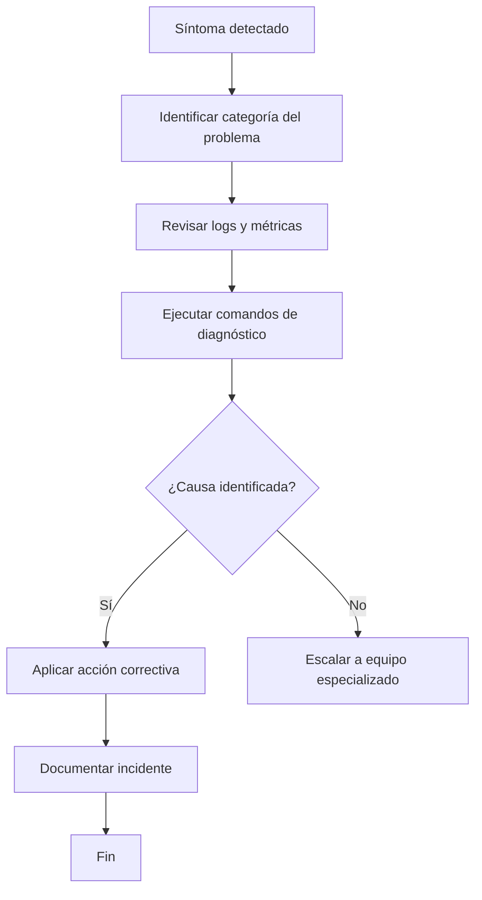
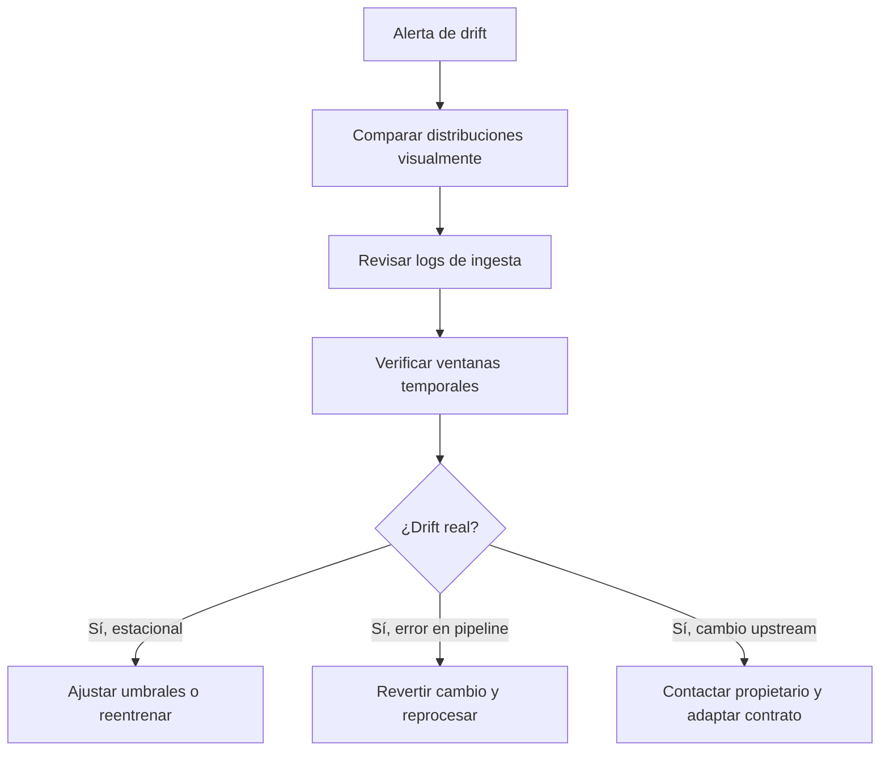
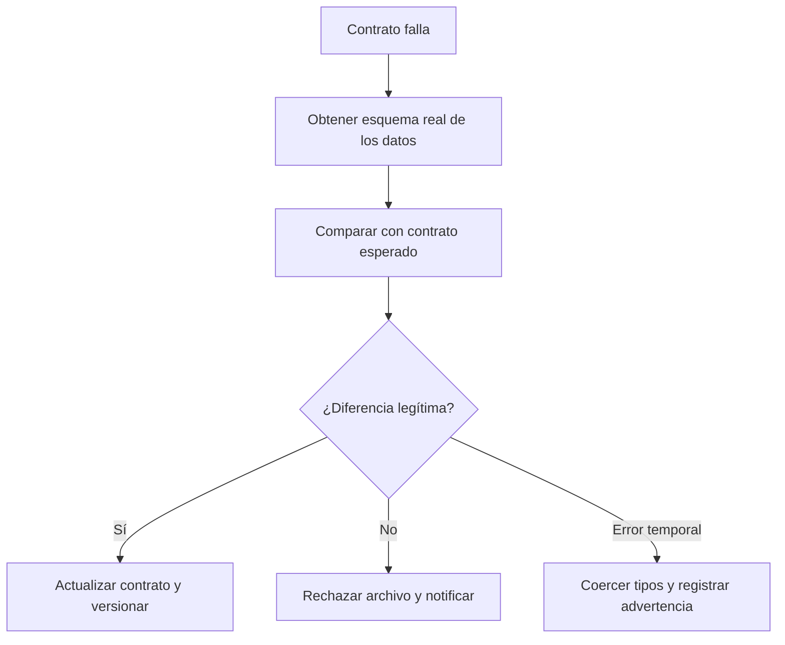
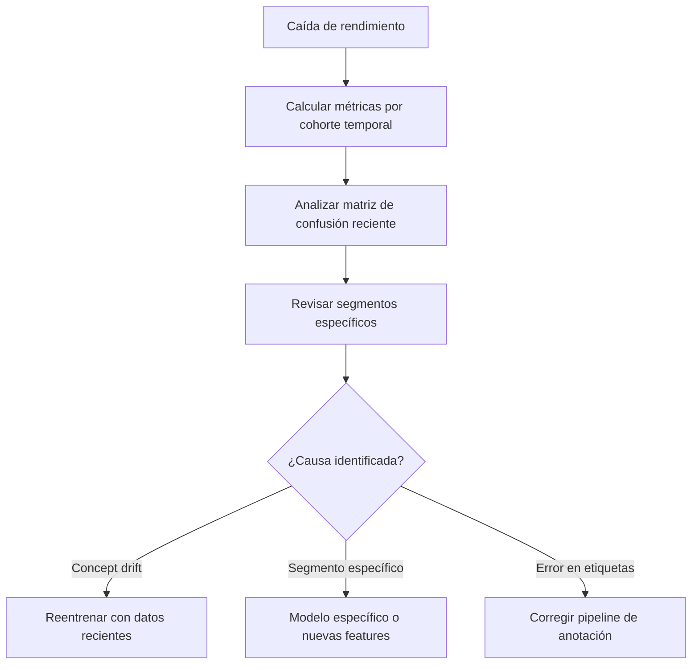
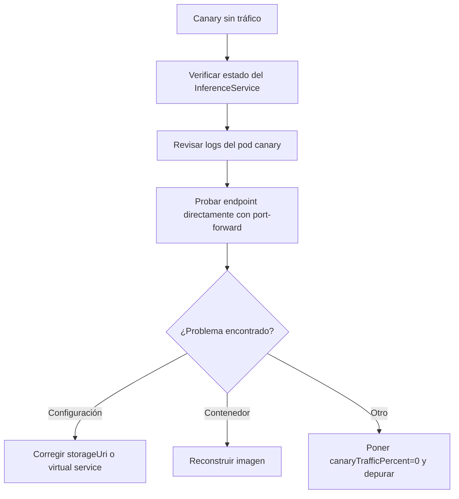
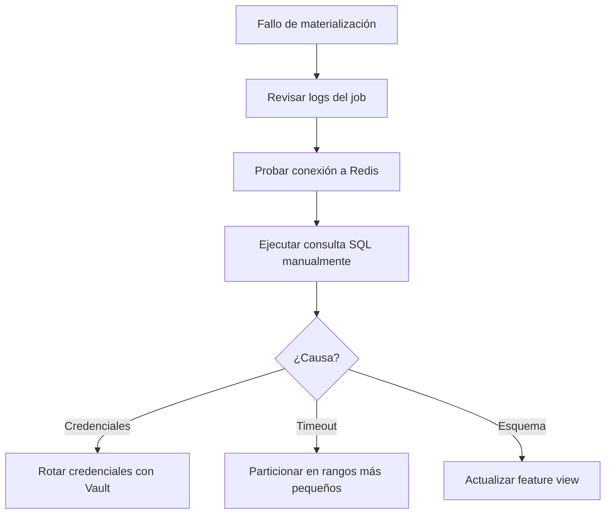
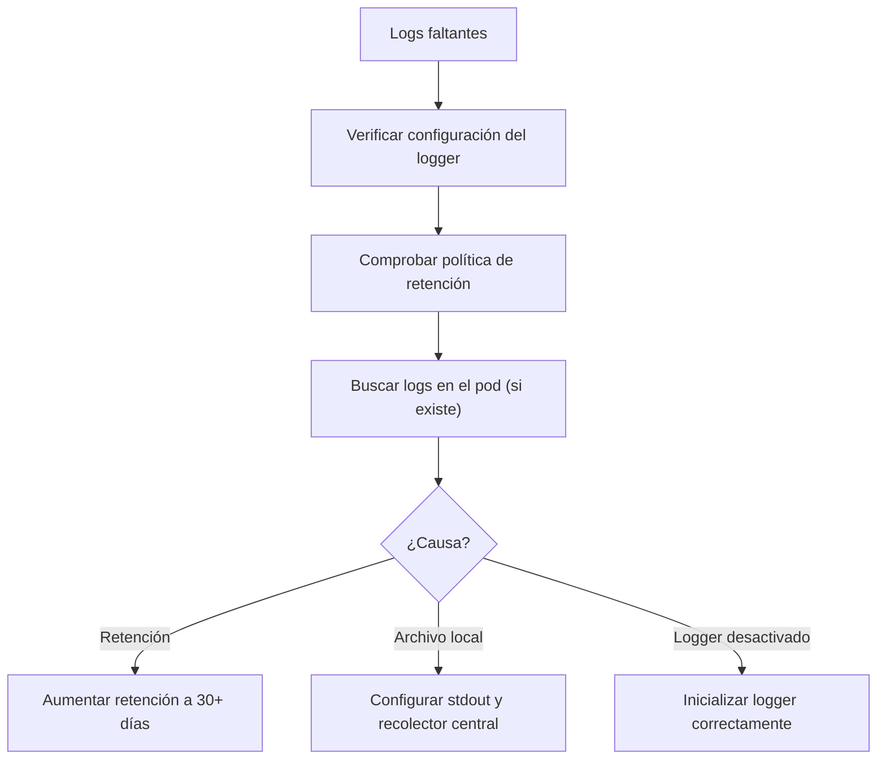

# Guía de Resolución de Problemas Comunes en Ingeniería de Software Estadístico

Esta guía es un **runbook práctico** para diagnosticar y resolver incidentes típicos en pipelines de datos, modelos y despliegues. Cada problema incluye síntomas, causas probables y pasos concretos de verificación y corrección.


---

## Flujo general de diagnóstico



## 1. Problemas con Data Drift

### 1.1. Alerta de drift en feature crítica

**Síntomas:**

- Evidently / WhyLabs reporta Hellinger distance > 0.1 o PSI > 0.25 para una o más variables.
- El dashboard de monitoreo muestra cambio en la distribución de una feature.

**Causas probables:**

- Cambio en el sistema upstream (ej. nueva versión de API que modifica formato).
- Error en pipeline de transformación (ej. imputación incorrecta).
- Cambio estacional real en los datos (ej. comportamiento de clientes).

**Diagrama de diagnóstico:**



**Pasos de diagnóstico:**

1. **Comparar distribuciones visualmente**

```python
# (fragmento ilustrativo, no ejecutable)
import pandas as pd
import matplotlib.pyplot as plt

ref = pd.read_parquet("data/reference.parquet")
prod = pd.read_parquet("data/production_sample.parquet")

for col in problematic_features:
    plt.hist(ref[col], bins=50, alpha=0.5, label='reference')
    plt.hist(prod[col], bins=50, alpha=0.5, label='production')
    plt.legend()
    plt.title(col)
    plt.show()
```

2. **Revisar logs de ingesta de datos**

```bash
grep "feature_name" audit/data_ingestion.log | tail -20
```

3. **Verificar fechas y ventanas temporales (point‑in‑time correctness)**

```sql
-- Ejemplo en BigQuery
SELECT MIN(event_timestamp), MAX(event_timestamp) FROM production_table;
```

**Acciones correctivas:**

- Drift estacional: ajustar umbrales o reentrenar con datos recientes.
- Error en pipeline: revertir cambio y reprocesar datos.
- Cambio upstream: contactar al equipo propietario y adaptar el contrato de datos.

## 2. Fallos en Validación de Datos (Contrato)

### 2.1. Contrato de datos falla en ingesta

**Síntomas:**

- Pipeline falla con error "Columnas faltantes: X" o "Tipo inesperado en columna Y".
- Log de auditoría registra `validation_status: failed`.

**Causas probables:**

- Cambio de esquema en la fuente (nueva columna, cambio de tipo, columna renombrada).
- Versión incorrecta del contrato.
- Problema de codificación o formato en el archivo fuente.

**Diagrama de diagnóstico:**



**Pasos de diagnóstico:**

1. **Obtener esquema real de los datos entrantes**

```python
# (fragmento ilustrativo, no ejecutable)
import pandas as pd

df = pd.read_csv("ruta/al/archivo.csv", nrows=5)
print(df.dtypes)
print(df.columns.tolist())
```

2. **Comparar con el contrato esperado** (`contracts/data_contract.yaml`):

- Columnas faltantes o extra.
- Tipos de datos (`object` vs `string`, `int64` vs `float64`).

3. **Revisar el historial del contrato en Git**

```bash
git log contracts/data_contract.yaml
```

**Acciones correctivas:**

- Cambio legítimo: actualizar el contrato y versionarlo.
- Error temporal: rechazar el archivo y notificar al proveedor.
- Coerción de tipos automática (si es seguro): implementar y registrar advertencia.

## 3. Degradación del Rendimiento del Modelo

### 3.1. AUC / precisión cae por debajo del umbral

**Síntomas:**

- Métricas de rendimiento (ground truth diferido) caen >5% respecto al champion.
- Aumento de falsos positivos o falsos negativos en el dashboard.

**Causas probables:**

- Concept drift (cambio en la relación features → target).
- Data drift no detectado previamente.
- Error en la obtención de ground truth (etiquetas incorrectas o atrasadas).

**Diagrama de diagnóstico:**



**Pasos de diagnóstico:**

1. **Comparar curvas de rendimiento por cohorte temporal**

```python
# (fragmento ilustrativo, no ejecutable)
df_results['week'] = df_results['prediction_date'].dt.isocalendar().week
weekly_auc = df_results.groupby('week').apply(
    lambda x: roc_auc_score(x['true_label'], x['pred_proba'])
)
```

2. **Analizar matriz de confusión reciente**

```python
# (fragmento ilustrativo, no ejecutable)
from sklearn.metrics import confusion_matrix, ConfusionMatrixDisplay

cm = confusion_matrix(y_true_recent, y_pred_recent)
ConfusionMatrixDisplay(cm).plot()
```

3. **Revisar si el problema es global o solo en un segmento** (ej. caída solo en una región).

**Acciones correctivas:**

- Concept drift: reentrenar con datos más recientes.
- Segmento específico: modelo específico o añadir nuevas features.
- Error en etiquetas: corregir pipeline de anotación y regenerar ground truth.

## 4. Problemas en Despliegue o Rollback

### 4.1. El nuevo modelo no recibe tráfico después del canary

**Síntomas:**

- `canaryTrafficPercent` > 0 pero todas las solicitudes van al champion.
- El endpoint del canary no aparece en los logs de acceso.

**Causas probables:**

- Error en configuración de KServe / Istio (virtual service mal definido).
- Contenedor del canary en crash loop.
- Versión del modelo no existe en el storage URI.

**Diagrama de diagnóstico:**



**Pasos de diagnóstico:**

1. **Verificar el estado del InferenceService**

```bash
kubectl get inferenceservice fraud-detector -o yaml
kubectl describe inferenceservice fraud-detector
```

2. **Revisar logs del pod canary**

```bash
kubectl logs -l app=fraud-detector-canary -c model-container
```

3. **Probar el endpoint del canary directamente (port‑forward)**

```bash
kubectl port-forward svc/fraud-detector-canary 8080:80 &
curl -X POST http://localhost:8080/v1/models/fraud-detector:predict \
  -d '{"instances": [...]}'
```

**Acciones correctivas:**

- Corregir `storageUri` o definición del virtual service.
- Reconstruir imagen si faltan dependencias.
- Temporalmente, poner `canaryTrafficPercent=0` y depurar en staging.

## 5. Fallos en Feature Store (Feast)

### 5.1. Materialización falla (offline → online)

**Síntomas:**

- Job de materialización (Airflow) falla con error de conexión a Redis o BigQuery.
- Valores online desactualizados o ausentes.

**Causas probables:**

- Credenciales de base de datos expiradas.
- Timeout en consulta a offline store (dataset muy grande).
- Inconsistencia en el esquema de feature views.

**Diagrama de diagnóstico:**



**Pasos de diagnóstico:**

1. **Revisar logs del job de materialización**

```bash
kubectl logs -n feast job-materialization-xxxx
```

2. **Probar conexión a Redis**

```bash
redis-cli -h redis.feast.svc.cluster.local -p 6379 ping
```

3. **Ejecutar la consulta SQL manualmente en BigQuery**

```sql
SELECT *
FROM `project.dataset.feature_table`
WHERE event_timestamp > TIMESTAMP_SUB(CURRENT_TIMESTAMP(), INTERVAL 1 DAY)
LIMIT 100;
```

**Acciones correctivas:**

- Rotar credenciales e inyectarlas mediante Vault.
- Particionar la materialización en rangos más pequeños (por horas).
- Actualizar la definición de feature view si el esquema cambió.

## 6. Problemas con Logs y Auditoría

### 6.1. No se encuentran logs de un incidente específico

**Síntomas:**

- El audit trail no contiene una predicción concreta.
- Logs rotos o incompletos.

**Causas probables:**

- Volumen de logs excedió la retención configurada.
- Error en la aplicación de logging (logger no inicializado).
- Log escrito en archivo local dentro de contenedor efímero.

**Diagrama de diagnóstico:**



**Pasos de diagnóstico:**

1. **Verificar que el logger está configurado para stdout**

```yaml
# En Dockerfile o configuración
ENV LOG_LEVEL=INFO
```

2. **Comprobar la política de retención de logs** (ej. Loki, Elasticsearch).

```bash
curl http://loki:3100/api/v1/status/buildinfo
```

3. **Buscar logs en el sistema de archivos del pod** (si aún existe)

```bash
kubectl exec -it pod-name -- cat /var/log/app/audit.log
```

**Acciones correctivas:**

- Aumentar retención (ej. 30 días para logs de auditoría).
- Configurar la aplicación para escribir logs en stdout y que un recolector (Fluentd, Logstash) los envíe a almacenamiento central.
- Implementar logging estructurado con `trace_id` para correlacionar eventos.

## 7. Checklist de Diagnóstico Rápido

| Síntoma | Primer comando / acción |
|---------|------------------------|
| Alerta de drift | `kubectl logs -n monitoring drift-detector` |
| Fallo en ingesta de datos | `cat audit/data_ingestion.log \| tail -50` |
| Modelo lento en inferencia | `kubectl top pod -l app=model` |
| No se actualiza el alias champion | `mlflow models get-version --model-name X --version Y` |
| Feast materialization timeout | `kubectl logs -n feast job-xxxx \| grep "timeout"` |
| Error de conexión a base de datos | `kubectl exec -it pod-name -- nc -zv db-host 5432` |
| Rollback no funciona | Verificar que el alias `@champion` apunta a la versión correcta: `mlflow models get-versions --model-name X` |

## 8. Recursos y enlaces útiles

| Herramienta / Tema | Enlace de referencia |
| --- | --- |
| Evidently AI (drift) | [Documentación oficial](https://docs.evidentlyai.com/) |
| Great Expectations (contratos) | [Great Expectations Docs](https://docs.greatexpectations.io/) |
| MLflow (model registry) | [MLflow Tracking](https://mlflow.org/docs/latest/tracking.html) |
| KServe (canary deployments) | [KServe Documentation](https://kserve.github.io/website/) |
| Feast (feature store) | [Feast Troubleshooting](https://docs.feast.dev/) |
| OpenTelemetry (logging) | [OpenTelemetry Logs](https://opentelemetry.io/docs/reference/specification/logs/) |
| Prometheus (alertas) | [Prometheus Alerting](https://prometheus.io/docs/prometheus/latest/configuration/alerting_rules/) |
| HashiCorp Vault (secretos) | [Vault Documentation](https://www.vaultproject.io/docs) |

## Buenas Prácticas para Dashboards Analíticos en R/Shiny

## Documentos relacionados

- [Getting Started](Getting_Started.md): configuración inicial y primer modelo, base para entender los errores comunes.
- [Monitoreo de Modelos en Producción](Monitoring.md): alertas y métricas que diagnostican problemas en producción.
- [Estrategia de Rollback de Modelos](Rollback.md): solución de último recurso cuando el troubleshooting no es suficiente.
- [Pruebas de Integración para Modelos Estadísticos](Integration_Tests.md): tests que previenen los problemas descritos en esta guía.
