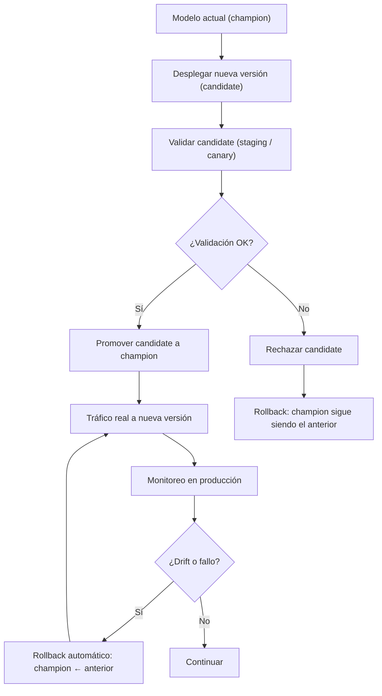
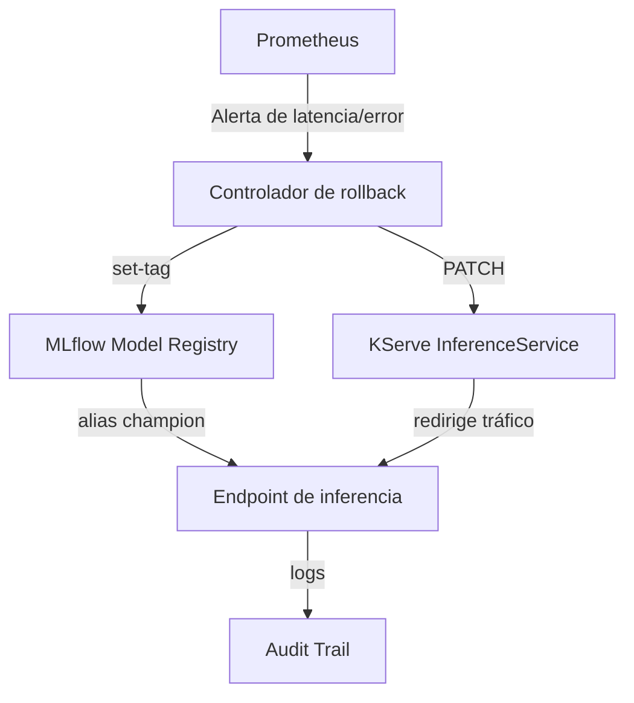
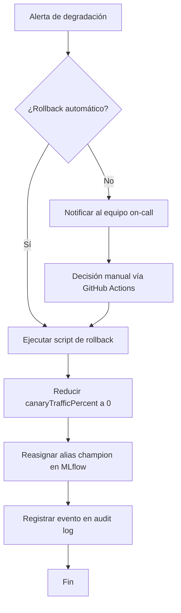

# Estrategia de Rollback de Modelos en Producción

## 1. Introducción

A pesar de las pruebas de integración y validación, los modelos pueden fallar en producción por razones imprevistas:

- Cambios en la distribución de los datos de entrada (drift).

- Degradación del rendimiento no detectada en staging.

- Efectos colaterales de la nueva versión en sistemas downstream.

La capacidad de **revertir rápidamente a una versión anterior** es tan importante como el propio despliegue.

Un rollback efectivo debe cumplir tres condiciones:

- **Rápido** (segundos o pocos minutos, no horas).

- **Automático** (disparado por alertas o por decisión manual con un solo clic).

- **Auditable** (dejar traza en el registro de modelos y en los logs de auditoría).

Este capítulo describe estrategias concretas usando **MLflow**, **KServe/Istio** y **Docker**, así como su integración con CI/CD.

## 2. El Patrón Champion‑Challenger con Alias

El **model registry** es el componente central para gestionar versiones. Se utilizan tres alias:

| Alias | Propósito |
|-------|-----------|
| `champion` | Modelo que recibe tráfico real. |
| `candidate` | Modelo en pruebas (staging o canary). |
| `archived` | Versiones retiradas pero conservadas por auditoría. |

Cuando se despliega una nueva versión, se mueve el alias `champion` al nuevo modelo tras las validaciones. El rollback consiste en **revertir el alias `champion` a la versión anterior**.

### Diagrama de flujo del patrón champion‑challenger



### 2.1. Ejemplo con MLflow

Supongamos un modelo `fraud_detector` con versiones 1, 2, 3, …

```bash
# Despliegue de la versión 3 como champion (nuevo modelo)
mlflow models set-tag \
  --model-name fraud_detector \
  --version 3 \
  --tag @champion

# Rollback a la versión 2 (campeón anterior)
mlflow models set-tag \
  --model-name fraud_detector \
  --version 2 \
  --tag @champion
```

El endpoint de inferencia siempre carga el modelo apuntado por `@champion`. El rollback es instantáneo (solo actualiza la referencia, no reinicia pods).

## 3. Rollback Automático con KServe e Istio

En entornos Kubernetes, KServe (o un service mesh como Istio) permite dividir el tráfico entre versiones. Combinado con MLflow y Prometheus, se puede automatizar el rollback.

### 3.1. Flujo con KServe (Canary)

KServe define un `InferenceService` con `canaryTrafficPercent`. El rollback consiste en poner ese porcentaje a 0.

```yaml
apiVersion: serving.kserve.io/v1beta1
kind: InferenceService
metadata:
  name: fraud-detector
spec:
  predictor:
    canaryTrafficPercent: 20       # Nuevo modelo recibe 20% del tráfico
    model:
      modelFormat: sklearn
      storageUri: gs://models/fraud_detector/3   # versión 3
```

Si las métricas del canary superan umbrales, un script automático elimina el tráfico del canary:

```bash
# Rollback: canaryTrafficPercent = 0
kubectl patch inferenceservice fraud-detector --type='json' \
  -p='[{"op": "replace", "path": "/spec/predictor/canaryTrafficPercent", "value": 0}]'
```

Simultáneamente, se revierte el alias en MLflow a la versión anterior.

### 3.2. Integración con Prometheus y Alertas

Un controlador (script, pod o función serverless) escucha las alertas de Prometheus y ejecuta el rollback.

```python
# (fragmento ilustrativo, no ejecutable)
# rollback_controller.py (ejemplo)
from prometheus_api_client import PrometheusConnect
import requests
import mlflow

def check_canary_health():
    prom = PrometheusConnect(url="http://prometheus:9090")
    query = (
        'histogram_quantile(0.99, '
        'sum(rate(model_inference_duration_seconds_bucket{model_version="3"}[5m])) by (le))'
    )
    result = prom.custom_query(query)
    p99_latency = float(result[0]["value"][1])
    return p99_latency <= 0.5   # umbral 500 ms

if not check_canary_health():
    # 1. Revertir tráfico en KServe
    requests.patch(
        "http://kserve-controller/...",
        json={"canaryTrafficPercent": 0}
    )
    # 2. Revertir alias en MLflow
    mlflow.set_tag("fraud_detector", "3", "@archived")
    mlflow.set_tag("fraud_detector", "2", "@champion")
    # 3. Registrar auditoría
    log_audit("rollback", "automático", "latencia alta en canary")
```

### Diagrama de componentes para rollback automático



## 4. Rollback con Regeneración de Imagen Docker

Cuando el modelo está empaquetado dentro de la imagen (y no se carga dinámicamente desde un registry), el rollback implica reconstruir y desplegar la imagen anterior.

### 4.1. Estrategia: Etiquetado canónico

Cada imagen se etiqueta con la versión del modelo y con el alias `champion` solo en la versión activa.

```bash
# Construcción inicial
docker build -t fraud-detector:2 -t fraud-detector:champion .
docker push fraud-detector:2
docker push fraud-detector:champion

# Nuevo despliegue (versión 3)
docker build -t fraud-detector:3 .
docker push fraud-detector:3
docker tag fraud-detector:3 fraud-detector:champion
docker push fraud-detector:champion
```

Para hacer rollback:

```bash
# Reetiquetar la versión anterior como champion
docker tag fraud-detector:2 fraud-detector:champion
docker push fraud-detector:champion
# Reiniciar pods
kubectl rollout restart deployment/fraud-detector
```

Este método es más lento (requiere reinicio) y se recomienda solo para modelos simples o entornos legacy.

## 5. Flujo de Rollback Recomendado (Integrado con CI/CD)

### Diagrama de decisión para rollback



### 5.1. Automatización con GitHub Actions

Se puede crear un workflow manual (o automático) para ejecutar rollback desde la interfaz de GitHub.

```yaml
# .github/workflows/rollback.yml
name: Emergency Model Rollback
on:
  workflow_dispatch:
    inputs:
      model_name:
        description: 'Nombre del modelo'
        required: true
      target_version:
        description: 'Versión a la que revertir (número)'
        required: true
      reason:
        description: 'Motivo del rollback'
        required: true

jobs:
  rollback:
    runs-on: ubuntu-latest
    steps:
      - uses: actions/checkout@v4
      - name: Reassign champion alias
        run: |
          mlflow models set-tag \
            --model-name ${{ github.event.inputs.model_name }} \
            --version ${{ github.event.inputs.target_version }} \
            --tag @champion
      - name: Update KServe canary (if applicable)
        run: |
          kubectl patch inferenceservice ${{ github.event.inputs.model_name }} \
            --patch '{"spec":{"predictor":{"canaryTrafficPercent":0}}}' \
            --type merge
      - name: Notify team
        uses: slackapi/slack-github-action@v1.24
        with:
          payload: |
            {
              "text": "Rollback ejecutado en modelo '${{ github.event.inputs.model_name }}' a versión ${{ github.event.inputs.target_version }}. Motivo: ${{ github.event.inputs.reason }}"
            }
      - name: Audit log
        run: |
          echo "$(date -u +%Y-%m-%dT%H:%M:%SZ), rollback, ${{ github.actor }}, ${{ github.event.inputs.model_name }}, ${{ github.event.inputs.target_version }}, ${{ github.event.inputs.reason }}" >> audit/rollback.log
```

## 6. Comparativa de Estrategias de Rollback

| Estrategia | Velocidad | Complejidad | Dependencias | Caso de uso |
|------------|-----------|-------------|--------------|-------------|
| MLflow alias | Instantánea | Baja | MLflow, endpoint dinámico | Modelos cargados desde registry |
| KServe canary | Rápida (segundos) | Media | Kubernetes, KServe, Prometheus | Infraestructura cloud nativa |
| Docker tag + rollout | Lenta (minutos) | Baja | Docker, Kubernetes | Modelos empaquetados en imagen |

## 7. Buenas Prácticas

- Mantener al menos las últimas 3 versiones de cada modelo en el registry.

- Probar el rollback regularmente en entornos de staging (simular fallos).

- Documentar cada rollback en el audit trail (quién, cuándo, por qué, desde/hacia qué versión).

- Separar la lógica de rollback del código de inferencia: el servicio no debe contener reglas de selección de versión; debe delegar en MLflow y en el controlador de tráfico.

## Documentos relacionados

- [MLflow para la Gestión del Ciclo de Vida de Modelos Estadísticos](MLflow.md): registry desde el cual se selecciona la versión anterior para el rollback.
- [Monitoreo de Modelos en Producción](Monitoring.md): alertas que disparan el proceso de rollback automático.
- [Guía de Despliegue](Deployment_Guide.md): pipeline de despliegue que gestiona la transición de versiones.
