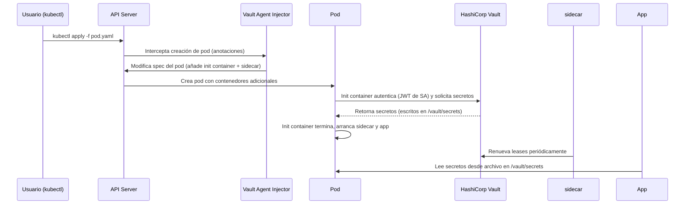
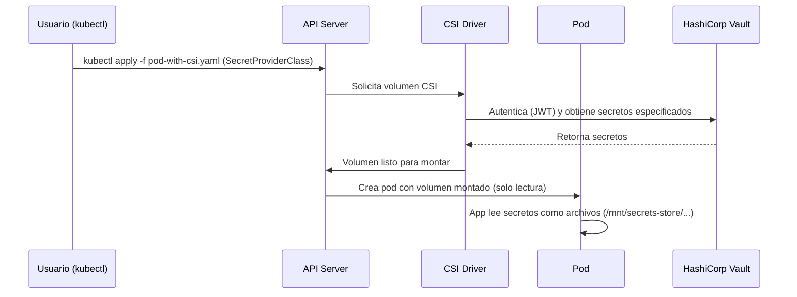
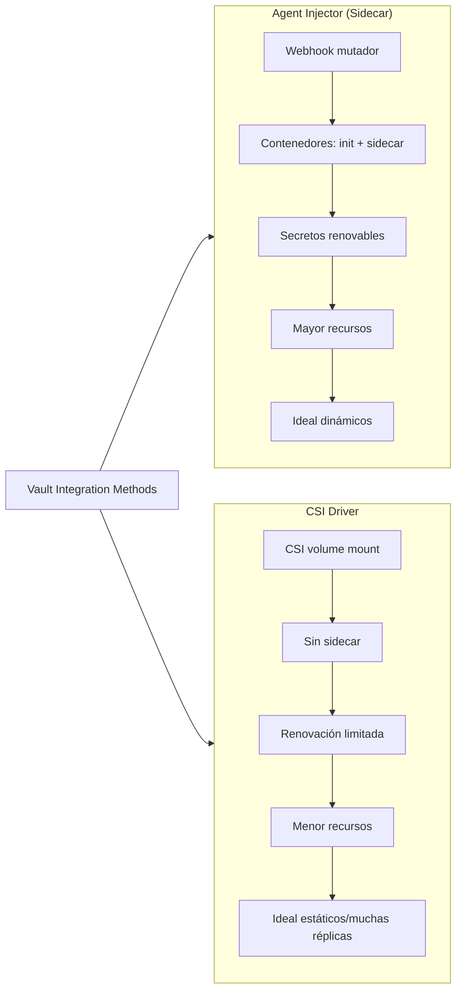
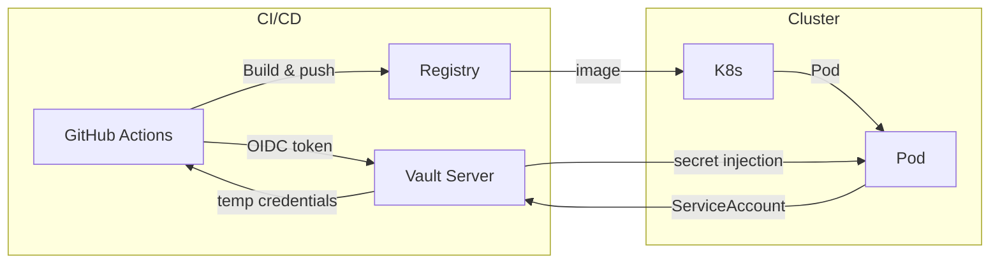

# Gestión de Secretos en Contenedores con Vault

Las credenciales de bases de datos, claves de API y tokens de autenticación son activos críticos. Kubernetes Secrets almacena estos secretos en `etcd` en texto plano (a menos que se configure `EncryptionConfiguration`) y, en la práctica, suelen terminar sin cifrar en repositorios Git (GitOps). Para sistemas estadísticos que manejan datos sensibles, confiar solo en Kubernetes Secrets es insuficiente.

**HashiCorp Vault** resuelve estas limitaciones: centraliza la gestión, cifra los secretos en reposo y en tránsito, y permite inyectarlos en contenedores sin exponerlos en variables de entorno. Este artículo compara los dos métodos principales de integración con Kubernetes; **Vault Agent Injector** (sidecar) y **CSI Driver**, proporcionan ejemplos prácticos y una guía de selección adaptada a proyectos de software estadístico y MLOps.

### Diagrama de flujo: Inyección de secretos con Vault Agent Injector



### Diagrama de flujo: CSI Driver (montaje directo)



## 1. Los dos métodos de integración: Agent Injector vs. CSI Driver

Vault ofrece dos enfoques para inyectar secretos en pods, manteniéndolos fuera de `etcd`. Ambos son seguros, pero tienen arquitecturas y casos de uso distintos.


### 1.1 Vault Agent Injector (Sidecar)

Un **webhook mutador** intercepta la creación de pods y, según anotaciones, inyecta dos contenedores auxiliares:

- `vault-agent-init`: autentica el pod contra Vault y precarga los secretos antes de que arranque la aplicación.
- `vault-agent`: sidecar que renueva automáticamente los leases de los secretos.
- Los secretos se escriben en un volumen de memoria compartida (`/vault/secrets`). La aplicación solo lee archivos de esa ruta.

| Fase | Descripción |
|------|-------------|
| 1. Interceptación | El webhook captura el evento de creación del pod. |
| 2. Inyección de Init Container | Se añade `vault-agent-init` que autentica y precarga secretos. |
| 3. Inyección de Sidecar | Se añade `vault-agent` que renueva leases continuamente. |
| 4. Montaje de Volumen Compartido | Todos los contenedores montan un `emptyDir` en `/vault/secrets`. |

### Mapa conceptual comparativo: Agent Injector vs CSI Driver



#### Instalación y configuración básica

```bash
helm repo add hashicorp https://helm.releases.hashicorp.com
helm repo update

helm install vault hashicorp/vault \
  --namespace vault \
  --create-namespace \
  --set "injector.enabled=true" \
  --set "injector.replicas=2" \
  --set "server.ha.enabled=true" \
  --set "server.ha.replicas=3"
```

Verificar el injector:

```bash
kubectl -n vault get pods -l app.kubernetes.io/name=vault-agent-injector
kubectl get mutatingwebhookconfigurations vault-agent-injector-cfg
```

Configuración del Auth Method de Kubernetes:

```bash
kubectl exec -n vault vault-0 -- vault auth enable kubernetes
kubectl exec -n vault vault-0 -- vault write auth/kubernetes/config \
  kubernetes_host="https://kubernetes.default.svc:443"
```

Política de Vault (ejemplo para acceso a secretos de base de datos):

```hcl
path "database/creds/db-app" {
  capabilities = ["read"]
}
```

Rol que vincula la ServiceAccount con la política:

```bash
kubectl exec -n vault vault-0 -- vault write auth/kubernetes/role/app-role \
  bound_service_account_names=app-sa \
  bound_service_account_namespaces=default \
  policies=read-db-creds \
  ttl=24h
```

Ejemplo práctico: pod con inyección de secretos

```yaml
# app-with-vault-secrets.yaml
apiVersion: v1
kind: ServiceAccount
metadata:
  name: app-sa
---
apiVersion: v1
kind: Pod
metadata:
  name: app-with-secrets
  annotations:
    vault.hashicorp.com/agent-inject: "true"
    vault.hashicorp.com/role: "app-role"
    vault.hashicorp.com/agent-inject-secret-db-creds: "database/creds/db-app"
    vault.hashicorp.com/agent-inject-template-db-creds: |
      {{- with secret "database/creds/db-app" -}}
      export DB_USER="{{ .Data.username }}"
      export DB_PASSWORD="{{ .Data.password }}"
      export DB_HOST="postgres.prod.svc.cluster.local"
      {{- end }}
spec:
  serviceAccountName: app-sa
  containers:
    - name: app
      image: myapp:latest
      command: ["/bin/bash", "-c"]
      args:
        - |
          source /vault/secrets/db-creds
          python /app/main.py
      volumeMounts:
        - name: vault-secrets
          mountPath: /vault/secrets
          readOnly: true
  volumes:
    - name: vault-secrets
      emptyDir:
        medium: Memory   # Montaje en RAM, sin persistencia en disco
```

La aplicación lee las credenciales desde `/vault/secrets/db-creds` tras ejecutar `source`. No necesita conocer la API de Vault.

### 1.2 CSI Driver (Container Storage Interface)

El CSI Driver monta secretos como volúmenes efímeros directamente desde Vault hacia el pod, sin contenedores sidecar.

#### Instalación

```bash
helm install vault-secrets-operator hashicorp/vault-secrets-operator \
  --namespace vault \
  --set csi.enabled=true
```

#### Definir un SecretProviderClass

```yaml
# secret-provider-class.yaml
apiVersion: secrets-store.csi.x-k8s.io/v1
kind: SecretProviderClass
metadata:
  name: vault-database-creds
spec:
  provider: vault
  parameters:
    roleName: 'app-role'
    objects: |
      - objectName: "db-username"
        secretPath: "secret/data/database"
        secretKey: "username"
      - objectName: "db-password"
        secretPath: "secret/data/database"
        secretKey: "password"
```

#### Montar el volumen en el pod

```yaml
volumes:
  - name: secrets-store
    csi:
      driver: secrets-store.csi.k8s.io
      readOnly: true
      volumeAttributes:
        secretProviderClass: "vault-database-creds"
```

Los secretos aparecen como archivos individuales (ej. `/mnt/secrets-store/db-username`).

### 1.3 Comparativa y guía de selección

| Criterio | Agent Injector (Sidecar) | CSI Driver |
|----------|--------------------------|------------|
| Complejidad operativa | Media (sidecars adicionales) | Baja (solo montaje de volumen) |
| Renovación automática de secretos | Sí, continua | Limitada (requiere reinicio del pod) |
| Compatibilidad con aplicaciones existentes | Alta (lee archivos) | Alta (lee archivos) |
| Huella de recursos | Mayor (uno o dos contenedores extra por pod) | Menor (driver a nivel de nodo) |
| Casos de uso recomendados | Secretos dinámicos con rotación frecuente; apps que no pueden reiniciarse | Secretos estáticos o rotación poco frecuente; clústeres con muchos pods |

> **Recomendación para software estadístico:** El Vault Agent Injector es preferible para modelos en producción, pipelines de entrenamiento y servicios de inferencia real‑time, porque renueva leases automáticamente sin reiniciar los pods. El CSI Driver es más ligero para trabajos batch (ETL, entrenamientos cortos).

En cualquier caso, nunca almacene secretos en texto plano en el código fuente ni en variables de entorno inseguras.

## 2. Gestión de secretos en entornos de desarrollo local

Para pruebas locales sin un clúster Kubernetes, puede ejecutar Vault en modo dev o usar variables de entorno para secretos de baja criticidad. Ejemplo con `docker-compose`:

```yaml
version: '3.9'
services:
  vault:
    image: vault:1.15
    cap_add: [IPC_LOCK]
    environment:
      VAULT_DEV_ROOT_TOKEN_ID: root
      VAULT_DEV_LISTEN_ADDRESS: 0.0.0.0:8200
    ports:
      - "8200:8200"
```

Luego configure su aplicación para leer secretos desde Vault (usando la API REST o el agente local) solo en desarrollo. En producción, use el injector.

## 3. Integración con el flujo de trabajo de MLOps

En un pipeline de MLOps, múltiples etapas requieren secretos:

### Flujo de integración con MLOps (GitHub Actions + Vault OIDC)



| Etapa | Ejemplo de secreto |
|-------|-------------------|
| Ingesta de datos | Claves de API para fuentes externas (financieras, gubernamentales), credenciales de bases de datos. |
| Entrenamiento | Tokens de MLflow, credenciales para GPUs en la nube, claves de almacenamiento (S3). |
| Despliegue | Claves de API del modelo, tokens de service mesh. |

Cada pod se inyecta solo los secretos que necesita (mínimo privilegio). Ejemplo de anotaciones para múltiples secretos:

```yaml
annotations:
  vault.hashicorp.com/agent-inject-secret-mlflow-token: "secret/data/mlflow/token"
  vault.hashicorp.com/agent-inject-secret-bigquery-creds: "secret/data/bigquery/credentials"
```

Para pipelines CI/CD (GitHub Actions), puede autenticarse con Vault mediante OIDC sin almacenar tokens largos:

```yaml
jobs:
  deploy:
    steps:
      - name: Authenticate to Vault via OIDC
        uses: hashicorp/vault-action@v2
        with:
          url: https://vault.example.com
          method: jwt
          role: github-actions-role
```

El secreto se obtiene como variable de entorno temporal dentro del job.

## 4. Mejores prácticas y checklist de seguridad

| Práctica | Descripción |
|----------|-------------|
| ServiceAccounts dedicadas | Cada aplicación tiene su propia cuenta de servicio de Kubernetes, con un rol de Vault independiente y una política que concede acceso solo a los secretos que necesita. Previene propagación lateral. |
| TLS/mTLS | Configurar TLS para todas las comunicaciones entre los pods y Vault. Usar mTLS cuando sea posible. |
| Auditoría de acceso | Vault logs todas las operaciones (quién accedió a qué secreto, cuándo y desde qué pod). Integre estos logs con su sistema de monitoreo (SIEM, bucket centralizado). |
| Rotación automática | Configure políticas de rotación (ej. cada 30 días). El Agent Injector renueva leases sin reiniciar las aplicaciones. |
| No almacenar secretos en imágenes | Las imágenes Docker nunca deben contener secretos. Inyecte siempre en tiempo de ejecución. |
| Alta disponibilidad | En producción, despliegue Vault en modo HA con al menos 3 réplicas y almacenamiento persistente (Raft, Consul). |
| Monitoreo de salud | Health checks periódicos sobre la API de Vault. Alertas cuando el servidor esté sealed o no responda. |

### Checklist rápido

- [ ] ¿Los secretos se inyectan mediante Vault, no están hardcodeados ni en variables de entorno?

- [ ] ¿Cada aplicación tiene su propia ServiceAccount y rol Vault con políticas específicas?

- [ ] ¿Se ha habilitado TLS/mTLS entre Vault y los pods?

- [ ] ¿Los logs de acceso a secretos se envían a un sistema centralizado (ELK, SIEM)?

- [ ] ¿Está configurada la rotación automática de credenciales?

- [ ] ¿Vault está en modo HA con almacenamiento persistente?

- [ ] ¿Se han probado health checks y alertas de sellado?

## Referencias

- [HashiCorp Vault Documentation](https://developer.hashicorp.com/vault/docs)

- [Vault Agent Injector](https://developer.hashicorp.com/vault/docs/platform/k8s/injector)

- [Vault CSI Driver](https://developer.hashicorp.com/vault/docs/platform/k8s/csi)

- [Vault OIDC Auth for GitHub Actions](https://developer.hashicorp.com/vault/docs/auth/jwt/oidc-providers/github)


## Documentos relacionados

- [Estrategia de Datos y Data Governance](Data_Governance.md): políticas de acceso y clasificación de datos sensibles que requieren secretos.
- [Guía de Despliegue](Deployment_Guide.md): integración de Vault con contenedores Docker y GitHub Actions.
- [Guía de Despliegue](Deployment_Guide.md): gestión de secretos en pipelines de despliegue a producción.
