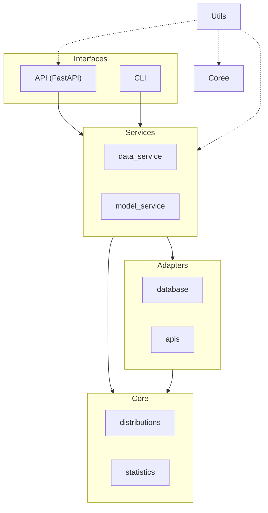
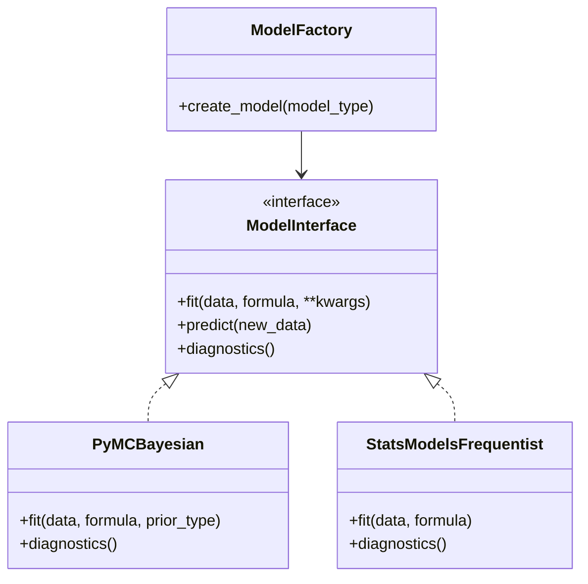
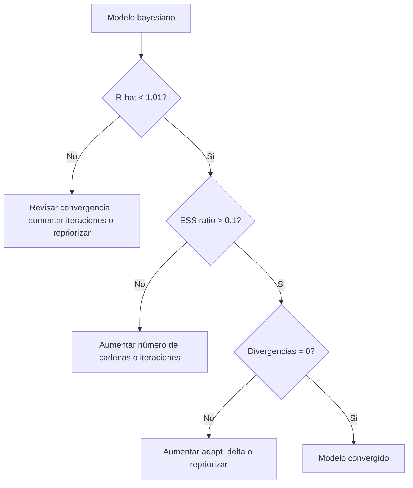
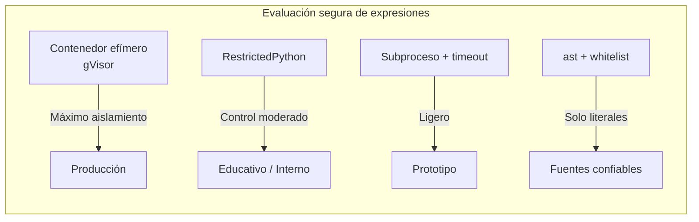
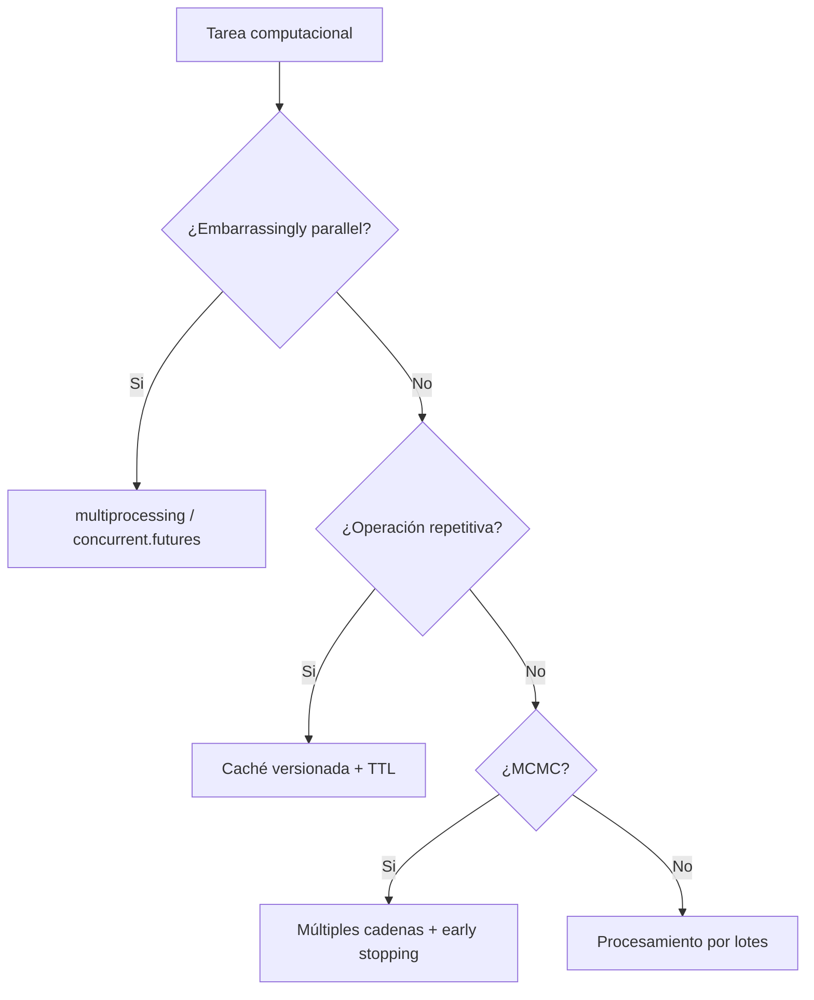
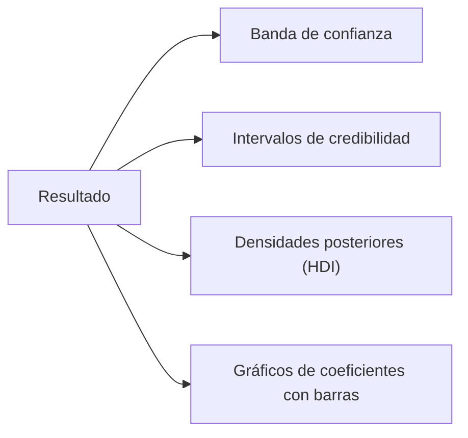
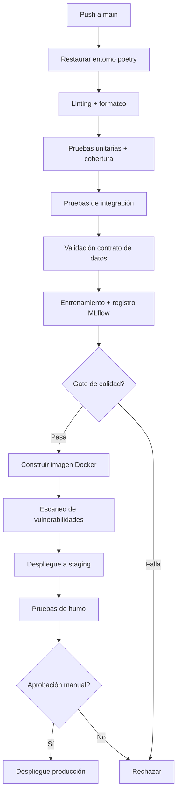
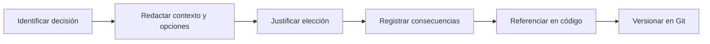

# Principios y Prácticas para la Construcción de Sistemas Estadísticos Robustos

La ingeniería de software estadístico es el estándar necesario para construir sistemas fiables, auditables y sostenibles en producción. Adoptar estos principios permite confiar en los resultados (son reproducibles), colaborar en equipo (el código es legible y modular), pasar auditorías regulatorias (cada decisión está registrada) y escalar sin reescribir (la arquitectura lo permite).

El código es el algoritmo. El algoritmo es el producto. El producto genera confianza.

## Premisa Fundamental

Un sistema estadístico profesional no es una colección de scripts que funcionan. Es un sistema diseñado para ser:

- **Legible**: Un colega debe entender la lógica sin documentación adicional. 
- **Modular**: Cada componente puede ser reemplazado sin afectar el resto.
- **Mantenible**: Los cambios posteriores no introducen deuda técnica 
significativa.
- **Auditable**: Cada decisión estadística puede justificarse y rastrearse.
- **Escalable**: La arquitectura está preparada para crecer en usuarios, datos y complejidad.

---

## 1. Principios Rectores

Para un ejemplo práctico completo que aplica estos principios, ver [Getting Started](Getting_Started.md).

**Diagrama de relaciones entre principios:**


| Principio | Descripción | Práctica recomendada |
| --- | --- | --- |
| Reproducibilidad | Un mismo proceso produce los mismos resultados bajo las mismas condiciones | Lock files, semillas fijas, registro de entorno |
| Modularidad | El sistema se compone de piezas independientes y reutilizables | Separación en capas, inyección de dependencias |
| Validación continua | Los errores se detectan temprano | Tests automáticos, contratos de datos en cada ingesta |
| Eficiencia | El sistema usa recursos de forma proporcional | Caché, paralelismo, lazy evaluation |
| Transparencia estadística | Los resultados comunican explícitamente la incertidumbre | Intervalos de credibilidad, diagnósticos de convergencia |
| Seguridad por diseño | Los datos y el código se protegen desde la arquitectura | Gestión de secretos, logs de acceso, cifrado de artefactos |
| Diseño para el reemplazo | Los componentes pueden intercambiarse sin afectar al sistema | Fábricas, estrategias, polimorfismo |
| Documentación como código | Las decisiones analíticas están versionadas y vinculadas al código | `docs/decisions/`, referencias en metadatos |

## 2. Arquitectura en Capas

La arquitectura recomendada separa responsabilidades en capas que dependen hacia adentro. La capa más interna (core) no conoce las externas.

**Diagrama de dependencias entre capas:**



```text
proyecto/
├── core/                           # Lógica estadística pura, sin dependencias externas
│   ├── distributions.py            # Funciones de densidad, generación de muestras
│   ├── models.py                   # Especificación de modelos (fórmulas, priors)
│   ├── inference.py                # Algoritmos de inferencia (MCMC, optimización)
│   └── statistics.py               # Estadísticos, tests, validaciones
├── adapters/                       # Conexión con fuentes de datos y sistemas externos
│   ├── database.py
│   ├── apis.py
│   ├── files.py                    # CSV, Parquet, Delta Lake
│   └── cache.py
├── services/                       # Orquestación de flujos de trabajo
│   ├── data_service.py             # Validación, limpieza, transformación
│   ├── model_service.py            # Ajuste, guardado, carga de modelos
│   ├── analysis_service.py
│   └── export_service.py
├── interfaces/                     # Puntos de entrada
│   ├── api/                        # FastAPI
│   │   └── main.py
│   └── cli/                        # Scripts de línea de comandos
│       └── main.py
├── utils/
│   ├── logging.py                  # Logger estructurado
│   ├── validators.py
│   ├── safe_eval.py
│   └── constants.py
├── tests/
│   ├── unit/
│   └── integration/
├── audit/                          # Trazas inmutables y metadatos
│   ├── data_ingestion.log
│   ├── diagnostics.json
│   └── environment.json
├── docs/
│   └── decisions/                  # Decisiones analíticas versionadas (ver sección 14)
├── models/
├── data/
├── notebooks/                      # Solo exploración; no producción
├── .github/
│   └── workflows/
├── pyproject.toml                  # Dependencias con lock file
└── README.md
```

### Reglas de dependencia

- Core no depende de ninguna otra capa.
- Adapters puede depender de core.
- Services puede depender de core y adapters.
- Interfaces puede depender de services, adapters y core.
- Utils puede ser usado por todas las capas.
- La interfaz de usuario (Next.js) se comunica exclusivamente con la capa `interfaces/api`, no con el core directamente.

Para el manejo de features versionados, ver también: [Feature Store](Feature_Store.md).

## 3. Validación de Calidad de Datos

Un contrato de datos moderno incluye expectativas de calidad: valores nulos, rangos, relaciones entre columnas y consistencia temporal. La definición del contrato es independiente de la implementación y se expresa en YAML.

### 3.1 Definición del Contrato (YAML)

```yaml
# contracts/ventas_diarias.yaml
dataset: ventas_diarias
version: "1.1"
columns:
  - name: fecha
    type: date
    nullable: false
  - name: producto_id
    type: string
    nullable: false
  - name: unidades
    type: integer
    nullable: false
expectations:
  - type: not_null
    columns: [fecha, producto_id, unidades]
  - type: unique
    columns: [fecha, producto_id]
  - type: range
    column: unidades
    min: 0
    max: 10000
  - type: values_in_set
    column: estado
    values: ["activo", "cancelado", "pendiente"]
```

### 3.2 Implementación con Great Expectations (Python)

```python
# (fragmento ilustrativo, no ejecutable)
import great_expectations as gx
from great_expectations.core.batch import RuntimeBatchRequest

context = gx.get_context()

# Nota: el datasource "pandas_datasource" debe existir previamente en el contexto de GX.
# Puede crearse vía CLI: great_expectations datasource new --name pandas_datasource
suite = context.create_expectation_suite("ventas_suite", overwrite_existing=True)

batch_request = RuntimeBatchRequest(
    datasource_name="pandas_datasource",
    data_connector_name="runtime_connector",
    data_asset_name="ventas",
    runtime_parameters={"batch_data": df},
    batch_identifiers={"run_id": "2026-06-08"},
    expectation_suite_name="ventas_suite",
)

validator = context.get_validator(batch_request=batch_request)
validator.expect_column_values_to_not_be_null("producto_id")
validator.expect_column_values_to_be_between("unidades", min_value=0, max_value=10000)
validator.expect_column_values_to_be_in_set("estado", ["activo", "cancelado", "pendiente"])

results = validator.validate()
if not results["success"]:
    raise ValueError(f"Contrato de datos violado: {results['statistics']}")
```

### 3.3 Auditoría de Ingesta

Cada ingesta registra metadatos estructurados en `audit/data_ingestion.log`:

```json
{
  "timestamp": "2026-06-08T10:30:00Z",
  "source_id": "ventas_2026_06",
  "user": "system_etl",
  "n_rows": 15234,
  "hash_sha256": "a3f5c2d8...",
  "contract_version": "1.1",
  "validation_status": "passed",
  "dvc_commit": "abc1234"
}
```

El campo `dvc_commit` vincula el dataset con su versión en DVC para trazabilidad completa hacia MLflow.

## 4. Modelado Estadístico Robusto

### 4.1 Principios de especificación

La fórmula del modelo debe ser explícita y estar documentada.

Para modelos bayesianos, los priors se justifican en `docs/decisions/` (ver sección 14).

El código permite cambiar especificación, familia y priors sin reescribir la arquitectura.

### 4.2 Patrón de Fábrica para Modelos (Python)

**Diagrama de clases del patrón de fábrica:**



```python
# (fragmento ilustrativo, no ejecutable)
import numpy as np
import pandas as pd
from abc import ABC, abstractmethod

class ModelInterface(ABC):
    @abstractmethod
    def fit(self, data: pd.DataFrame, formula: str, **kwargs) -> None:
        pass

    @abstractmethod
    def predict(self, new_data: pd.DataFrame) -> np.ndarray:
        pass

    @abstractmethod
    def diagnostics(self) -> dict:
        pass

class PyMCBayesian(ModelInterface):
    """Modelo bayesiano con PyMC. Ver docs/decisions/prior_selection.md."""
    
    def fit(self, data, formula, prior_type="weakly_informative"):
        # Implementación con PyMC
        pass
    
    def predict(self, new_data):
        pass
    
    def diagnostics(self) -> dict:
        return {"rhat_max": self._rhat_max, "ess_min": self._ess_min}

class StatsModelsFrequentist(ModelInterface):
    def fit(self, data, formula):
        import statsmodels.formula.api as smf
        self.result = smf.ols(formula, data=data).fit()
    
    def predict(self, new_data):
        return self.result.predict(new_data)
    
    def diagnostics(self) -> dict:
        return {"aic": self.result.aic, "bic": self.result.bic}

def model_factory(model_type: str) -> ModelInterface:
    registry = {
        "bayesian": PyMCBayesian,
        "frequentist": StatsModelsFrequentist,
    }
    if model_type not in registry:
        raise ValueError(f"Unknown model type: {model_type}. Options: {list(registry)}")
    return registry[model_type]()
```

### 4.3 Almacenamiento de modelos con metadatos

Al guardar un modelo, se almacena junto con:

- Fecha y hora de entrenamiento.
- Hash de Git (versión del código).
- Hash DVC del dataset utilizado.
- Métricas de validación (R-hat, ESS, RMSE, AUC, etc.).
- Versiones de bibliotecas del entorno.

El formato recomendado es MLflow.

## 5. Validación y Diagnósticos

**Árbol de decisión de diagnósticos bayesianos:**



### 5.1 Diagnósticos para modelos bayesianos

| Criterio | Umbral mínimo | Herramienta |
|----------|---------------|-------------|
| R-hat | < 1.01 en todos los parámetros | `arviz.rhat()` |
| ESS ratio | > 0.1 | `arviz.ess()` |
| Divergencias | 0 (HMC) | `az.plot_parallel()` |
| Gráficos de traza | Inspeccionados y archivados | `az.plot_trace()` |

### 5.2 Validación de supuestos (modelos frecuentistas)

| Supuesto | Test | Criterio |
|----------|------|-----------|
| Normalidad de residuos | Shapiro-Wilk | p > 0.05 |
| Homocedasticidad | Breusch-Pagan | p > 0.05 |
| Independencia | Durbin-Watson | p > 0.05 |
| Linealidad | RESET (Ramsey) | p > 0.05 |

Si algún supuesto falla, se documenta en `audit/assumptions_<run_id>.json` con la acción correctiva tomada.

### 5.3 Análisis de sensibilidad

Se ejecuta el modelo con al menos tres variantes de especificación (diferentes variables, priors o funciones de enlace). Si la variación relativa de coeficientes clave supera el 10%, la conclusión no es robusta y debe documentarse explícitamente.

## 6. Evaluación Segura de Expresiones

**Mapa conceptual de enfoques de seguridad:**



> **Advertencia de producción**: La implementación con `ast` y lista blanca de nombres **no es suficiente para entornos de producción**.

| Enfoque | Cuándo usarlo | Herramienta |
| --- | --- | --- |
| **Contenedor efímero con gVisor** | Producción — máximo aislamiento | Docker + `--runtime=runsc` (gVisor); proceso muere al terminar la expresión |
| **RestrictedPython** | Entornos con control moderado | `pip install RestrictedPython`; restringe el AST a un subconjunto seguro |
| **Subproceso aislado con timeout** | Prototipo / entorno educativo controlado | `subprocess.run(timeout=5)` con `seccomp` profile |
| **`ast` + whitelist** | Solo para literales matemáticos simples, sin variables | Aceptable únicamente si el input viene de fuentes completamente confiables |

**Implementación recomendada para producción (contenedor efímero):**

```python
# (ejemplo ejecutable)
import subprocess
import json
import os

def safe_eval_production(expr: str, timeout_seconds: int = 5) -> dict:
    """
    Evalúa una expresión en un contenedor Docker efímero con gVisor.
    El contenedor se destruye automáticamente al terminar.
    Requiere Docker con runtime gVisor instalado: https://gvisor.dev/docs/user_guide/install/
    """
    # Usamos json.dumps para escapar comillas y evitar inyección de formato
    script_body = json.dumps(f"import json, math, statistics; print(json.dumps({{'result': {expr}}}))")
    result = subprocess.run(
        [
            "docker", "run", "--rm",
            "--runtime=runsc",
            "--network=none",
            "--memory=64m",
            "--cpus=0.1",
            "--read-only",
            "python:3.11-slim",
            "python", "-c", script_body,
        ],
        capture_output=True,
        text=True,
        timeout=timeout_seconds,
    )
    if result.returncode != 0:
        raise ValueError(f"Evaluation failed: {result.stderr[:200]}")
    return json.loads(result.stdout)
```

Para entornos donde Docker no está disponible, usar RestrictedPython:

```python
# (ejemplo ejecutable)
from RestrictedPython import compile_restricted, safe_globals

def safe_eval_restricted(expr: str) -> object:
    """
    Evalúa una expresión con RestrictedPython.
    Más ligero que Docker, pero menos seguro que gVisor.
    """
    code = compile_restricted(expr, "<string>", "eval")
    restricted_globals = {**safe_globals, "math": __import__("math")}
    return eval(code, restricted_globals, {})
```

El archivo `utils/safe_eval.py` debe usar el enfoque apropiado al nivel de riesgo del sistema. Para sistemas educativos internos, `RestrictedPython` es suficiente. Para sistemas con usuarios externos no confiables, solo `gVisor` u otro sandbox a nivel de kernel es adecuado.

## 7. Paralelismo y Optimización

**Diagrama de flujo de estrategias:**



Procesamiento en lotes: dividir grandes volúmenes en chunks para control de memoria.

Caché versionada: resultados intermedios con TTL e invalidación por cambio de datos.

```python
# (ejemplo ejecutable)
import hashlib
import pickle
import os
from datetime import datetime, timedelta


def cached_computation(key: str, compute_func, ttl_seconds: int = 3600):
    cache_file = f"cache/{hashlib.md5(key.encode()).hexdigest()}.pkl"

    if os.path.exists(cache_file):
        mtime = datetime.fromtimestamp(os.path.getmtime(cache_file))
        if datetime.now() - mtime < timedelta(seconds=ttl_seconds):
            with open(cache_file, "rb") as f:
                return pickle.load(f)

    result = compute_func()
    os.makedirs("cache", exist_ok=True)
    with open(cache_file, "wb") as f:
        pickle.dump(result, f)

    return result
```

Ejecución paralela: multiprocessing o concurrent.futures para simulaciones y bootstrap; múltiples cadenas MCMC para modelos bayesianos (ya implementado en PyMC).

## 8. Visualización de la Incertidumbre

**Tipos de visualización según incertidumbre:**



Toda visualización de resultados estadísticos comunica explícitamente la incertidumbre:

- Banda de confianza/credibilidad en lugar de línea de tendencia sola.
- Intervalos o densidades en lugar de barras de error simples.
- Gráficos de coeficientes con intervalos (punto y bigotes) para comparaciones.
- Histogramas o densidades con región HDI para distribuciones posteriores.

```python
# (ejemplo ejecutable)
import matplotlib.pyplot as plt
import seaborn as sns
import arviz as az


def plot_posterior(trace, param_name: str, hdi_prob: float = 0.95):
    samples = trace.posterior[param_name].values.flatten()
    hdi = az.hdi(samples, hdi_prob=hdi_prob)

    fig, ax = plt.subplots()
    sns.kdeplot(samples, fill=True, ax=ax)
    ax.axvline(hdi[0], color="red", linestyle="--", label=f"HDI {hdi_prob * 100:.0f}%")
    ax.axvline(hdi[1], color="red", linestyle="--")
    ax.set_title(f"Posterior: {param_name}")

    return fig
```

El frontend (Next.js) recibe las muestras posteriores vía API y las renderiza con Plotly.js o Recharts, mostrando siempre intervalos de credibilidad, no solo estimaciones puntuales.

Ver también: [Diseño de Dashboards](UX_UI.md).

## 9. Robustez y Análisis de Sensibilidad

El análisis de sensibilidad verifica que las conclusiones sean estables frente a cambios razonables en la especificación. Las pruebas de mutación de datos son una técnica complementaria para casos especializados.

```python
# (fragmento ilustrativo, no ejecutable)
def sensitivity_analysis(data: pd.DataFrame, specifications: list[dict]) -> dict:
    """
    Ejecuta el modelo bajo múltiples especificaciones y compara coeficientes clave.

    specifications: lista de dicts con claves 'formula', 'prior_type', 'family'.
    """
    results = []

    for spec in specifications:
        model = model_factory(spec.get("model_type", "bayesian"))
        model.fit(
            data,
            spec["formula"],
            prior_type=spec.get("prior_type", "weakly_informative")
        )
        results.append({"spec": spec, "diagnostics": model.diagnostics()})

    # Comparar coeficientes clave entre especificaciones
    key_coefs = [
        r["diagnostics"].get("coef_main")
        for r in results
        if r["diagnostics"].get("coef_main") is not None
    ]

    if key_coefs and max(key_coefs) > 0:
        variation = (max(key_coefs) - min(key_coefs)) / max(key_coefs)
        is_robust = variation < 0.10
    else:
        is_robust = None
        variation = None

    return {"results": results, "robust": is_robust, "variation": variation}
```

## 10. Exposición como API

El sistema se expone como API REST vía FastAPI. El frontend Next.js se comunica exclusivamente con esta capa.

### Endpoints estándar

| Endpoint | Método | Descripción |
|----------|--------|-------------|
| `/health` | GET | Verificar disponibilidad |
| `/fit` | POST | Ajustar un modelo (asíncrono) |
| `/fit/{task_id}` | GET | Consultar estado del ajuste |
| `/predict` | POST | Generar predicciones |
| `/diagnostics/{model_id}` | GET | Diagnósticos de un modelo |
| `/audit/log` | GET | Logs de auditoría (autenticado) |

### Implementación base

```python
# (fragmento ilustrativo, no ejecutable)
from fastapi import FastAPI, HTTPException, BackgroundTasks, Depends
from fastapi.security import HTTPBearer
from pydantic import BaseModel, Field
import uuid
import logging

app = FastAPI(title="Statistical API", version="2.0.0")
security = HTTPBearer()
logger = logging.getLogger(__name__)


class FitRequest(BaseModel):
    formula: str = Field(..., example="y ~ x1 + x2")
    data_json: str
    prior_type: str = Field("weakly_informative", pattern="^(weakly_informative|informative)$")
    model_type: str = Field("bayesian", pattern="^(bayesian|frequentist)$")


@app.post("/fit")
async def fit_model(
    request: FitRequest,
    background_tasks: BackgroundTasks,
    token: str = Depends(security),
):
    task_id = str(uuid.uuid4())
    logger.info(f"Fit request accepted: task_id={task_id}, formula={request.formula}")
    background_tasks.add_task(run_fitting, task_id, request)
    return {"task_id": task_id, "status": "accepted"}
```

> **Nota**: `run_fitting` es un placeholder. En producción debe implementar la lógica de entrenamiento (carga de datos, ajuste vía `model_factory`, registro en MLflow) y reportar progreso vía WebSocket o polling.

Características obligatorias de toda API estadística: validación de entrada con Pydantic, rate limiting, timeouts configurados, logging estructurado por petición (timestamp, endpoint, usuario, duración, status), autenticación JWT para endpoints con datos sensibles.

## 11. Seguridad en Sistemas Estadísticos

La seguridad va más allá de las credenciales. Los sistemas estadísticos tienen vectores de ataque específicos.

### 11.1 Gestión de secretos

Ninguna credencial en el código fuente. Las credenciales se inyectan desde variables de entorno o HashiCorp Vault.

```python
# (ejemplo ejecutable)
import os
import hvac  # Cliente para HashiCorp Vault


def get_secret(path: str, key: str) -> str:
    client = hvac.Client(
        url=os.environ["VAULT_ADDR"],
        token=os.environ["VAULT_TOKEN"]
    )
    secret = client.secrets.kv.v2.read_secret_version(path=path)
    return secret["data"]["data"][key]
```

### 11.2 Cifrado de artefactos

Los modelos serializados en reposo deben cifrarse, especialmente si contienen información derivada de datos sensibles. MLflow soporta backends de artefactos con cifrado en reposo (S3 con SSE-KMS, Azure Blob con CMK).

```python
# (fragmento ilustrativo, no ejecutable)
import mlflow

# Configurar MLflow con backend cifrado
mlflow.set_tracking_uri("http://mlflow-server:5000")
# Los artefactos se almacenan en S3 con cifrado SSE-KMS configurado en el bucket
mlflow.log_artifact("model.pkl", artifact_path="encrypted_models")
```

### 11.3 Control de acceso (RBAC)

MLflow y DataHub soportan RBAC (control basado en roles) para definir:

- Quién puede ver un modelo registrado.
- Quién puede ejecutar inferencias.
- Quién puede promover versiones a producción.

### 11.4 Registro de accesos a APIs de predicción

Todo acceso a la API de predicción genera una entrada de auditoría, no solo el acceso a datos sensibles:

```python
# (fragmento ilustrativo, no ejecutable)
import time
import json
from datetime import datetime
from fastapi import Request

@app.middleware("http")
async def audit_middleware(request: Request, call_next):
    start = time.time()
    response = await call_next(request)
    duration_ms = (time.time() - start) * 1000

    logger.info(json.dumps({
        "timestamp": datetime.utcnow().isoformat(),
        "endpoint": request.url.path,
        "method": request.method,
        "user": getattr(request.state, "user_id", "anonymous"),
        "status_code": response.status_code,
        "duration_ms": round(duration_ms, 2),
    }))

    return response
```

### 11.5 Protección contra ataques de inferencia

Los modelos expuestos públicamente pueden ser vulnerables a:

- **Model stealing**: extraer el modelo mediante consultas repetidas.
- **Membership inference**: determinar si un registro estuvo en el entrenamiento.

Mitigaciones: rate limiting estricto por usuario/IP, agregar ruido calibrado a las predicciones en contextos de alto riesgo, monitorear patrones de consulta inusuales.

## 12. Gobernanza y Auditoría

### 12.1 Registro de decisiones analíticas

Cada decisión analítica significativa se registra junto con:

- Timestamp e identificador del analista/sistema.
- Justificación (referencia a `docs/decisions/`).
- Alternativas consideradas y razón del rechazo.

### 12.2 Integridad de los registros

Los logs de auditoría son inmutables (solo se añaden líneas) y encadenados:

```python
# (ejemplo ejecutable)
import hashlib
import json


def append_audit_log(
    entry: dict,
    previous_hash: str,
    log_path: str = "audit/audit.log",
) -> str:
    entry["previous_hash"] = previous_hash
    entry_str = json.dumps(entry, sort_keys=True)
    new_hash = hashlib.sha256(entry_str.encode()).hexdigest()
    with open(log_path, "a") as f:
        f.write(json.dumps(entry) + "\n")
    return new_hash
```

Para entornos altamente regulados, los logs se exportan a sistemas externos (SIEM, bases de datos append-only) y se verifican mediante webhooks hacia auditores.

## 13. MLOps y Despliegue Continuo

**Diagrama de flujo del pipeline CI/CD para modelos:**



### 13.1 Pipeline CI/CD para modelos

El pipeline automatizado ejecuta en orden:

- Restauración del entorno (`poetry install --sync`).
- Linting y formateo (Ruff, Black).
- Pruebas unitarias (cobertura > 80% en módulos críticos).
- Pruebas de integración (flujos end-to-end con datos de muestra).
- Validación de contrato de datos (Great Expectations).
- Entrenamiento y registro en MLflow con hash DVC.
- Gate de calidad automático (R-hat, ESS, métricas de negocio).
- Construcción de imagen Docker.
- Despliegue a staging.
- Pruebas de humo en staging.
- Despliegue a producción (tras aprobación o gate automático).

### 13.2 Monitoreo en producción

- **Data drift**: comparar distribuciones de features con la referencia del entrenamiento (Evidently AI, Hellinger Distance).
- **Concept drift**: monitorizar métricas de rendimiento cuando llegan etiquetas.
- **Alertas automáticas**: umbral de drift → notificación → ticket de incidente.
- **Reentrenamiento**: basado en políticas de tiempo o drift; el flujo es el mismo que el entrenamiento inicial.

### 13.3 Herramientas

| Función | Herramientas |
| --- | --- |
| Orquestación | Prefect, Airflow, Dagster |
| Experiment tracking | MLflow, Weights & Biases |
| Monitoreo de drift | Evidently AI, NannyML |
| Métricas operacionales | Prometheus + Grafana |
| Contenedores | Docker, Kubernetes |

## 14. Documentación de Decisiones Analíticas

**Flujo de proceso para documentar una decisión:**



La documentación como código se complementa con la documentación de decisiones: la justificación de elecciones estadísticas que no puede expresarse solo en código (selección de priors, elección de variables, supuestos de independencia).

### 14.1 Estructura recomendada

Cada modelo o análisis significativo tiene un archivo de decisión en `docs/decisions/`:

```text
docs/
└── decisions/
    ├── 001-prior-selection-credit-model.md
    ├── 002-feature-engineering-rationale.md
    └── 003-model-family-choice.md
```

### 14.2 Plantilla de decisión

```markdown
# Decisión [número]: [Título]

**Fecha**: 2026-06-08
**Estado**: Aceptada
**Autores**: [nombres o identidad del sistema]

## Contexto

[Descripción del problema y por qué esta decisión era necesaria]

## Opciones consideradas

1. [Opción A] — [pros y contras]
2. [Opción B] — [pros y contras]

## Decisión

[Qué se decidió y por qué]

## Consecuencias

[Impacto esperado en el análisis, limitaciones, qué se monitorea]

## Referencias

- [Literatura metodológica]
- Código relacionado: `core/models.py#L45`
- Experimento MLflow: `run_id: abc123`
```

### 14.3 Vinculación con el código

Las decisiones se referencian en el código mediante comentarios o metadatos:

```python
# (fragmento ilustrativo, no ejecutable)
def build_credit_model(data, prior_type="weakly_informative"):
    """
    Modelo de riesgo de crédito bayesiano.

    Decisión de priors: docs/decisions/001-prior-selection-credit-model.md
    Justificación de variables: docs/decisions/002-feature-engineering-rationale.md
    """
    # Cuerpo de la función (por ahora vacío, pero debe implementarse)
    pass
```

## Recursos Recomendados

**Libros:**

- Clean Code: Robert C. Martin.

- Designing Data-Intensive Applications: Martin Kleppmann.

- Bayesian Data Analysis: Gelman, Carlin, Stern, Rubin.

**Referencias técnicas:**

- FastAPI: https://fastapi.tiangolo.com/

- PyMC: https://www.pymc.io/

- MLflow: https://mlflow.org/

- Great Expectations: https://docs.greatexpectations.io/

- Evidently AI: https://www.evidentlyai.com/

- HashiCorp Vault: https://developer.hashicorp.com/vault


## Documentos relacionados

- [Manual Completo de Ingeniería de Software Estadístico](Complete_Manual.md): integración de todos los principios, arquitectura y MLOps del sistema.
- [Getting Started](Getting_Started.md): flujo inicial de configuración y primer modelo en producción.
- [DataOps para Ingeniería Estadística](DataOps_Statistical_Engineering.md): pipelines de datos, testing y linaje como código.
- [MLflow para la Gestión del Ciclo de Vida de Modelos Estadísticos](MLflow.md): registro, versionado y despliegue de modelos con MLflow.
