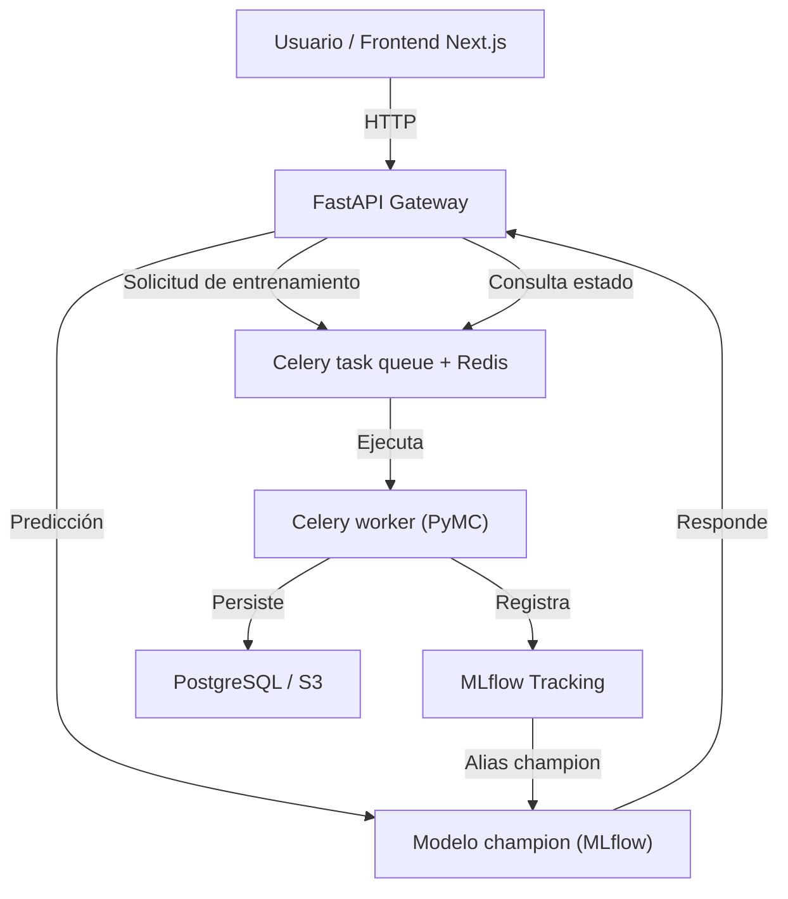
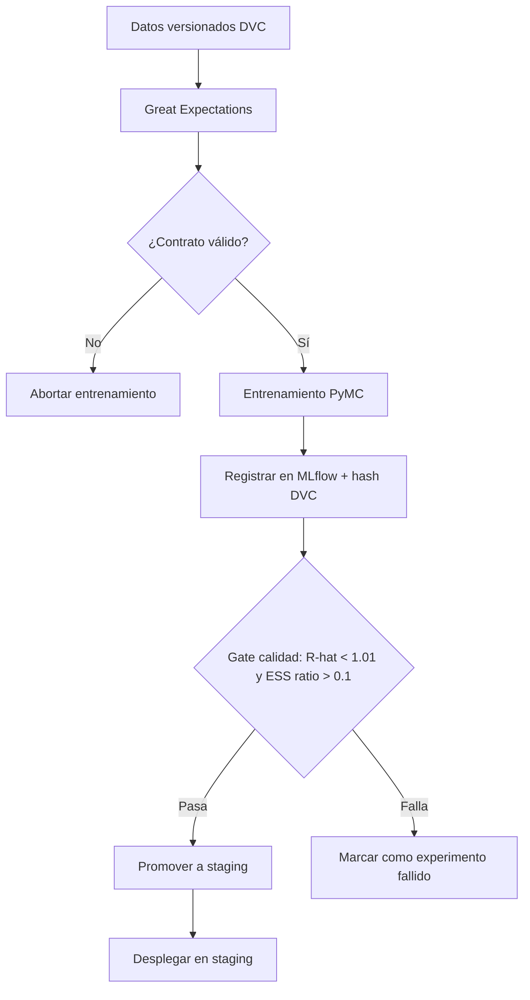
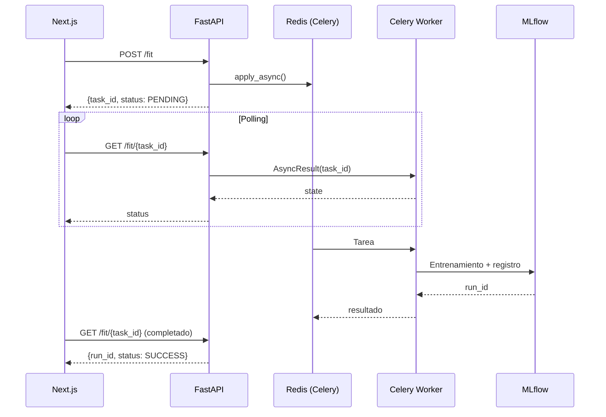
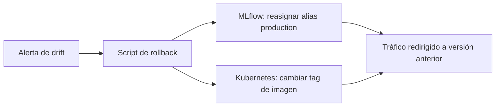

# Guía de Implementación de Sistemas Estadísticos

## Modelado robusto, API asíncrona con FastAPI + Celery, integración Next.js y despliegue reproducible

**Lenguaje principal: Python | R como motor especializado**

---

## Introducción

Esta guía describe las prácticas técnicas para construir sistemas estadísticos capaces de operar en entornos de producción. Cubre el ciclo completo:

- Modelado estadístico robusto (frecuentista y bayesiano) con PyMC como herramienta principal.

- Exposición de funcionalidades mediante APIs FastAPI con colas de tareas (Celery + Redis) para entrenamientos largos (MCMC).

- Integración con frontend Next.js para visualización de incertidumbre.

- Pipeline integrado MLflow + DVC + validación de contratos de calidad de datos.

- Despliegue reproducible con Docker y orquestación con docker-compose o Kubernetes.

**Sobre la elección de lenguaje**: Python es el lenguaje principal de esta guía por ser el estándar del ecosistema de producción (FastAPI, MLflow, Great Expectations, Evidently AI). R cumple un rol especializado, documentado en el Apéndice, para casos donde sus herramientas de modelado bayesiano ofrecen ventajas específicas no cubiertas por PyMC (modelos jerárquicos complejos, análisis regulatorios con precedente documentado).

### Diagrama de arquitectura general



## 1. Modelado Estadístico Robusto con Python

### 1.1 Principios generales

Un modelo estadístico en producción debe cumplir:

- Especificación explícita de fórmula, familia y priors, justificada en `docs/decisions/`.
- Registro automático de versiones del código, datos (hash DVC) y entorno.
- Diagnósticos de convergencia para métodos MCMC o variacionales.
- Análisis de sensibilidad ante cambios en especificación o datos.
- Almacenamiento del modelo con sus metadatos completos en MLflow.

### 1.2 Modelo lineal bayesiano con PyMC

```python
# (ejemplo ejecutable)
import pymc as pm
import arviz as az
import pandas as pd
import numpy as np


def build_bayesian_model(
    data: pd.DataFrame,
    formula_vars: list[str],
    target: str,
    prior_type: str = "weakly_informative",
) -> tuple:
    """
    Construye y ajusta un modelo lineal bayesiano con PyMC.
    Decisión de priors: docs/decisions/001-prior-selection.md
    """
    with pm.Model() as model:
        if prior_type == "weakly_informative":
            sigma = pm.HalfNormal("sigma", sigma=2.5)
            intercept = pm.Normal("intercept", mu=0, sigma=5)
            betas = {
                v: pm.Normal(f"beta_{v}", mu=0, sigma=2.5) for v in formula_vars
            }
        elif prior_type == "informative":
            sigma = pm.HalfNormal("sigma", sigma=1.0)
            intercept = pm.Normal("intercept", mu=data[target].mean(), sigma=1.0)
            betas = {
                v: pm.Normal(f"beta_{v}", mu=0, sigma=0.5) for v in formula_vars
            }
        else:
            raise ValueError(f"prior_type desconocido: {prior_type}")

        mu = intercept + sum(betas[v] * data[v] for v in formula_vars)
        pm.Normal("y_obs", mu=mu, sigma=sigma, observed=data[target])

        trace = pm.sample(2000, chains=4, return_inferencedata=True, random_seed=2026)

    return model, trace


def run_diagnostics(trace) -> dict:
    """Calcula y retorna diagnósticos de convergencia."""
    rhat_max = float(az.rhat(trace).max().to_array().max())
    total_samples = trace.posterior.dims["draw"] * trace.posterior.dims["chain"]
    ess_min_val = float(az.ess(trace).min().to_array().min())
    ess_ratio_min = ess_min_val / total_samples
    divergences = int(trace.sample_stats.diverging.sum())
    return {
        "rhat_max": rhat_max,
        "ess_min": ess_min_val,
        "ess_ratio_min": ess_ratio_min,
        "divergences": divergences,
        "converged": rhat_max < 1.01 and ess_ratio_min > 0.1 and divergences == 0,
    }
```

**Truco de experto**: Para modelos más complejos, guarda el trace en formato NetCDF (`az.to_netcdf`) y así podrás reanudar el muestreo si se interrumpe. También aumenta `target_accept` en `pm.sample(..., target_accept=0.95)` para reducir divergencias.

## 2. Pipeline Integrado: DVC + Contratos de Calidad + MLflow

Este es el flujo completo para cualquier entrenamiento en producción. Garantiza trazabilidad desde los datos hasta el artefacto desplegado.

### 2.1 Flujo del pipeline

```text
Datos versionados (DVC)
    → Validación de calidad (Great Expectations)
    → Entrenamiento (PyMC / statsmodels)
    → Registro MLflow (parámetros + métricas + hash DVC)
    → Gate de calidad automático (R-hat, ESS ratio)
    → Promoción a staging/producción
```

### 2.2 Implementación completa

```python
# (fragmento ilustrativo, no ejecutable)
import subprocess
import json
from pathlib import Path
import mlflow
import great_expectations as gx
import pandas as pd
import arviz as az  # necesario para guardar trace.nc


def get_dvc_commit_hash() -> str:
    result = subprocess.run(
        ["git", "rev-parse", "HEAD"], capture_output=True, text=True
    )
    return result.stdout.strip()


def validate_data_contract(df: pd.DataFrame, suite_name: str = "training_suite") -> bool:
    # Se asume que el datasource "pandas_datasource" ya está configurado en Great Expectations
    context = gx.get_context()
    validator = context.get_validator(
        batch_request=gx.core.batch.RuntimeBatchRequest(
            datasource_name="pandas_datasource",
            data_connector_name="runtime_connector",
            data_asset_name="training_data",
            runtime_parameters={"batch_data": df},
            batch_identifiers={"run_id": "training"},
        ),
        expectation_suite_name=suite_name,
    )
    results = validator.validate()
    return results.success


def training_pipeline(
    data_path: str,
    formula_vars: list[str],
    target: str,
    experiment_name: str = "statistical_model",
    model_name: str = "StatisticalModel",
    min_ess_ratio: float = 0.1,
):
    df = pd.read_parquet(data_path)
    dvc_hash = get_dvc_commit_hash()

    if not validate_data_contract(df):
        raise ValueError("Contrato de calidad violado. Entrenamiento abortado.")

    mlflow.set_tracking_uri("http://mlflow-server:5000")
    mlflow.set_experiment(experiment_name)

    with mlflow.start_run(run_name=f"run_{dvc_hash[:8]}") as run:
        model, trace = build_bayesian_model(df, formula_vars, target)
        diag = run_diagnostics(trace)

        mlflow.log_params({
            "prior_type": "weakly_informative",
            "chains": 4,
            "iterations": 2000,
            "random_seed": 2026,
            "dvc_data_hash": dvc_hash,
            "formula": f"{target} ~ {' + '.join(formula_vars)}",
            "decision_doc": "docs/decisions/001-prior-selection.md",
        })
        mlflow.log_metrics({
            "rhat_max": diag["rhat_max"],
            "ess_min": diag["ess_min"],
            "ess_ratio_min": diag["ess_ratio_min"],
            "divergences": diag["divergences"],
        })

        Path("audit").mkdir(exist_ok=True)
        audit_entry = {**diag, "run_id": run.info.run_id, "dvc_hash": dvc_hash}
        with open(f"audit/diagnostics_{run.info.run_id[:8]}.json", "w") as f:
            json.dump(audit_entry, f, indent=2)

        az.to_netcdf(trace, "trace.nc")
        mlflow.log_artifact("trace.nc")
        mlflow.log_artifact(f"audit/diagnostics_{run.info.run_id[:8]}.json")
        mlflow.register_model(f"runs:/{run.info.run_id}/trace", model_name)

        if diag["converged"] and diag["ess_ratio_min"] >= min_ess_ratio:
            client = mlflow.tracking.MlflowClient()
            latest = client.get_latest_versions(model_name, stages=["None"])
            if latest:
                client.set_registered_model_alias(model_name, "staging", latest[0].version)
                print(f"Modelo v{latest[0].version} promovido a staging (R-hat={diag['rhat_max']:.4f}).")
        else:
            print(f"Gate no superado: {diag}. Modelo no promovido.")

    return run.info.run_id
```

### 2.3 Recuperar datos exactos de un modelo en producción

```python
# (fragmento ilustrativo, no ejecutable)
def reproduce_training_data(model_name: str, version: int) -> pd.DataFrame:
    client = mlflow.tracking.MlflowClient()
    model_version = client.get_model_version(model_name, str(version))
    run = client.get_run(model_version.run_id)
    dvc_hash = run.data.params["dvc_data_hash"]
    data_path = run.data.params["data_path"]
    subprocess.run(["git", "checkout", dvc_hash], check=True)
    subprocess.run(["dvc", "checkout"], check=True)
    return pd.read_parquet(data_path)
```

**⚠️ Advertencia**: `subprocess.run(["git", "checkout", ...])` cambiará el estado de tu repositorio local. Úsalo solo en entornos aislados (ej. worker de CI/CD). En producción, mejor almacena los datos en un bucket versionado (S3, GCS) y usa DVC con remote.

### Diagrama del pipeline integrado



## 3. API con FastAPI + Celery

### 3.1 Por qué no usar BackgroundTasks para modelos estadísticos

`FastAPI.BackgroundTasks` ejecuta tareas en el mismo proceso del servidor web. Para entrenamiento MCMC (minutos a horas), esto provoca:

- Timeout del worker web.
- Bloqueo del event loop, afectando otras peticiones.
- Sin persistencia del estado de la tarea ni reintentos.
- Imposibilidad de escalar workers de entrenamiento independientemente.

**Solución correcta**: cola de tareas con Celery + Redis. FastAPI encola el trabajo y retorna `task_id` inmediatamente; workers Celery independientes ejecutan el entrenamiento.

### 3.2 Configuración de Celery (`celery_app.py`)

```python
# (fragmento ilustrativo, no ejecutable)
from celery import Celery
import os

celery_app = Celery(
    "statistical_tasks",
    broker=os.environ["CELERY_BROKER_URL"],      # redis://redis:6379/0
    backend=os.environ["CELERY_RESULT_BACKEND"], # redis://redis:6379/1
    include=["tasks.training"],
)

celery_app.conf.update(
    task_serializer="json",
    result_serializer="json",
    accept_content=["json"],
    task_track_started=True,
    task_soft_time_limit=3600,      # 1 hora soft limit → SoftTimeLimitExceeded
    task_time_limit=3900,           # 1h5m hard kill
    worker_prefetch_multiplier=1,   # Un job a la vez por worker (MCMC intensivo)
    task_acks_late=True,            # Re-encolar si el worker muere
)
```

### 3.3 Tarea Celery (`tasks/training.py`)

```python
# (fragmento ilustrativo, no ejecutable)
from celery_app import celery_app
from celery.utils.log import get_task_logger
import traceback

logger = get_task_logger(__name__)


@celery_app.task(
    bind=True,
    name="tasks.training.run_training_pipeline",
    max_retries=2,
    default_retry_delay=60,
)
def run_training_pipeline(
    self,
    data_path: str,
    formula_vars: list[str],
    target: str,
    experiment_name: str,
    model_name: str = "StatisticalModel",
):
    try:
        self.update_state(state="STARTED", meta={"progress": "validating_data"})
        run_id = training_pipeline(data_path, formula_vars, target, experiment_name, model_name)
        return {"status": "completed", "run_id": run_id}
    except Exception as exc:
        logger.error(f"Training failed: {traceback.format_exc()}")
        raise self.retry(exc=exc)
```

### 3.4 Endpoints FastAPI

```python
# (fragmento ilustrativo, no ejecutable)
from fastapi import FastAPI, Depends
from fastapi.security import HTTPBearer
from pydantic import BaseModel, Field
from celery.result import AsyncResult
import time
import json
import logging
from datetime import datetime
from tasks.training import run_training_pipeline

app = FastAPI(title="Statistical API", version="2.0.0")
security = HTTPBearer()
logger = logging.getLogger(__name__)


class FitRequest(BaseModel):
    formula_vars: list[str] = Field(..., example=["x1", "x2"])
    target: str = Field(..., example="y")
    data_path: str
    prior_type: str = Field("weakly_informative", pattern="^(weakly_informative|informative)$")
    experiment_name: str = "default"
    model_name: str = "StatisticalModel"


class TaskStatusResponse(BaseModel):
    task_id: str
    status: str          # PENDING | STARTED | SUCCESS | FAILURE | RETRY
    progress: str | None = None
    run_id: str | None = None
    error: str | None = None


@app.middleware("http")
async def audit_middleware(request, call_next):
    start = time.time()
    response = await call_next(request)
    logger.info(json.dumps({
        "timestamp": datetime.utcnow().isoformat() + "Z",
        "endpoint": request.url.path,
        "method": request.method,
        "status_code": response.status_code,
        "duration_ms": round((time.time() - start) * 1000, 2),
    }))
    return response


@app.post("/fit", response_model=TaskStatusResponse, status_code=202)
async def fit_model(request: FitRequest, token=Depends(security)):
    task = run_training_pipeline.apply_async(kwargs=request.dict())
    return TaskStatusResponse(task_id=task.id, status="PENDING")


@app.get("/fit/{task_id}", response_model=TaskStatusResponse)
async def get_fit_status(task_id: str, token=Depends(security)):
    result = AsyncResult(task_id)
    meta = result.info or {}
    if result.state == "FAILURE":
        return TaskStatusResponse(task_id=task_id, status="FAILURE", error=str(result.info))
    return TaskStatusResponse(
        task_id=task_id,
        status=result.state,
        progress=meta.get("progress"),
        run_id=meta.get("run_id") if result.state == "SUCCESS" else None,
    )


@app.get("/health")
async def health():
    return {"status": "ok", "timestamp": datetime.utcnow().isoformat()}
```

### 3.5 Cliente TypeScript para Next.js (con polling)

```typescript
// lib/statistical-api.ts
interface FitRequest {
  formula_vars: string[];
  target: string;
  data_path: string;
  prior_type?: "weakly_informative" | "informative";
  experiment_name?: string;
  model_name?: string;
}

interface TaskStatus {
  task_id: string;
  status: string;
  progress?: string;
  run_id?: string;
  error?: string;
}

export class StatisticalApiClient {
  private baseUrl: string;
  private token: string;

  constructor(
    baseUrl = process.env.NEXT_PUBLIC_STATS_API_URL ?? "http://localhost:8000",
    token = ""
  ) {
    this.baseUrl = baseUrl;
    this.token = token;
  }

  private headers(): HeadersInit {
    return {
      "Content-Type": "application/json",
      Authorization: `Bearer ${this.token}`,
    };
  }

  async fitModelAsync(params: FitRequest): Promise<string> {
    const res = await fetch(`${this.baseUrl}/fit`, {
      method: "POST",
      headers: this.headers(),
      body: JSON.stringify(params),
    });
    if (res.status !== 202) throw new Error(`Unexpected status: ${res.status}`);
    const { task_id } = await res.json();
    return task_id;
  }

  async getTaskStatus(taskId: string): Promise<TaskStatus> {
    const res = await fetch(`${this.baseUrl}/fit/${taskId}`, {
      headers: this.headers(),
    });
    if (!res.ok) throw new Error(`Failed to get status: ${res.status}`);
    return res.json();
  }

  async pollUntilComplete(
    taskId: string,
    intervalMs = 10000,
    maxAttempts = 360
  ): Promise<TaskStatus> {
    for (let i = 0; i < maxAttempts; i++) {
      await new Promise((r) => setTimeout(r, intervalMs));
      const status = await this.getTaskStatus(taskId);
      if (status.status === "SUCCESS" || status.status === "FAILURE") {
        return status;
      }
    }
    throw new Error(`Task ${taskId} timed out`);
  }
}
```

**Truco de experto**: En lugar de polling, puedes usar WebSockets (FastAPI + Socket.IO) para recibir actualizaciones en tiempo real del progreso del entrenamiento. Sin embargo, polling con intervalos de 5‑10 segundos es más simple y suficiente para la mayoría de los casos.

### Diagrama de interacción API + Celery



### 3.6 Visualización de incertidumbre en Next.js

Los resultados bayesianos se presentan siempre con intervalos de credibilidad, no solo estimaciones puntuales. El frontend recibe muestras posteriores vía API y las renderiza con componentes como `PosteriorPlot` (ver ejemplo en la sección anterior, adaptado al stack Next.js + Recharts). Asegúrate de usar `useEffect` para cargar los datos del modelo y `useState` para manejar las muestras.

## 4. Despliegue con Docker y Orquestación

### 4.1 Dockerfile (servicio Python + Celery worker)

```dockerfile
FROM python:3.11-slim

WORKDIR /app

RUN apt-get update && \
    apt-get install -y --no-install-recommends gcc && \
    rm -rf /var/lib/apt/lists/*

COPY pyproject.toml poetry.lock ./
RUN pip install poetry --no-cache-dir && \
    poetry config virtualenvs.create false && \
    poetry install --only=main --no-interaction

COPY . .

RUN adduser --disabled-password --gecos "" appuser && \
    chown -R appuser /app
USER appuser

HEALTHCHECK --interval=30s --timeout=5s CMD curl -f http://localhost:8000/health || exit 1

# El comando se define en docker-compose (para api o worker)
```

### 4.2 Docker Compose (API + Worker + Redis + MLflow + PostgreSQL)

```yaml
version: "3.9"

services:
  redis:
    image: redis:7-alpine
    volumes:
      - redisdata:/data
    command: redis-server --save 60 1

  db:
    image: postgres:15-alpine
    environment:
      POSTGRES_DB: mlflow
      POSTGRES_USER: mlflow
      POSTGRES_PASSWORD_FILE: /run/secrets/db_password
    secrets:
      - db_password

  mlflow:
    image: ghcr.io/mlflow/mlflow:latest
    ports:
      - "5000:5000"
    command: >
      mlflow server --host 0.0.0.0
      --backend-store-uri postgresql://mlflow:${MLFLOW_DB_PASSWORD}@db/mlflow
    environment:
      MLFLOW_DB_PASSWORD: ${MLFLOW_DB_PASSWORD}
    depends_on:
      - db

  api:
    build: .
    ports:
      - "8000:8000"
    command: uvicorn interfaces.api.main:app --host 0.0.0.0 --port 8000
    environment:
      CELERY_BROKER_URL: redis://redis:6379/0
      CELERY_RESULT_BACKEND: redis://redis:6379/1
      MLFLOW_TRACKING_URI: http://mlflow:5000
    volumes:
      - ./audit:/app/audit
      - ./models:/app/models
    depends_on:
      - redis
      - mlflow

  worker:
    build: .
    command: celery -A celery_app worker --loglevel=info --concurrency=2
    environment:
      CELERY_BROKER_URL: redis://redis:6379/0
      CELERY_RESULT_BACKEND: redis://redis:6379/1
      MLFLOW_TRACKING_URI: http://mlflow:5000
    volumes:
      - ./audit:/app/audit
      - ./models:/app/models
    deploy:
      resources:
        limits:
          cpus: "4"
          memory: "8g"
    depends_on:
      - redis
      - mlflow

  frontend:
    build: ./frontend
    ports:
      - "3000:3000"
    environment:
      NEXT_PUBLIC_STATS_API_URL: http://api:8000
    depends_on:
      - api

secrets:
  db_password:
    file: ./secrets/db_password.txt

volumes:
  redisdata:
```

**⚠️ Advertencia**: Nunca guardes secretos en archivos versionados. El archivo `secrets/db_password.txt` debe estar en `.gitignore`. Usa un gestor de secretos como Vault o variables de entorno en entornos gestionados (Kubernetes Secrets).

### 4.3 Estrategia de rollback de modelos

En MLflow: el alias `production` apunta a una versión. Para rollback, simplemente reasignar el alias a la versión anterior.

En Kubernetes: el despliegue usa la imagen etiquetada con la versión de modelo (ej. `model-registry:version-3`). El rollback se hace cambiando el tag en el deployment y aplicando.

Automatización: script que, ante alerta de drift severo, ejecuta `client.set_registered_model_alias(model_name, "production", previous_version)` y re-despliega la imagen anterior.



## 5. Checklist de Despliegue (resumen)

- [ ] Lock file versionado (`poetry.lock`).
- [ ] Contrato de calidad con Great Expectations validado en CI.
- [ ] Diagnósticos de convergencia: R-hat < 1.01, ESS ratio > 0.1, divergencias = 0.
- [ ] Hash DVC del dataset registrado en MLflow.
- [ ] Gate de calidad automático configurado (promoción a staging).
- [ ] Imagen Docker reproducible, escaneada con Trivy (sin vulnerabilidades críticas).
- [ ] Secretos gestionados con Vault (no hardcodeados).
- [ ] Middleware de auditoría activo.
- [ ] Health check implementado.
- [ ] Monitoreo de drift con Evidently AI + Prometheus + Grafana (ver `Monitoring.md`).
- [ ] Celery workers con límites de recursos y reintentos configurados.

## Apéndice: Motor especializado en R

Para análisis bayesianos donde `brms` ofrece ventajas específicas (modelos jerárquicos complejos, modelos de supervivencia, análisis regulatorios con precedente documentado), se integra un microservicio R separado. El servicio R se expone con Plumber, registra sus modelos en MLflow vía el paquete `mlflow` de R y sigue el mismo flujo de auditoría y versionado de datos.

```r
# (fragmento ilustrativo, no ejecutable)
library(mlflow)
library(brms)

mlflow_set_tracking_uri("http://mlflow-server:5000")
mlflow_set_experiment("bayesian_r_specialist")

with(mlflow_start_run(), {
    mlflow_log_param("chains", 4)
    mlflow_log_param("iter", 2000)
    mlflow_log_param("dvc_data_hash", system("git rev-parse HEAD", intern = TRUE))
    mlflow_log_param("decision_doc", "docs/decisions/002-hierarchical-prior.md")

    fit <- brm(y ~ x1 + x2 + (1 | group), data = data,
               chains = 4, iter = 2000, seed = 2026)

    mlflow_log_metric("rhat_max", max(brms::rhat(fit), na.rm = TRUE))
    mlflow_log_metric("ess_min",  min(brms::neff_ratio(fit), na.rm = TRUE))

    saveRDS(fit, "model.rds")
    mlflow_log_artifact("model.rds")
})
```

La comunicación entre el gateway Python y el servicio R usa JSON estándar. El orquestador (Prefect o Airflow) coordina la secuencia entre servicios.

## Referencias

- [PyMC](https://www.pymc.io/)

- [ArviZ](https://python.arviz.org/)

- [FastAPI](https://fastapi.tiangolo.com/)

- [Celery](https://docs.celeryq.dev/)

- [MLflow](https://mlflow.org/)

- [DVC](https://dvc.org/)

- [Great Expectations](https://docs.greatexpectations.io/)

- [Evidently AI](https://www.evidentlyai.com/)

- [HashiCorp Vault](https://developer.hashicorp.com/vault)
