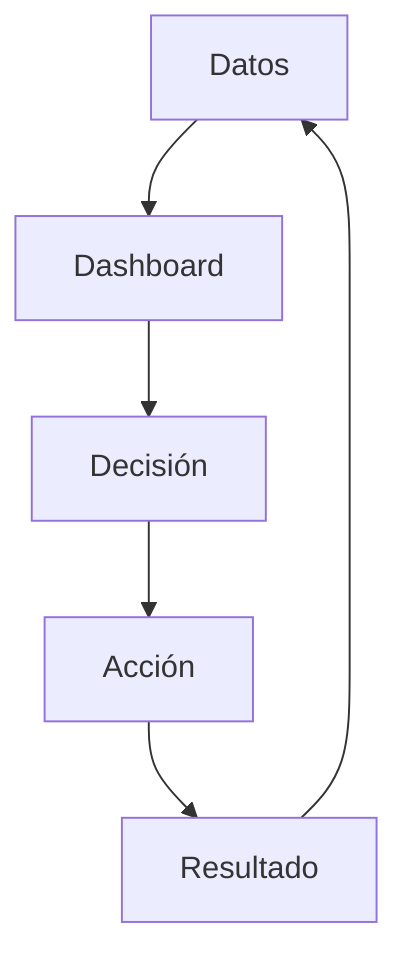
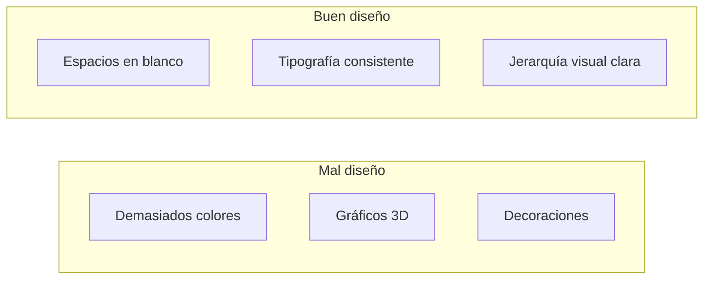
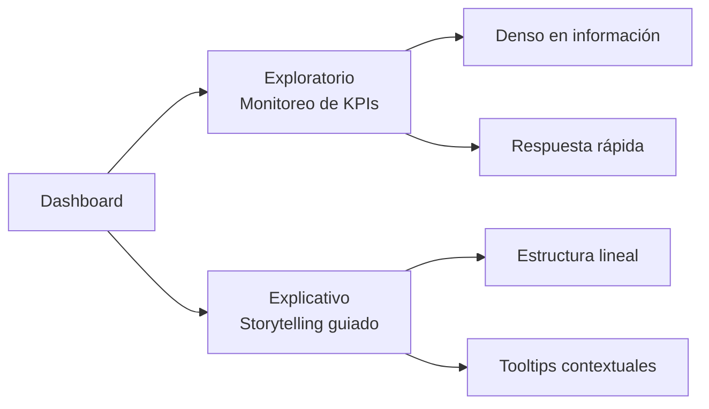
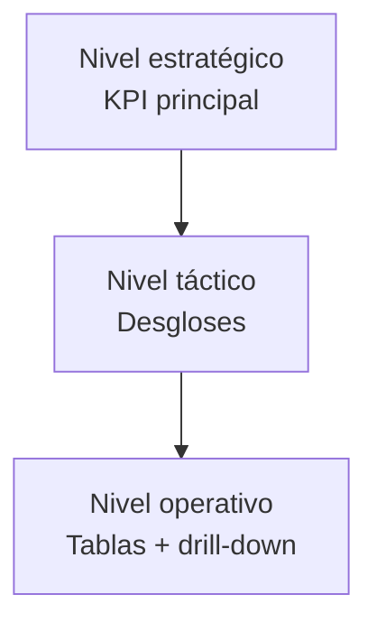
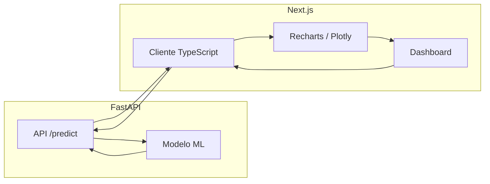

# Fundamento Teórico y Diseño de Dashboards Analíticos

El diseño de dashboards analíticos se apoya en tres pilares: principios de simplicidad y orientación a la decisión, sistemas de diseño estandarizados y accesibilidad como requisito.

## Introducción

Un dashboard analítico no es un mero agregado de gráficos. Es una interfaz que debe traducir datos en decisiones. Su diseño, por tanto, no es una cuestión estética, sino de eficacia cognitiva y funcional. Un dashboard bien concebido reduce la carga mental, guía la atención hacia los puntos críticos y permite al usuario extraer conclusiones accionables con el mínimo esfuerzo.

### Diagrama conceptual del dashboard analítico



## Principios Fundamentales del Diseño Centrado en Datos

### Simplicidad funcional

La simplicidad no implica minimalismo vacío, sino la eliminación de todo elemento que no sirva a la comprensión de los datos.



- Uso consistente de espacios en blanco, tipografía y paletas de color.
- Eliminación de efectos decorativos (sombras, gradientes, bordes innecesarios).
- Jerarquía visual: el elemento más relevante (habitualmente el KPI principal) se sitúa arriba a la izquierda, donde la mirada se posa primero.

### Contexto y decisión como anclas

Antes de diseñar cualquier gráfico, se debe responder: ¿quién usará el dashboard?, ¿qué decisión tomará con él?, ¿con qué frecuencia? La respuesta debe reducirse a una frase que condicione cada elección de diseño.

Ejemplo: "El gestor de riesgos necesita identificar diariamente los préstamos con alta probabilidad de impago para priorizar la revisión manual."

### Distinción entre uso exploratorio y explicativo



Un dashboard de monitorización (KPIs operativos) debe ser denso en información, orientado a la respuesta rápida y a la detección de anomalías. Un dashboard explicativo, en cambio, cuenta una historia o guía a un usuario menos experto; requiere una estructura más lineal, menos opciones simultáneas y, a menudo, un modo guiado (tooltips contextuales, paneos ordenados).

### Jerarquía de la información

La información se organiza en niveles:

1. **Nivel estratégico**: indicadores globales (KPIs máximos) en la posición más prominente.
2. **Nivel táctico**: desgloses por dimensiones clave (región, producto, tiempo).
3. **Nivel operativo**: tablas detalladas o visualizaciones de granularidad fina, accesibles mediante drill-down o pestañas.



Cada nivel debe ser reconocible sin necesidad de leer explicaciones largas.

## Sistemas de Diseño de Referencia

Los sistemas de diseño de código abierto proporcionan un lenguaje visual consistente y componentes validados por el uso masivo.

| Sistema | Enfoque en datos | Componentes clave |
| --- | --- | --- |
| Google Material Design | Guías de selección de gráficos según el tipo de dato y la tarea. | Taxonomía de gráficos, comportamiento interactivo, paletas de colores categóricas. |
| IBM Carbon | Componentes de gráficos (Carbon Charts) con accesibilidad integrada. | Paletas de colores accesibles (WCAG 2.1), kits para Figma, recursos de diseño centrados en la historia. |
| Shopify Polaris | polaris-viz: librería React con cinco principios (precisión, intuición, engagement, enfoque, granularidad). | Cada visualización responde a una sola pregunta; identidad visual unificada. |
| Atlassian Design System | Retroalimentación visual en la interacción (hover, selección). | Uso de tokens (variables de diseño) para mantener consistencia en estados interactivos. |
| Ant Design | Páginas de visualización completas con principios de jerarquía y selección de gráficos por "tamaño de partícula de datos". | Archivos de recursos para diseñadores (Sketch), guías detalladas de layout. |

La adopción de un sistema de diseño (o una combinación bien fundamentada de sus principios) garantiza consistencia, reduce la deuda de diseño y facilita la colaboración entre desarrolladores y analistas.

## Fuentes de Aprendizaje y Referencia Teórica

### Libros fundamentales

- **Human-Centred Scientific Data Visualisation** – R. Damaševičius (2026). Puente entre rigor científico, UX y estrategias de codificación en Python y R.

- **Dashboards That Deliver** – A. Cotgreave et al. (2025). Proceso completo de diseño desde el descubrimiento hasta el despliegue.

- **The Big Book of Dashboards** – S. Wexler et al. (2017). Análisis de dashboards reales, aciertos y errores comunes.

- **Interactive Data Visualization for the Web** – S. Murray. Proceso fundamental de visualización interactiva con tecnologías web.

### Cursos en línea especializados

| Curso | Plataforma | Enfoque principal |
| --- | --- | --- |
| Craft Dashboards & Summaries | Coursera | Optimización de la "relación datos-tinta", rediseño sistemático de dashboards. |
| Build Interactive Dashboards | Coursera | Storytelling y diseño de interacciones que transforman solicitudes en interfaces intuitivas. |
| Design Enterprise Data Architecture Dashboards | Udacity | Descubrimiento de necesidades del usuario, identificación de métricas y adaptación a audiencias jerárquicas. |

## Repositorios de GitHub de Referencia para la Implementación

La teoría se materializa en código. Los siguientes repositorios ofrecen ejemplos de alta calidad, reproducibles y con buenas prácticas de UX.

| Repositorio | Descripción | Enlace |
| --- | --- | --- |
| recharts-demo (jonbrick) | Dashboard con sincronización de estado en la URL (vistas compartibles). | GitHub |
| polaris-viz (Shopify) | Librería React de visualización del sistema Polaris. | GitHub |
| awesome-streamlit-themes | Temas profesionales para Streamlit. | GitHub |
| DataVizShowcase (SchmidtPaul) | Colección curada de visualizaciones con código y datasets. | GitHub |
| rhinoverse | Herramientas para dashboards R Shiny con shiny.semantic. | GitHub |

## Accesibilidad y Ética como Estándares de Calidad

Un dashboard profesional es necesariamente accesible y ético. La accesibilidad no es un añadido, sino un requisito funcional.

### Paletas de colores accesibles

- **ColorBrewer**: selección de paletas seguras para daltónicos.
- **Viz Palette**: prueba interactiva de paletas simulando diferentes tipos de daltonismo.
- **colorspace** (R) y **colorblindr** (R): generación y validación de paletas accesibles.

### Guías de accesibilidad concretas

- Proporcionar texto alternativo para cada gráfico (describiendo la tendencia, no solo los ejes).
- Usar patrones o texturas además del color para diferenciar categorías.
- Asegurar contraste mínimo 4.5:1.
- Garantizar navegabilidad por teclado.

### Ética de la representación

- Las escalas de los ejes deben comenzar en cero (o justificarse explícitamente si no es así).
- No truncar gráficos de barras ni usar escalas logarítmicas sin advertencia.
- Contextualizar agregados (media, desviación, intervalo de confianza).
- Documentar transformaciones (normalización, imputación) en tooltips o notas al pie.

## Implementación Práctica: Next.js + FastAPI

Esta sección conecta los principios de diseño con código real del stack utilizado en el proyecto (FastAPI backend, Next.js frontend).

### Diagrama de arquitectura para dashboards



### Cliente tipado para la API

```typescript
// lib/statistical-api.ts
const API_URL = process.env.NEXT_PUBLIC_API_URL || "http://127.0.0.1:8000";

interface PredictRequest {
  x1: number;
  x2: number;
}

interface PredictResponse {
  prediction: number;
  model_version: string;
}

export async function predict(features: PredictRequest): Promise<PredictResponse> {
  const res = await fetch(`${API_URL}/predict`, {
    method: "POST",
    headers: { "Content-Type": "application/json" },
    body: JSON.stringify(features),
  });
  if (!res.ok) throw new Error(`API error: ${res.status}`);
  return res.json();
}
```

### Gráfico de incertidumbre con Recharts

```tsx
// components/UncertaintyChart.tsx
"use client";
import {
  AreaChart,
  Area,
  XAxis,
  YAxis,
  CartesianGrid,
  Tooltip,
  ResponsiveContainer,
} from "recharts";

interface UncertaintyChartProps {
  data: { x: number; lower: number; median: number; upper: number }[];
}

export function UncertaintyChart({ data }: UncertaintyChartProps) {
  return (
    <ResponsiveContainer width="100%" height={300}>
      <AreaChart data={data}>
        <CartesianGrid strokeDasharray="3 3" />
        <XAxis dataKey="x" />
        <YAxis />
        <Tooltip />
        <Area
          type="monotone"
          dataKey="upper"
          stroke="none"
          fill="#8884d8"
          fillOpacity={0.3}
        />
        <Area
          type="monotone"
          dataKey="lower"
          stroke="none"
          fill="#8884d8"
          fillOpacity={0.3}
        />
        <Area
          type="monotone"
          dataKey="median"
          stroke="#8884d8"
          fill="none"
          strokeWidth={2}
        />
      </AreaChart>
    </ResponsiveContainer>
  );
}
```

### Dashboard accionable con drill-down

```tsx
// app/dashboard/page.tsx
"use client";
import { useState } from "react";
import { predict } from "@/lib/statistical-api";
import { UncertaintyChart } from "@/components/UncertaintyChart";

export default function DashboardPage() {
  const [x1, setX1] = useState(0);
  const [x2, setX2] = useState(0);
  const [prediction, setPrediction] = useState<number | null>(null);
  const [showDetails, setShowDetails] = useState(false);
  const [chartData, setChartData] = useState<
    { x: number; lower: number; median: number; upper: number }[]
  >([]);

  const handlePredict = async () => {
    const res = await predict({ x1, x2 });
    setPrediction(res.prediction);
  };

  const loadChart = async () => {
    const points = [];
    for (let x = -2; x <= 2; x += 0.2) {
      const res = await predict({ x1: x, x2: 0 });
      points.push({
        x,
        lower: res.prediction - 0.2,
        median: res.prediction,
        upper: res.prediction + 0.2,
      });
    }
    setChartData(points);
  };

  return (
    <main className="p-6 max-w-4xl mx-auto">
      <h1 className="text-2xl font-bold mb-4">Dashboard Analítico</h1>

      <div className="grid grid-cols-2 gap-4 mb-6">
        <div>
          <label>x1</label>
          <input
            type="number"
            value={x1}
            onChange={(e) => setX1(Number(e.target.value))}
            className="border p-2 w-full"
          />
        </div>
        <div>
          <label>x2</label>
          <input
            type="number"
            value={x2}
            onChange={(e) => setX2(Number(e.target.value))}
            className="border p-2 w-full"
          />
        </div>
      </div>

      <button
        onClick={handlePredict}
        className="bg-blue-600 text-white px-4 py-2 rounded mb-4"
      >
        Predecir
      </button>

      {prediction !== null && (
        <div
          className="bg-gray-100 p-4 rounded mb-4 cursor-pointer"
          onClick={() => setShowDetails(!showDetails)}
        >
          <p className="text-lg font-semibold">
            Predicción: {prediction.toFixed(4)}
          </p>
          {showDetails && (
            <div className="mt-2 text-sm text-gray-600">
              <p>Modelo: LinearRegression (champion)</p>
              <p>Intervalo de confianza: [{(prediction - 0.2).toFixed(4)}, {(prediction + 0.2).toFixed(4)}]</p>
              <button
                onClick={loadChart}
                className="mt-2 bg-green-600 text-white px-3 py-1 rounded text-xs"
              >
                Ver curva de sensibilidad
              </button>
            </div>
          )}
        </div>
      )}

      {chartData.length > 0 && (
        <div className="mt-6">
          <h2 className="text-xl font-semibold mb-2">Curva de sensibilidad (x2=0)</h2>
          <UncertaintyChart data={chartData} />
        </div>
      )}
    </main>
  );
}
```

## Referencias

- [Getting Started](Getting_Started.md): ejemplo completo ejecutable

- [Manual Completo](Complete_Manual.md): arquitectura y principios

- [Guía de Implementación](Statistical_Systems_Implementation_Guide.md): API y despliegue

- [UX/UI para Dashboards](UX_UI.md): documento original de diseño
